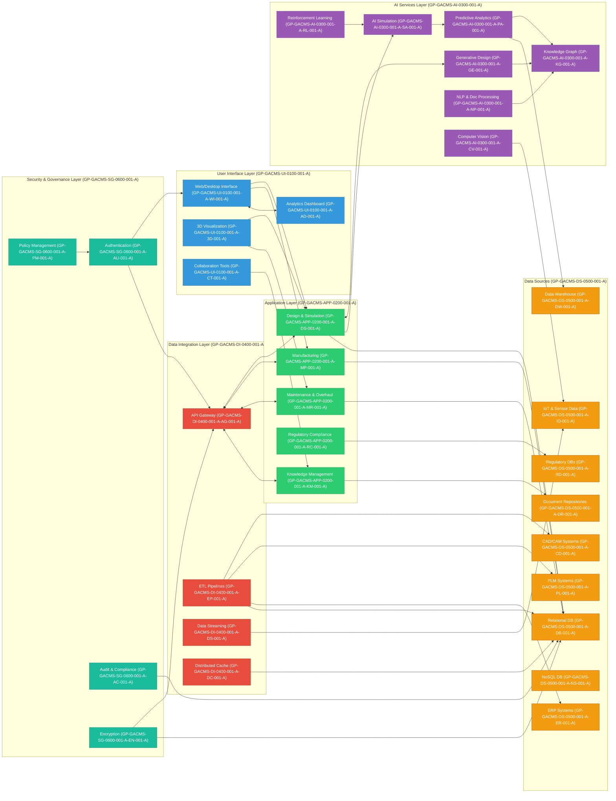
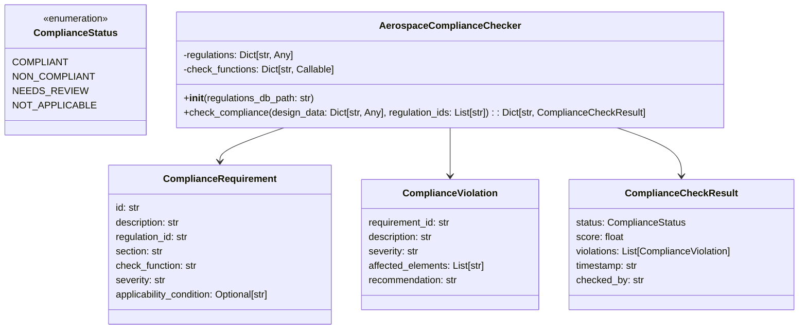

**MODEL AI^4 DEFINITION: Containing and Orchestrating Aerospace Full Instances C.O.A.F.I. (AEROSPACE INTEGRATED INDEX ON INSTRUCTIONS AND IMPLEMENTATIONS)**

# 📈 Efficiency Model – General Mathematical Formulation

## 1. Basic Efficiency Formula

Efficiency is typically defined as the ratio of output to input:


This applies universally—from engines to economics!

---

## 2. Efficiency in Linear Programming / DEA (Data Envelopment Analysis)

In **Operations Research** and **DEA**, efficiency of a **Decision Making Unit (DMU)** is modeled as:


Where:

- \( y_{ro} \): Output \( r \) of DMU \( o \)  
- \( x_{io} \): Input \( i \) of DMU \( o \)  
- \( u_r, v_i \): Weights assigned to outputs and inputs  
- \( s \): Number of outputs  
- \( m \): Number of inputs  

**Subject to:**


This formulation is often solved via **Linear Programming (LP)** or **Fractional Programming**.

---

## 3. Energy Efficiency Model

For example, in thermodynamics:


Where:

- \( W_{\text{out}} \): Work output  
- \( Q_{\text{in}} \): Heat input  

---

## 4. Economic Efficiency


Where:

- \( P \): Price  
- \( MC \): Marginal Cost  
- Efficiency = 1 is optimal.

---

# 🏗️ Infrastructural Requirements for Efficiency Models

To effectively implement and analyze an **Efficiency Model**, the following infrastructure is required:

## 1. 🧠 Data Infrastructure

- **Input & Output Metrics**: 
  - Input: labor hours, capital, energy, etc.  
  - Output: units produced, services delivered, etc.
- Data must be:
  - Quantifiable 📏
  - Consistent 📈
  - Clean and normalized 🧹

---

## 2. ⚙️ Computational Infrastructure

- LP/DEA Solvers (e.g., PuLP, CVXPY, Gurobi)
- Real-time analytics platforms
- Storage: cloud databases, data lakes

---

## 3. 🧮 Mathematical Modeling Infrastructure

- Model orientation: **Input-minimizing** or **Output-maximizing**
- Constraints:
  - Non-negativity: \( u_r, v_i \geq 0 \)
  - Normalization: \( \frac{\sum u_r y_{rj}}{\sum v_i x_{ij}} \leq 1 \)
- Tools:
  - Python (`scipy.optimize`, `cvxpy`)
  - R (`Benchmarking`, `deaR`)
  - DEA-Solver software

---

## 4. 🧑‍💼 Organizational & Sectoral Requirements

| Sector           | Infrastructure Required                        |
|------------------|-------------------------------------------------|
| 💡 Energy         | Smart meters, IoT sensors, SCADA systems        |
| 🏭 Manufacturing   | MES, ERP, machine sensors                      |
| 🚛 Transportation  | GPS, vehicle telematics, scheduling tools      |
| 🏢 Government      | National databases, open data portals          |
| 🧠 AI & Research   | GPUs, ML pipelines, data labeling systems      |

---

## 5. 🔐 Security and Ethics Infrastructure

- Compliance with data protection laws (GDPR, HIPAA)
- Model transparency and explainability
- Bias detection and fairness in scoring


---

## I. Introduction to COAFI

El **Diagrama de Bloques COAFI (Constituent Objects → Assembly → Functional Items)** es una herramienta estructurada que organiza los componentes de un sistema en tres niveles jerárquicos: **Objetos Constituyentes (Constituent Objects)**, **Ensamblajes (Assembly)** y **Elementos Funcionales (Functional Items)**. Este enfoque permite una gestión clara del diseño, fabricación y mantenimiento de sistemas complejos como los de la aeronave **AMPEL360XWLRGA**.

A continuación, se presenta el diagrama de bloques COAFI con números de partes (Part Numbers) asociados a cada nivel:

---

### **Diagrama de Bloques COAFI**

#### **Nivel 1: Constituent Objects (CO)**  
Son los materiales o componentes básicos que forman la base de todos los ensamblajes. Cada objeto constituyente tiene un número de parte único.

| **Part Number** | **Description**                          | **Material/Component**         |
|------------------|------------------------------------------|--------------------------------|
| CO-001          | Aleación de aluminio ligero              | Material estructural           |
| CO-002          | Fibra de carbono                        | Material compuesto             |
| CO-003          | Titanio                                  | Material resistente            |
| CO-004          | Polímero termoplástico                  | Material interior              |
| CO-005          | Vidrio laminado                         | Material para ventanas         |

---

#### **Nivel 2: Assembly (AS)**  
Los objetos constituyentes se combinan para formar ensamblajes intermedios. Estos ensamblajes son subcomponentes funcionales o estructurales.

| **Part Number** | **Description**                          | **Constituent Objects**        |
|------------------|------------------------------------------|--------------------------------|
| AS-101           | Fuselaje principal                       | CO-001, CO-002                |
| AS-102           | Alas estructurales                       | CO-002, CO-003                |
| AS-103           | Tren de aterrizaje                       | CO-003, CO-004                |
| AS-104           | Sistema de control de vuelo              | CO-001, CO-005                |
| AS-105           | Interiores de cabina                     | CO-004, CO-005                |

---

#### **Nivel 3: Functional Items (FI)**  
Los ensamblajes se integran en elementos funcionales completos que realizan tareas específicas dentro del sistema global de la aeronave.

| **Part Number** | **Description**                          | **Assemblies**                 |
|------------------|------------------------------------------|--------------------------------|
| FI-201           | Sistema estructural completo             | AS-101, AS-102               |
| FI-202           | Sistema de propulsión                    | AS-103, AS-104               |
| FI-203           | Sistema de navegación                    | AS-104, AS-105               |
| FI-204           | Sistema de comunicaciones seguras        | AS-105                        |
| FI-205           | Sistema de gestión ambiental             | AS-101, AS-105               |

---

### **Diagrama Visual COAFI**

```plaintext
┌───────────────────────────────────────────────────────────────────────┐
│                             Functional Items (FI)                      │
│                                                                         │
│   FI-201: Sistema estructural completo                                 │
│   FI-202: Sistema de propulsión                                        │
│   FI-203: Sistema de navegación                                        │
│   FI-204: Sistema de comunicaciones seguras                            │
│   FI-205: Sistema de gestión ambiental                                 │
└───────────────────────────────────────────────────────────────────────┘
                                   ↑
                                   │
┌───────────────────────────────────────────────────────────────────────┐
│                              Assembly (AS)                             │
│                                                                         │
│   AS-101: Fuselaje principal                                           │
│   AS-102: Alas estructurales                                           │
│   AS-103: Tren de aterrizaje                                           │
│   AS-104: Sistema de control de vuelo                                  │
│   AS-105: Interiores de cabina                                         │
└───────────────────────────────────────────────────────────────────────┘
                                   ↑
                                   │
┌───────────────────────────────────────────────────────────────────────┐
│                        Constituent Objects (CO)                        │
│                                                                         │
│   CO-001: Aleación de aluminio ligero                                  │
│   CO-002: Fibra de carbono                                             │
│   CO-003: Titanio                                                      │
│   CO-004: Polímero termoplástico                                       │
│   CO-005: Vidrio laminado                                              │
└───────────────────────────────────────────────────────────────────────┘
```

---

### **Descripción del Diagrama**

1. **Constituent Objects (CO):**  
   Representan los materiales o componentes básicos utilizados en la fabricación. Son los "ladrillos" del diseño.

2. **Assembly (AS):**  
   Los objetos constituyentes se ensamblan para formar subcomponentes estructurales o funcionales. Por ejemplo, el fuselaje (AS-101) está hecho de aleación de aluminio (CO-001) y fibra de carbono (CO-002).

3. **Functional Items (FI):**  
   Los ensamblajes se integran en sistemas funcionales completos. Por ejemplo, el sistema estructural completo (FI-201) incluye el fuselaje (AS-101) y las alas (AS-102).

---

### **Beneficios del Diagrama COAFI**

- **Claridad Organizativa:** Facilita la comprensión de cómo se construyen y relacionan los componentes.
- **Trazabilidad:** Permite rastrear cada componente desde su origen hasta su función final.
- **Optimización:** Identifica oportunidades para mejorar materiales, ensamblajes o sistemas funcionales.
- **Mantenimiento:** Simplifica el diagnóstico y reemplazo de componentes durante operaciones de mantenimiento.

---

### **Ejemplo Práctico**

Para el **Sistema de Propulsión (FI-202)**:
1. **Constituent Objects (CO):** Titanio (CO-003) y polímero termoplástico (CO-004).
2. **Assembly (AS):** Tren de aterrizaje (AS-103) y sistema de control de vuelo (AS-104).
3. **Functional Item (FI):** Sistema de propulsión integrado (FI-202).

Este enfoque asegura que cada componente cumpla con los requisitos de diseño y funcionalidad.

---

$$
\boxed{\text{El Diagrama COAFI proporciona una estructura clara para gestionar los componentes de la aeronave AMPEL360XWLRGA.}}
$$

**Purpose of COAFI:**

*   To manage the inherent complexity of the GAIA AIR project documentation.
*   To ensure consistency in documentation style, format, and referencing across all systems and components.
*   To facilitate seamless collaboration and information sharing among diverse engineering and operational teams.
*   To enable efficient searching, retrieval, and contextualization of technical information for various user roles.
*   To rigorously support regulatory compliance and airworthiness/spaceworthiness certification processes.
*   To provide end-to-end traceability and audit trails from high-level system requirements down to detailed component design and implementation specifics.
*   To establish a **contextualized** documentation approach where data is presented with appropriate processing and filtering for specific user needs.
*   To facilitate **circular** documentation processes, allowing for iterative refinement and continuous improvement based on feedback and operational experience.

**Benefits of COAFI:**

*   **Modularity:** Documentation is broken down into independent modules (Parts, Chapters, Documents), enabling focused updates and improvements without impacting the entire framework.
*   **Scalability:** The hierarchical and coded structure is designed to accommodate the continuous growth and expansion of the GAIA AIR project documentation as new systems and technologies are integrated.
*   **Flexibility:** The framework is adaptable and can be modified to incorporate changes in project scope, technology advancements, and evolving documentation requirements.
*   **Enhanced Discoverability:** Facilitates efficient information retrieval through optimized navigation and search functionalities (planned GAIA Quantum Portal integration).
*   **Contextualization:** The "Views" system (planned for future implementation) allows for tailoring documentation presentation to specific user roles, ensuring users access only the most relevant information for their tasks.

**Relationship to ATA Chapters:** COAFI Part I (Airframes) and Part II (Spaceframes) are aligned with the Air Transport Association (ATA) chapter system and Air Transport Association Space (AS) chapter system respectively. This alignment ensures compatibility with industry-standard documentation practices while extending beyond traditional ATA to encompass the unique aspects of GAIA AIR, including quantum technologies, AI, and space operations.

**For a complete overview of the COAFI structure, see [COAFI Structure and Guidelines](Part0/GP-OV-COAFI-0001-A.md).**

## II. GAIA AIR Project Overview

The **GAIA AIR (Global Aerospace Infrastructural Agentic AI Intercepting Robotics)** project is a groundbreaking initiative focused on developing a next-generation aerospace platform that seamlessly integrates:

*   **GAIA PULSE (Quantum Propulsion):** A revolutionary quantum propulsion system, designated Q-01, designed to provide efficient, sustainable, and high-performance thrust, potentially harnessing novel physics principles for aerospace propulsion.
*   **GAIA CONTROL (AI-Powered Flight Control - Heuritmática):** An advanced, AI-driven autonomous flight control system, codenamed "Heuritmática (GP-HEUR)", enabling enhanced flight stability, adaptive control laws, flight envelope protection, and optimized flight management through sophisticated AI algorithms and quantum-enhanced computing.
*   **GAIA FAB (Sustainable Materials - AMPEL):** The utilization of advanced, lightweight, and sustainable materials under the AMPEL (Atmospheric Modular Program Enveloped Logics) initiative, focusing on Boron Nitride Nanotube (BNNT) composites, carbon lattice structures, and bio-derived materials to minimize environmental impact and maximize structural performance.
*   **GAIA SPACE (Atmospheric and Space Operations):** A dual-domain aerospace platform with capabilities for both atmospheric flight (AMPEL360XWLRGA airframe) and suborbital/orbital space travel (GAIA SPACE spaceframe), enabling a wide range of missions from sustainable air transport to space tourism and scientific research in both domains.
*   **GAIA COMPUTE (AI and Quantum Computing - HPC/QPU Nodes):**  A distributed, high-performance computing infrastructure, integrating both High-Performance Computing (HPC) and Quantum Processing Units (QPUs), codenamed "Node (GP-NOD)", to support AI model training, complex simulations, real-time data processing, and quantum algorithm execution for various GAIA AIR systems.

GAIA AIR aims to pioneer a new era of sustainable and versatile aerospace transportation, revolutionizing both atmospheric and space travel. The project's overarching objective is to develop a highly efficient, adaptable, and environmentally responsible aerospace platform that not only transforms transportation but also contributes to a deeper understanding of our cosmos and promotes sustainable practices in the aerospace industry.

---

## III. COAFI Documentation Structure

The COAFI documentation system is organized using a hierarchical structure, designed for modularity, scalability, and ease of navigation. The hierarchy consists of the following levels:

*   **Master Index:** The top-level entry point for the entire COAFI documentation set, providing a comprehensive table of contents and links to all Parts, Sections, and key documents (this document - `COAFI.MD`).
*   **Parts:** Major divisions representing distinct domains or aspects of the GAIA AIR project. COAFI is currently divided into Parts 0 through IX, each focusing on a specific area (e.g., Airframes, Spaceframes, Propulsion, Project Management).
*   **Sections (Optional):** Subdivisions within Parts, used for logical grouping of related chapters or documents within a Part. Sections are used as needed to further organize content within larger Parts.
*   **Chapters:** Within each Part (or Section), content is further divided into Chapters, which represent specific systems, subsystems, or functional areas. Part I and Part II utilize an adapted ATA/AS chapter numbering system (00-99, 00-100) for detailed system documentation.
*   **Documents:** The fundamental units of COAFI documentation. Each chapter is composed of individual Markdown files (`.md`) that contain specific information, specifications, procedures, analyses, or reports related to a particular topic within the COAFI framework.

### Document Codes

Each document within the COAFI framework is assigned a unique and structured document code to facilitate organization, identification, and cross-referencing. The document code follows a standardized format:

`[Part Code]-[System Code]-[Subsystem Code]-[Assembly Code]-[Disassembly Code]-[Disassy Code Variant]-[Info Code]-[Info Code Variant]-[Item Location Code]`

| Code Component         | Description                                                                    | Example          |
|-----------------------|--------------------------------------------------------------------------------|------------------|
| **Part Code**         | Identifies the main project area (Part I, Part II, etc.)                         | GP-OV, GP-AM      |
| **System Code**        | Identifies the major system or domain (Airframe, Propulsion, Avionics, etc.)    | GAI, AMPEL, HEUR    |
| **Subsystem Code (Opt)**| Identifies a specific subsystem within a system (optional, used for granularity)| QEE, SSS, IAH     |
| **Assembly Code**       | Numeric code identifying a major assembly or module.                             | 0100, 0200        |
| **Disassembly Code**    | Numeric code identifying a sub-assembly or component within an assembly.       | 001, 005          |
| **Disassembly Code Variant**| Alphanumeric character indicating a variant or revision of a sub-assembly. | A, B, Q01         |
| **Info Code**           | Identifies the type of information contained in the document (Overview, Specification, Procedure, etc.). | OV, SP, DS        |
| **Info Code Variant**   | Alphanumeric character indicating a variant or revision of the information type.| A, B, THEO       |
| **Item Location Code**  | Numeric code indicating the physical location or zone within the aircraft or spaceframe (often "00" for general documents). | 00, FUS, CAB      |

**Refer to [COAFI System and Subsystem Codes (Part0/GP-OV-NUM-0004-001-A.md)](Part0/GP-OV-NUM-0004-001-A.md) for a complete and detailed list of all System Codes, Subsystem Codes, and their corresponding descriptions used within the COAFI framework.**

---

## IV. COAFI Parts Index

The COAFI documentation framework is divided into the following Parts, each representing a major domain within the GAIA AIR project. Click on the Part titles below to navigate to the index page for each Part:

*   **Part 0: Project Overarching Principles (GP-OV)** ([Part0/index.md](Part0/index.md)): Project-wide principles, definitions, introductory material, business plan, and market analysis.
*   **Part 0A: Heuritmática (GP-HEUR)** ([Part0A/index.md](Part0A/index.md)):  The foundational principles of Heuritmática.
*   **Part I: Airframes – AMPEL360XWLRGA (GP-AM)** ([PartI/index.md](PartI/index.md)):  Documentation for the atmospheric aircraft, organized by ATA chapters.
*   **Part II: Spaceframes – GAIA SPACE Modules (GP-SM)** ([PartII/index.md](PartII/index.md)): Documentation for space-based systems and operations, organized by AS chapters.
*   **Part III: GAIA Propulsion Modules (GP-PM)** ([PartIII/index.md](PartIII/index.md)): Documentation for all propulsion systems, including GAIA PULSE.
*   **Part IV: GAIA Common Modules (GP-CM)** ([PartIV/index.md](PartIV/index.md)): Cross-cutting technologies and methodologies used across multiple GAIA systems (AI, Quantum, Materials, etc.).
*   **Part V: GAIA AIR Computing & Simulation (GP-GACMS)** ([PartV/index.md](PartV/index.md)): Documentation for computing and material simulation.
*   **Part VI: Project Management and Operations (GP-PMO)** ([PartVI/index.md](PartVI/index.md)): Project management and operational procedures.
*   **Part VII: Appendices and Reference Material (GP-APP)** ([PartVII/index.md](PartVII/index.md)): Supporting documentation, standards, and procedures.
*   **Future Expansions:**
    *   **Part VIII: GAIA GALACTIC MINING OPERATIONS (GP-GMO)** ([PartVIII/index.md](PartVIII/index.md)): Documentation related to the long-term vision for resource extraction in space.

**(Note:** The links within Part IV (COAFI Parts Index) are relative Markdown links, intended to function within a complete COAFI documentation repository. In a live deployment (e.g., a website generated using MkDocs), these links will resolve to the corresponding Part index pages based on the repository's file structure.)*

---

## V. COAFI Views

COAFI supports the concept of "Views," which are designed to tailor the presentation and accessibility of documentation based on specific user roles and needs. This ensures that users can efficiently access and navigate the information most relevant to their responsibilities.  **COAFI Views Implementation:** The implementation of COAFI Views is a planned feature. It is envisioned to leverage technologies such as MkDocs plugins, custom JavaScript, and potentially integration with the GAIA Quantum Portal (GQP) to provide role-based access and dynamic content filtering, tailoring the documentation presentation to specific user needs.

*   **Engineer View:**  Specifications, designs, test procedures, and results.
*   **Regulatory View:**  Certification documents, safety analyses, and compliance reports.
*   **Project Manager View:**  Project schedules, requirements, progress reports, and risk assessments.
*   **Maintenance View:**  Maintenance procedures, parts lists, and troubleshooting guides.
*   **Executive View:**  High-level overviews, key performance indicators, and strategic summaries.

**For more information on COAFI Views and their implementation roadmap, see [COAFI Views Implementation Guide](Part0/views_guide.md).**

---

## VI. Getting Started

*   **Explore COAFI Structure and Guidelines:** To gain a comprehensive understanding of the COAFI documentation framework, its principles, and organizational structure, refer to the **[COAFI Structure and Guidelines](Part0/GP-OV-COAFI-0001-A.md)** document in Part 0.
*   **Navigate to Relevant Parts:** To access documentation related to specific areas of the GAIA AIR project, navigate to the appropriate Part index page (listed in Section IV above) based on your area of interest (e.g., Part I for Airframes, Part III for Propulsion, Part VI for Project Management).
*   **Utilize Document Codes for Direct Access:** Use the structured document codes (outlined in Section III) to directly access specific documents if you know the relevant code. Document codes are consistently used throughout the COAFI framework for easy searching and cross-referencing.
*   **Contribute to COAFI Documentation:** For information on contributing to the COAFI documentation, including guidelines for creating new documents, updating existing content, and adhering to COAFI standards, refer to the **[Contribution Guidelines](Part0/contribution_guidelines.md)** document in Part 0.

---
title: "GP-AM-ATA: Guidance for Applying ATA Principles in COAFI Part I (Airframes)"
author: "COAFI Documentation Team"
date: "2024-12-07"
status: "Draft"
doc_code: "GP-AM-ATA-GUIDE-0001-B" # Revision B to reflect changes
nav_order: 100 # Place at the end of GP-AM Part index
nav_title: "GP-AM-ATA Guidance"
---

# GP-AM-ATA: Guidance for Applying ATA Principles in COAFI Part I (Airframes – AMPEL360XWLRGA)

This document provides guidance for authors creating documentation within **COAFI Part I: Airframes – AMPEL360XWLRGA (GP-AM)**. It specifically outlines how to apply principles from the Air Transport Association (ATA) documentation standards within the COAFI framework to ensure consistency, clarity, and industry best practices in airframe documentation.

---

## 1. Purpose and Scope

This guide aims to:

*   Clarify the integration of ATA principles within the COAFI Part I (GP-AM) documentation structure.
*   Provide practical guidelines for authors to create ATA-compliant documentation for the AMPEL360XWLRGA airframe.
*   Ensure consistency and standardization in GP-AM documentation, aligning with industry best practices.
*   Facilitate the creation of high-quality, user-friendly maintenance and engineering documentation.

This guide applies to all documentation created within **COAFI Part I: Airframes (GP-AM)** and should be consulted by all authors contributing to this part of the COAFI framework.

---

## 2. ATA Standard and COAFI Integration

### 2.1 ATA Standard Reference

COAFI Part I (GP-AM) documentation is primarily aligned with the principles of **ATA Spec 100** (and draws inspiration from **ATA iSpec 2200** for potential future digital data applications). While COAFI is a broader framework, GP-AM utilizes ATA chapter numbering and organizational principles to structure airframe-specific content, particularly for maintenance-related documentation.

### 2.2 COAFI as the Overarching Framework

It is crucial to understand that **COAFI is the overarching documentation framework for the entire GAIA AIR project**, including GP-AM. ATA principles are applied *within* the GP-AM Part of COAFI to provide a detailed, industry-standard structure for airframe documentation.

### 2.3 GP-AM Chapters as ATA-Aligned Categories

The chapter numbers used in GP-AM (e.g., GP-AM-05, GP-AM-21, GP-AM-32, etc.) are directly derived from and aligned with ATA chapter numbering.  This provides a familiar and logical categorization for users accustomed to ATA-structured documentation.

### 2.4 Future Considerations - ATA iSpec 2200

While GP-AM currently focuses on ATA Spec 100 principles, we acknowledge the evolution towards digital data standards like ATA iSpec 2200.  Future iterations of COAFI and GP-AM may incorporate elements from iSpec 2200, such as:

*   **Data Modules:** Considering content as modular data components for enhanced reuse and management.
*   **Information Exchange Packages:** Structuring documentation for potential digital exchange with maintenance information systems.

These considerations are for future evolution and do not impact the current guidelines focused on ATA Spec 100 alignment.

---

## 3. Key ATA Principles to Apply in GP-AM

Authors should adhere to the following key ATA principles when creating GP-AM documentation:

*   **Modularity and Chapter Structure:**

    *   Organize content into logical chapters based on the ATA chapter list (as outlined in COAFI.md and the GP-AM Part index).
    *   Each chapter should focus on a specific system, subsystem, or area of the airframe.
    *   Within chapters, further subdivide content logically using sections, sub-sections, and modules (following COAFI subdivision patterns).

*   **Standard Numbering and Coding:**

    *   Utilize the **GP-AM document code structure** consistently for all documents within Part I (Airframes).
    *   In conjunction with the GP-AM document code, implicitly or explicitly reference the ATA chapter number that the document pertains to.  For example, a document might start with a clear statement such as:  "**This document pertains to COAFI GP-AM Chapter 32: Landing Gear System.**"
    *   Refer to [COAFI Document Codes](COAFI.md#document-codes) and [GP-AM Part Index](COAFI.md#iv-coafi-parts-index) for detailed code structure and chapter lists.

*   **Task-Oriented and Procedural Focus (Where Applicable):**

    *   For maintenance procedures, troubleshooting guides, and operational instructions, adopt a task-oriented approach.
    *   Clearly define steps, inputs, outputs, tools, and safety precautions for each task.
    *   Use clear, concise, and action-oriented language.

*   **Clarity and Conciseness:**

    *   Write in clear, unambiguous, and technically accurate language.
    *   Avoid jargon or overly complex sentence structures where simpler alternatives suffice.
    *   Use consistent terminology and definitions (refer to the COAFI Glossary in Part VII).

*   **Emphasis on Safety and Warnings:**

    *   Clearly highlight all safety precautions, warnings, and cautions relevant to procedures and tasks.
    *   Use standardized warning formats (e.g., **WARNING**, **CAUTION**, **NOTE**) to ensure visibility.

*   **Visual Aids and Illustrations:**

    *   Utilize diagrams, schematics, illustrations, and photographs to enhance understanding and clarity, especially for complex systems and procedures.
    *   Ensure visuals are accurate, clearly labeled, and directly relevant to the accompanying text.

*   **Units of Measurement and Standards:**

    *   Use standard aviation units of measurement (Imperial or Metric, ensure consistency within a document).
    *   Reference relevant industry standards (e.g., MIL-SPEC, SAE, ISO) where applicable.

---

## 4. GP-AM Specific Adaptations and Considerations

While adhering to ATA principles, authors should also consider the unique aspects of GAIA AIR and AMPEL360XWLRGA:

*   **Advanced Materials (AMPEL):**

    *   Documentation for structural components and materials should reflect the advanced materials used in AMPEL (BNNT composites, carbon lattices, etc.).
    *   Highlight any unique maintenance procedures, inspection criteria, or repair techniques specific to these materials.

*   **Quantum Propulsion (GAIA PULSE):**

    *   Documentation related to propulsion systems will need to incorporate the novel aspects of the Q-01 Quantum Propulsion system.
    *   Adapt ATA chapters related to propulsion to accommodate quantum-specific components, control systems, and operational characteristics.
    *   Clearly differentiate documentation for traditional Turbofan/Hydrogen systems and Quantum Propulsion extensions (e.g., using sub-chapters or document code variants like `GP-AM-72-Q01`).

*   **AI-Augmented Systems (Heuritmática):**

    *   Documentation for systems incorporating AI (Flight Controls, Maintenance Prediction, etc.) should clearly explain the AI aspects and their impact on operation, maintenance, and troubleshooting.
    *   Consider adding sections within relevant ATA chapters to describe AI functionalities, data dependencies, and specific AI-related maintenance considerations.

*   **Spaceflight Capabilities (GAIA SPACE):**

    *   While GP-AM focuses on Airframes (atmospheric flight), be mindful of the dual-domain nature of GAIA AIR.
    *   Where relevant, cross-reference documentation with COAFI Part II (Spaceframes - GP-SM) for integrated systems or technologies that operate in both domains.

---

## 5. Document Code Usage in GP-AM (Examples)

To illustrate how to combine GP-AM Part codes with ATA chapter context, here are examples of document codes:

*   **GP-AM-24-PWR-OV-001-A.md**:  **GP-AM-24** indicates this document is within Airframes (GP-AM) and pertains to **Chapter 24: Electrical Power System**. **PWR-OV-001-A** further specifies that it is a **PWR** (Electrical Power System) **OV**erview document, revision **A**, and the first document of its type within this chapter.
*   **GP-AM-32-LNDGR-PROC-005-B.md**: **GP-AM-32** indicates **Chapter 32: Landing Gear System**. **LNDGR-PROC-005-B** specifies a **LNDGR** (Landing Gear) **PROC**edure document, revision **B**, and the fifth procedure document in this chapter.
*   **GP-AM-51-STRUCT-SP-010-A.md**: **GP-AM-51** indicates **Chapter 51: Structures – General**. **STRUCT-SP-010-A** specifies a **STRUCT**ures **SP**ecification document, revision **A**, and the tenth specification document in this chapter.
*   **GP-AM-72-Q01-MTR-DS-001-A.md**: **GP-AM-72-Q01** indicates **Chapter 72-Q01: Propulsion – Quantum Extension System**. **MTR-DS-001-A** specifies a **MTR** (Motor/Thruster) **DS** (Data Sheet) document, revision **A**, and the first data sheet document in this sub-chapter.

**Always ensure that the GP-AM prefix and the chapter number are clearly reflected in the document code and are consistent with the content of the document.**

---

## 6. Content Guidelines within GP-AM Chapters

Within each GP-AM chapter, authors should consider creating different types of documents to comprehensively cover the subject matter. Examples include:

*   **Overview Documents (`-OV-` in Info Code):**  Provide a high-level introduction to the system, subsystem, or component covered by the chapter. Describe its purpose, function, main components, and operational principles.
*   **Specification Documents (`-SP-` in Info Code):**  Detail technical specifications, performance characteristics, material properties, dimensions, tolerances, and other quantitative data.
*   **Procedure Documents (`-PROC-` in Info Code):**  Outline step-by-step procedures for maintenance tasks, inspections, testing, installation, removal, adjustments, and troubleshooting.
*   **Descriptive Documents (`-DS-` in Info Code):**  Provide detailed descriptions of components, assemblies, systems, including their construction, operation, and interfaces.
*   **Troubleshooting Guides (`-TRBL-` in Info Code):**  Offer structured guidance for diagnosing and resolving faults, malfunctions, or anomalies.
*   **Maintenance Manual Sections (`-MM-SEC-` in Info Code):**  Specific sections extracted or adapted from the overall Aircraft Maintenance Manual (AMM), focusing on a particular chapter's content.
*   **Illustrated Parts Catalog References (`-IPC-REF-` in Info Code):**  Links or references to the Illustrated Parts Catalog (IPC) for component identification and part number information.
*   **Wiring Diagrams and Schematics (`-WD-`, `-SCHEM-` in Info Code):**  Visual representations of electrical wiring, hydraulic circuits, pneumatic systems, etc.

**Choose the appropriate document type and Info Code based on the nature and purpose of the content you are creating within each GP-AM chapter.**

---

## 7. Formatting and Style Guide

Refer to the **[COAFI Style Guide (GP-OV-STYLE-GUIDE-0001-B.md) in Part 0](Part0/GP-OV-STYLE-GUIDE-0001-B.md)** for general formatting and style guidelines applicable to all COAFI documentation. In addition, for GP-AM documentation, consider:

*   **Headings:** Use clear and hierarchical headings to structure content within chapters and documents. Follow a consistent heading style (e.g., Markdown headings, numbered headings).
*   **Lists:** Utilize bulleted and numbered lists for procedures, features, components, and other enumerated information.
*   **Tables:** Present data, specifications, and comparisons in well-formatted tables with clear headers.
*   **Units:** Consistently use and clearly indicate units of measurement (e.g., PSI, MPa, kg, lbs, inches, mm, Volts, Amps).
*   **Language:** Employ clear, concise, and technically precise language. Avoid ambiguity and subjective terms. Use active voice where appropriate, especially in procedures.
*   **Terminology:**  Adhere to the COAFI Glossary and industry-standard aerospace terminology.

---

## 8. Review and Validation Process

All GP-AM documentation should undergo a review and validation process to ensure accuracy, completeness, and ATA compliance. Consider the following steps:

1.  **Author Self-Review:** Authors should review their own documents against this GP-AM-ATA guide and the COAFI Style Guide.
2.  **Peer Review:**  Another author or engineer familiar with the subject matter should review the document for technical accuracy, clarity, and completeness.
3.  **Subject Matter Expert (SME) Review:**  If applicable, involve a Subject Matter Expert (e.g., a system engineer, maintenance specialist) to validate the technical content and ensure it aligns with engineering specifications and operational requirements.
4.  **Compliance Check (ATA):**  Review the document specifically for adherence to ATA principles as outlined in this guide.

---

## 9. Resources and References

*   **COAFI Master Index (COAFI.md):** For overall COAFI framework structure and navigation.
*   **COAFI Style Guide (GP-OV-STYLE-GUIDE-0001-B.md):** For general formatting and style guidelines.
*   **COAFI Glossary (GP-APP-GLOSSARY-0001-A.md):** For consistent terminology.
*   **ATA Spec 100 (and ATA iSpec 2200) Standards Documents:** (Refer to official ATA documentation sources).
*   **GP-AM Part Index (COAFI.md - Section IV):** For the list of GP-AM chapters and document codes.
*   **Contact the COAFI Documentation Team:** For any questions or clarifications regarding ATA application in GP-AM.


---

## 📐 Architecture Layers Overview

### 🧑‍💻 User Interface Layer (COAFI Assembly: `GP-GACMS-UI-0100-001-A`)

This layer provides the user interface and interaction components for the GAIA AIR system.

- **Web/Desktop Interface** (COAFI Object: `GP-GACMS-UI-0100-001-A-WI-001-A`): Unified access point for users. *COAFI Function:* Provide a user-friendly interface for interacting with GAIA AIR systems.
- **3D Visualization** (COAFI Object: `GP-GACMS-UI-0100-001-A-3D-001-A`): Immersive display of models and simulations. *COAFI Function:* Visually explore designs, simulations, and data.
- **Collaboration Tools** (COAFI Object: `GP-GACMS-UI-0100-001-A-CT-001-A`): Team-based design and maintenance coordination. *COAFI Function:* Facilitate team collaboration on GAIA AIR projects.
- **Analytics Dashboard** (COAFI Object: `GP-GACMS-UI-0100-001-A-AD-001-A`): Real-time monitoring and KPI insights. *COAFI Function:* Provide real-time monitoring and performance analytics.

---

### 🧩 Application Layer (COAFI Assembly: `GP-GACMS-APP-0200-001-A`)

This layer encompasses the core application modules that drive the functionalities of GAIA AIR.

- **Design & Simulation Module** (COAFI Object: `GP-GACMS-APP-0200-001-A-DS-001-A`): Integrates AI in early-stage design and aerospace simulations. *COAFI Function:* Enable AI-powered design and simulation capabilities.
- **Manufacturing & Production Module** (COAFI Object: `GP-GACMS-APP-0200-001-A-MP-001-A`): Smart factory interfaces and digital twin integration. *COAFI Function:* Automate and optimize manufacturing and production processes.
- **Maintenance, Repair & Overhaul (MRO)** (COAFI Object: `GP-GACMS-APP-0200-001-A-MR-001-A`): AI-driven predictive maintenance with visual inspections. *COAFI Function:* Predict and prevent aircraft maintenance issues.
- **Regulatory Compliance Module** (COAFI Object: `GP-GACMS-APP-0200-001-A-RC-001-A`): Automates validation against standards (e.g., FAA, EASA). *COAFI Function:* Ensure automated compliance with regulatory requirements.
- **Knowledge Management Module** (COAFI Object: `GP-GACMS-APP-0200-001-A-KM-001-A`): Links tribal knowledge with semantic context. *COAFI Function:* Manage and leverage project-specific knowledge effectively.

---

### 🧠 AI Services Layer (COAFI Assembly: `GP-GACMS-AI-0300-001-A`)

This layer provides the core AI capabilities and services used throughout GAIA AIR.

- **Generative Design Engine (GEN)** (COAFI Object: `GP-GACMS-AI-0300-001-A-GE-001-A`): Creates design variants under constraint models. *COAFI Function:* Generate optimized design options automatically.  *COAFI Algorithm:* Topology optimization, genetic algorithms.
- **AI Simulation Accelerator (SIM)** (COAFI Object: `GP-GACMS-AI-0300-001-A-SA-001-A`): Speeds up simulations via surrogate modeling and quantum backends. *COAFI Function:* Accelerate complex simulation processes efficiently. *COAFI Algorithm:* Physics-informed neural networks, surrogate modeling.
- **Predictive Analytics Engine (PRED)** (COAFI Object: `GP-GACMS-AI-0300-001-A-PA-001-A`): Degradation, anomaly, and failure forecasting. *COAFI Function:* Predict system failures and performance degradation proactively. *COAFI Algorithm:* Time series analysis, anomaly detection.
- **NLP & Document Processing (NLP)** (COAFI Object: `GP-GACMS-AI-0300-001-A-NP-001-A`): Regulatory doc analysis and intelligent search. *COAFI Function:* Process and understand natural language documents intelligently. *COAFI Algorithm:* Transformer models, information extraction.
- **Computer Vision Services (CV)** (COAFI Object: `GP-GACMS-AI-0300-001-A-CV-001-A`): Image-based detection in MRO and manufacturing. *COAFI Function:* Analyze images for defects and anomalies visually. *COAFI Algorithm:* Convolutional neural networks, object detection.
- **Knowledge Graph (KG)** (COAFI Object: `GP-GACMS-AI-0300-001-A-KG-001-A`): Contextual linking of systems, materials, and processes. *COAFI Function:* Provide contextual understanding of project data semantically. *COAFI Algorithm:* Graph embedding, knowledge representation. *COAFI Interface:* SPARQL endpoint (GP-GACMS-AI-0300-001-A-KG-001-A-IF-SPARQL-001-A), graph database API (GP-GACMS-AI-0300-001-A-KG-001-A-API-GRAPHDB-001-A).
- **Reinforcement Learning (RL)** (COAFI Object: `GP-GACMS-AI-0300-001-A-RL-001-A`): Adaptive policies for control and decision-making. *COAFI Function:* Optimize control policies and decision-making adaptively. *COAFI Algorithm:* Deep Q-Networks (DQN), Proximal Policy Optimization (PPO).

---

### 🔗 Data Integration Layer (COAFI Assembly: `GP-GACMS-DI-0400-001-A`)

This layer handles the integration and management of data from various sources.

- **API Gateway** (COAFI Object: `GP-GACMS-DI-0400-001-A-AG-001-A`): Secure and scalable access interface. *COAFI Function:* Provide secure access to GAIA AIR data and services centrally. *COAFI Interface:* REST API (GP-GACMS-DI-0400-001-A-AG-001-A-API-REST-001-A), GraphQL API (GP-GACMS-DI-0400-001-A-AG-001-A-API-GQL-001-A), gRPC API (GP-GACMS-DI-0400-001-A-AG-001-A-API-GRPC-001-A), Authentication Interface (OAuth 2.0) (GP-GACMS-DI-0400-001-A-AG-001-A-INT-AUTH-001-A).
- **ETL Pipelines** (COAFI Object: `GP-GACMS-DI-0400-001-A-EP-001-A`): Structured extraction from legacy systems. *COAFI Function:* Extract, transform, and load data from various heterogeneous sources. *COAFI Interface:* Apache Spark, Apache Kafka, AWS Glue, custom Python scripts.
- **Data Streaming** (COAFI Object: `GP-GACMS-DI-0400-001-A-DS-001-A`): Real-time ingestion from sensor/IOT feeds. *COAFI Function:* Enable real-time data ingestion and processing continuously. *COAFI Interface:* Apache Kafka, Amazon Kinesis.
- **Distributed Cache** (COAFI Object: `GP-GACMS-DI-0400-001-A-DC-001-A`): Fast access layer for AI computation and dashboards. *COAFI Function:* Provide fast access to frequently used data for performance optimization. *COAFI Interface:* Redis, Memcached.

---

### 📡 Data Sources Layer (COAFI Assembly: `GP-GACMS-DS-0500-001-A`)

This layer lists the various data sources that feed into the GAIA AIR system, each as a COAFI Object within the Data Sources Assembly.

- **CAD/CAM Systems** (COAFI Object: `GP-GACMS-DS-0500-001-A-CD-001-A`)
- **PLM Systems** (COAFI Object: `GP-GACMS-DS-0500-001-A-PL-001-A`)
- **ERP Systems** (COAFI Object: `GP-GACMS-DS-0500-001-A-ER-001-A`)
- **IoT & Sensor Data** (COAFI Object: `GP-GACMS-DS-0500-001-A-IO-001-A`)
- **Document Repositories** (COAFI Object: `GP-GACMS-DS-0500-001-A-DR-001-A`)
- **Regulatory DBs** (COAFI Object: `GP-GACMS-DS-0500-001-A-RD-001-A`)
- **Relational DB** (COAFI Object: `GP-GACMS-DS-0500-001-A-DB-001-A`)
- **NoSQL DB** (COAFI Object: `GP-GACMS-DS-0500-001-A-NS-001-A`)
- **Data Warehouse** (COAFI Object: `GP-GACMS-DS-0500-001-A-DW-001-A`)

---

### 🔒 Security & Governance Layer (COAFI Assembly: `GP-GACMS-SG-0600-001-A`)

This layer encompasses security and governance services, with each service as a COAFI Object.

- **Authentication** (COAFI Object: `GP-GACMS-SG-0600-001-A-AU-001-A`)
- **Audit & Compliance** (COAFI Object: `GP-GACMS-SG-0600-001-A-AC-001-A`)
- **Encryption** (COAFI Object: `GP-GACMS-SG-0600-001-A-EN-001-A`)
- **Policy Management** (COAFI Object: `GP-GACMS-SG-0600-001-A-PM-001-A`)

---

## 📊 Visual Architecture Diagram



---

## 🔒 Future Enhancements (Optional)

- **🧬 Quantum Integration**: QAOA/VQE for advanced optimization tasks.  *Benefit:* Potentially solve computationally intractable optimization problems.
- **🔗 Blockchain Audit Trails**: Immutable compliance and process verification. *Benefit:* Enhance trust and transparency in regulatory processes.
- **🌐 Federated Learning**: Secure model training across global partners. *Benefit:* Enable collaborative AI development while preserving data privacy.

---

## 1. Design and Simulation Module

### Generative Design (COAFI Object: `GP-GACMS-AI-0300-001-A-GE-001-A`)

**Key Technologies:**

- Topology optimization algorithms
- Genetic algorithms and evolutionary computing
- Neural networks for design space exploration
- Cloud-based parallel computing

**Data Sources (COAFI Objects within Data Sources Assembly `GP-GACMS-DS-0500-001-A`):**

- CAD models and design specifications (`GP-GACMS-DS-0500-001-A-CD-001-A`)
- Material properties databases (`GP-GACMS-DS-0500-001-A-DB-001-A`)
- Performance requirements (`GP-GACMS-DS-0500-001-A-DR-001-A`)
- Manufacturing constraints (`GP-GACMS-DS-0500-001-A-DR-001-A`)
- Historical design data (`GP-GACMS-DS-0500-001-A-DW-001-A`)

**AI Algorithms (COAFI Algorithms within AI Services Layer `GP-GACMS-AI-0300-001-A`):**

- Multi-objective optimization algorithms (`GP-GACMS-AI-0300-001-A-GE-001-A-ALG-MOO-001-A`)
- Physics-informed neural networks (`GP-GACMS-AI-0300-001-A-GE-001-A-ALG-PINN-001-A`)
- Evolutionary algorithms for design exploration (`GP-GACMS-AI-0300-001-A-GE-001-A-ALG-EA-001-A`)
- Reinforcement learning for design optimization (`GP-GACMS-AI-0300-001-A-GE-001-A-ALG-RL-001-A`)

**Integration Points (COAFI Interfaces within Data Integration Layer `GP-GACMS-DI-0400-001-A` & UI Layer `GP-GACMS-UI-0100-001-A`):**

- CATIA, Siemens NX, SolidWorks via APIs (`GP-GACMS-DI-0400-001-A-AG-001-A`)
- STEP/IGES data exchange formats (`GP-GACMS-DI-0400-001-A-EP-001-A`)
- PLM systems for design management (`GP-GACMS-DI-0400-001-A-EP-001-A`)
- 3D Visualization Module (`GP-GACMS-UI-0100-001-A-3D-001-A`)

**Expected Benefits (COAFI Functions):**

- *COAFI Function (GP-GACMS-AI-0300-001-A-GE-001-A-FNC-REDUC-CYCLE-TIME-001-A):* Reduce design cycle time by 40-60%.
- *COAFI Function (GP-GACMS-AI-0300-001-A-GE-001-A-FNC-REDUC-WEIGHT-001-A):* Achieve 15-30% weight reduction in components.
- *COAFI Function (GP-GACMS-AI-0300-001-A-GE-001-A-FNC-EXPLORE-NOVEL-DESIGNS-001-A):* Explore novel design solutions effectively.
- *COAFI Function (GP-GACMS-AI-0300-001-A-GE-001-A-FNC-IMPROVE-PERF-WEIGHT-001-A):* Improve performance-to-weight ratios significantly.

Conceptual implementation:

```
python
project="Aerospace GenAI" file="generative_design_engine.py"
class GenerativeDesignEngine:
    def __init__(self):
        pass # Initialize connection to databases, APIs, etc.

    def generate_designs(self, requirements, constraints):
        """
        Generates design options based on requirements and constraints.

        Args:
            requirements (dict): Design requirements (e.g., lift, drag, weight).
            constraints (dict): Design constraints (e.g., material properties, manufacturing limitations).

        Returns:
            list: A list of design options, each represented as a dictionary.
        """
        pass # Implement generative design logic here

    def evaluate_design(self, design):
        """
        Evaluates a given design option.
        Args:
            design (dict): A design option to evaluate.
        Returns:
            dict: Evaluation results (e.g., performance metrics, feasibility).
        """
        pass
```

### AI-Powered Simulation

### AI-Powered Simulation (COAFI Object: `GP-GACMS-AI-0300-001-A-SA-001-A`)

**Key Technologies:**

- Physics-informed neural networks
- Surrogate modeling
- Deep learning for simulation acceleration
- Gaussian process regression

**Data Sources (COAFI Objects within Data Sources Assembly `GP-GACMS-DS-0500-001-A`):**

- CFD and FEA simulation results (`GP-GACMS-DS-0500-001-A-DB-001-A`)
- Flight test data (`GP-GACMS-DS-0500-001-A-DR-001-A`)
- Wind tunnel data (`GP-GACMS-DS-0500-001-A-DR-001-A`)
- Material models (`GP-GACMS-DS-0500-001-A-DB-001-A`)

**AI Algorithms (COAFI Algorithms within AI Services Layer `GP-GACMS-AI-0300-001-A`):**

- Convolutional neural networks for spatial data (`GP-GACMS-AI-0300-001-A-SA-001-A-ALG-CNN-001-A`)
- Recurrent neural networks for time-series data (`GP-GACMS-AI-0300-001-A-SA-001-A-ALG-RNN-001-A`)
- Gaussian process regression for surrogate models (`GP-GACMS-AI-0300-001-A-SA-001-A-ALG-GPR-001-A`)
- Transfer learning for model adaptation (`GP-GACMS-AI-0300-001-A-SA-001-A-ALG-TL-001-A`)

**Integration Points (COAFI Interfaces within Data Integration Layer `GP-GACMS-DI-0400-001-A` & UI Layer `GP-GACMS-UI-0100-001-A`):**

- ANSYS, NASTRAN, Fluent, Abaqus (`GP-GACMS-DI-0400-001-A-AG-001-A`)
- Simulation data management systems (`GP-GACMS-DI-0400-001-A-EP-001-A`)
- High-performance computing clusters (`GP-GACMS-DI-0400-001-A-DC-001-A`)
- 3D Visualization Module (`GP-GACMS-UI-0100-001-A-3D-001-A`)

**Expected Benefits (COAFI Functions):**

- *COAFI Function (GP-GACMS-AI-0300-001-A-SA-001-A-FNC-REDUC-SIM-TIME-001-A):* Achieve 90-99% reduction in simulation time.
- *COAFI Function (GP-GACMS-AI-0300-001-A-SA-001-A-FNC-BROADEN-DESIGN-SPACE-001-A):* Broaden design space exploration capabilities.
- *COAFI Function (GP-GACMS-AI-0300-001-A-SA-001-A-FNC-ENABLE-REALTIME-SIM-001-A):* Enable real-time simulation capabilities for interactive design.
- *COAFI Function (GP-GACMS-AI-0300-001-A-SA-001-A-FNC-REDUC-COMP-COSTS-001-A):* Reduce computational costs significantly.


## 2. Manufacturing and Production Module

### Automated Manufacturing Planning (COAFI Object: `GP-GACMS-APP-0200-001-A-MP-001-A`)

**Key Technologies:**

- Process planning AI
- Toolpath optimization
- Robotic path planning
- Digital twin simulation

**Data Sources (COAFI Objects within Data Sources Assembly `GP-GACMS-DS-0500-001-A`):**

- CAD/CAM models (`GP-GACMS-DS-0500-001-A-CD-001-A`)
- Machine capabilities (`GP-GACMS-DS-0500-001-A-DB-001-A`)
- Tool libraries (`GP-GACMS-DS-0500-001-A-DB-001-A`)
- Material properties (`GP-GACMS-DS-0500-001-A-DB-001-A`)
- Manufacturing constraints (`GP-GACMS-DS-0500-001-A-DR-001-A`)

**AI Algorithms (COAFI Algorithms within AI Services Layer `GP-GACMS-AI-0300-001-A`):**

- Hierarchical task network planning (`GP-GACMS-AI-0300-001-A-MP-001-A-ALG-HTN-001-A`)
- Genetic algorithms for process optimization (`GP-GACMS-AI-0300-001-A-MP-001-A-ALG-GA-001-A`)
- Reinforcement learning for toolpath generation (`GP-GACMS-AI-0300-001-A-MP-001-A-ALG-RL-001-A`)
- Machine learning for cost and time prediction (`GP-GACMS-AI-0300-001-A-MP-001-A-ALG-ML-PRED-001-A`)

**Integration Points (COAFI Interfaces within Data Integration Layer `GP-GACMS-DI-0400-001-A` & UI Layer `GP-GACMS-UI-0100-001-A`):**

- CAM software (Mastercam, Siemens NX CAM) (`GP-GACMS-DI-0400-001-A-AG-001-A`)
- Robotic programming systems (`GP-GACMS-DI-0400-001-A-AG-001-A`)
- Manufacturing execution systems (MES) (`GP-GACMS-DI-0400-001-A-EP-001-A`)
- ERP systems (`GP-GACMS-DI-0400-001-A-EP-001-A`)
- Web/Desktop Interface (`GP-GACMS-UI-0100-001-A-WI-001-A`)

**Expected Benefits (COAFI Functions):**

- *COAFI Function (GP-GACMS-APP-0200-001-A-MP-001-A-FNC-REDUC-PLAN-TIME-001-A):* Reduce manufacturing planning time by 40-60%.
- *COAFI Function (GP-GACMS-APP-0200-001-A-MP-001-A-FNC-INCREASE-MACHINE-UTIL-001-A):* Increase machine utilization by 15-25%.
- *COAFI Function (GP-GACMS-APP-0200-001-A-MP-001-A-FNC-OPTIMIZE-TOOLPATHS-001-A):* Optimize toolpaths and process sequences effectively.
- *COAFI Function (GP-GACMS-APP-0200-001-A-MP-001-A-FNC-REDUC-MANUF-COSTS-001-A):* Reduce overall manufacturing costs significantly.


### Quality Control and Inspection (COAFI Object: `GP-GACMS-APP-0200-001-A-QC-001-A`)

**Key Technologies:**

- Computer vision
- Deep learning for defect detection
- 3D scanning and point cloud analysis
- Automated non-destructive testing

**Data Sources (COAFI Objects within Data Sources Assembly `GP-GACMS-DS-0500-001-A`):**

- Images from inspection cameras (`GP-GACMS-DS-0500-001-A-IO-001-A`)
- 3D scan data (`GP-GACMS-DS-0500-001-A-IO-001-A`)
- X-ray and CT scan data (`GP-GACMS-DS-0500-001-A-IO-001-A`)
- Ultrasonic testing data (`GP-GACMS-DS-0500-001-A-IO-001-A`)
- Design specifications and tolerances (`GP-GACMS-DS-0500-001-A-DR-001-A`)

**AI Algorithms (COAFI Algorithms within AI Services Layer `GP-GACMS-AI-0300-001-A`):**

- Convolutional neural networks for defect detection (`GP-GACMS-AI-0300-001-A-CV-001-A-ALG-CNN-DETECTION-001-A`)
- Semantic segmentation for anomaly localization (`GP-GACMS-AI-0300-001-A-CV-001-A-ALG-SEM-SEG-001-A`)
- Point cloud processing algorithms (`GP-GACMS-AI-0300-001-A-CV-001-A-ALG-PCL-001-A`)
- Anomaly detection models (`GP-GACMS-AI-0300-001-A-PRED-001-A-ALG-ANOMALY-DETECTION-001-A`)

**Integration Points (COAFI Interfaces within Data Integration Layer `GP-GACMS-DI-0400-001-A` & UI Layer `GP-GACMS-UI-0100-001-A`):**

- Automated inspection systems (`GP-GACMS-DI-0400-001-A-AG-001-A`)
- Coordinate measuring machines (CMMs) (`GP-GACMS-DI-0400-001-A-AG-001-A`)
- Quality management systems (QMS) (`GP-GACMS-DI-0400-001-A-EP-001-A`)
- Digital twin platforms (`GP-GACMS-APP-0200-001-A-MP-001-A`)
- 3D Visualization Module (`GP-GACMS-UI-0100-001-A-3D-001-A`)
- Analytics Dashboard (`GP-GACMS-UI-0100-001-A-AD-001-A`)

**Expected Benefits (COAFI Functions):**

- *COAFI Function (GP-GACMS-APP-0200-001-A-QC-001-A-FNC-REDUC-INSP-TIME-001-A):* Achieve 70-90% reduction in inspection time.
- *COAFI Function (GP-GACMS-APP-0200-001-A-QC-001-A-FNC-IMPROVE-DEFECT-ACCURACY-001-A):* Improve defect detection accuracy significantly.
- *COAFI Function (GP-GACMS-APP-0200-001-A-QC-001-A-FNC-ENSURE-CONSISTENT-QUALITY-001-A):* Ensure consistent quality assessment across production.
- *COAFI Function (GP-GACMS-APP-0200-001-A-QC-001-A-FNC-REDUC-SCRAP-RATES-001-A):* Reduce material scrap rates and waste effectively.

## 3. Maintenance, Repair, and Overhaul (MRO) Module

### Predictive Maintenance for Aircraft (COAFI Object: `GP-GACMS-APP-0200-001-A-MR-001-A`)

**Key Technologies:**

- Time series analysis
- Anomaly detection
- Remaining useful life prediction
- Digital twin modeling

**Data Sources (COAFI Objects within Data Sources Assembly `GP-GACMS-DS-0500-001-A`):**

- Aircraft sensor data (`GP-GACMS-DS-0500-001-A-IO-001-A`)
- Flight data recorder information (`GP-GACMS-DS-0500-001-A-IO-001-A`)
- Maintenance records (`GP-GACMS-DS-0500-001-A-DR-001-A`)
- Component lifecycle data (`GP-GACMS-DS-0500-001-A-PLM-001-A`)
- Environmental conditions (`GP-GACMS-DS-0500-001-A-IO-001-A`)

**AI Algorithms (COAFI Algorithms within AI Services Layer `GP-GACMS-AI-0300-001-A`):**

- LSTM networks for time series prediction (`GP-GACMS-AI-0300-001-A-PRED-001-A-ALG-LSTM-001-A`)
- Anomaly detection algorithms (`GP-GACMS-AI-0300-001-A-PRED-001-A-ALG-ANOMALY-DETECTION-001-A`)
- Survival analysis models (`GP-GACMS-AI-0300-001-A-PRED-001-A-ALG-SURVIVAL-ANALYSIS-001-A`)
- Physics-informed neural networks (`GP-GACMS-AI-0300-001-A-SIM-001-A-ALG-PINN-001-A`)

**Integration Points (COAFI Interfaces within Data Integration Layer `GP-GACMS-DI-0400-001-A` & UI Layer `GP-GACMS-UI-0100-001-A`):**

- Aircraft health monitoring systems (`GP-GACMS-DI-0400-001-A-EP-001-A`)
- Airline maintenance systems (`GP-GACMS-DI-0400-001-A-EP-001-A`)
- Flight operations systems (`GP-GACMS-DI-0400-001-A-EP-001-A`)
- Supply chain management systems (`GP-GACMS-DI-0400-001-A-EP-001-A`)
- Digital twin platforms (`GP-GACMS-APP-0200-001-A-MP-001-A`)
- 3D Visualization Module (`GP-GACMS-UI-0100-001-A-3D-001-A`)
- Analytics Dashboard (`GP-GACMS-UI-0100-001-A-AD-001-A`)

**Expected Benefits (COAFI Functions):**

- *COAFI Function (GP-GACMS-APP-0200-001-A-MR-001-A-FNC-REDUC-UNSCHED-MAINT-001-A):* Reduce unscheduled maintenance by 30-50%.
- *COAFI Function (GP-GACMS-APP-0200-001-A-MR-001-A-FNC-INCREASE-AIRCRAFT-AVAIL-001-A):* Increase aircraft availability by 15-25%.
- *COAFI Function (GP-GACMS-APP-0200-001-A-MR-001-A-FNC-EXTEND-COMPONENT-LIFE-001-A):* Extend component useful life through proactive maintenance.
- *COAFI Function (GP-GACMS-APP-0200-001-A-MR-001-A-FNC-REDUC-MAINT-COSTS-001-A):* Reduce overall maintenance costs effectively.

### Automated Diagnostics and Troubleshooting (COAFI Object: `GP-GACMS-APP-0200-001-A-DT-001-A`)

**Key Technologies:**

- Natural language processing
- Knowledge graphs
- Case-based reasoning
- Causal inference models

**Data Sources (COAFI Objects within Data Sources Assembly `GP-GACMS-DS-0500-001-A` & AI Services Layer `GP-GACMS-AI-0300-001-A`):**

- Maintenance manuals (`GP-GACMS-DS-0500-001-A-DR-001-A`)
- Fault codes (`GP-GACMS-DS-0500-001-A-DR-001-A`)
- Troubleshooting guides (`GP-GACMS-DS-0500-001-A-DR-001-A`)
- Historical repair data (`GP-GACMS-DS-0500-001-A-DW-001-A`)
- Sensor readings (`GP-GACMS-DS-0500-001-A-IO-001-A`)
- Knowledge Graph (`GP-GACMS-AI-0300-001-A-KG-001-A`)

**AI Algorithms (COAFI Algorithms within AI Services Layer `GP-GACMS-AI-0300-001-A`):**

- Transformer models for text understanding (`GP-GACMS-AI-0300-001-A-NLP-001-A-ALG-TRANSFORMER-001-A`)
- Graph neural networks (`GP-GACMS-AI-0300-001-A-KG-001-A-ALG-GNN-001-A`)
- Bayesian networks for causal reasoning (`GP-GACMS-AI-0300-001-A-PRED-001-A-ALG-BAYESIAN-NET-001-A`)
- Classification models for fault diagnosis (`GP-GACMS-AI-0300-001-A-PRED-001-A-ALG-CLASSIFICATION-001-A`)

**Integration Points (COAFI Interfaces within Data Integration Layer `GP-GACMS-DI-0400-001-A` & UI Layer `GP-GACMS-UI-0100-001-A`):**

- Aircraft maintenance systems (`GP-GACMS-DI-0400-001-A-EP-001-A`)
- Electronic technical manuals (ETMs) (`GP-GACMS-DI-0400-001-A-DR-001-A`)
- Remote assistance platforms (`GP-GACMS-UI-0100-001-A-WI-001-A`, `GP-GACMS-UI-0100-001-A-CT-001-A`)
- Training systems (`GP-GACMS-APP-0200-001-A-KM-001-A`)
- Web/Desktop Interface (`GP-GACMS-UI-0100-001-A-WI-001-A`)
- Collaboration Tools (`GP-GACMS-UI-0100-001-A-CT-001-A`)
- Knowledge Management Module (`GP-GACMS-APP-0200-001-A-KM-001-A`)

**Expected Benefits (COAFI Functions):**

- *COAFI Function (GP-GACMS-APP-0200-001-A-DT-001-A-FNC-REDUC-DIAG-TIME-001-A):* Reduce diagnostic time by 40-60% significantly.
- *COAFI Function (GP-GACMS-APP-0200-001-A-DT-001-A-FNC-IMPROVE-FIRST-TIME-FIX-001-A):* Improve first-time fix rates for maintenance tasks.
- *COAFI Function (GP-GACMS-APP-0200-001-A-DT-001-A-FNC-CAPTURE-EXPERT-KNOWLEDGE-001-A):* Capture expert knowledge from aging workforce effectively.
- *COAFI Function (GP-GACMS-APP-0200-001-A-DT-001-A-FNC-ENHANCE-TECHNICIAN-EFFICIENCY-001-A):* Enhance maintenance technician efficiency and productivity.

## 4. Regulatory Compliance and Documentation Module

### Automated Document Generation (COAFI Object: `GP-GACMS-APP-0200-001-A-RC-001-A`)

**Key Technologies:**

- Natural language generation
- Computer vision for diagram creation
- Knowledge extraction
- Template-based generation

**Data Sources (COAFI Objects within Data Sources Assembly `GP-GACMS-DS-0500-001-A` & AI Services Layer `GP-GACMS-AI-0300-001-A`):**

- Design data (`GP-GACMS-DS-0500-001-A-CD-001-A`)
- Simulation results (`GP-GACMS-DS-0500-001-A-DB-001-A`)
- Test reports (`GP-GACMS-DS-0500-001-A-DR-001-A`)
- Regulatory requirements (`GP-GACMS-DS-0500-001-A-RD-001-A`)
- Industry standards (`GP-GACMS-DS-0500-001-A-RD-001-A`)
- Knowledge Graph (`GP-GACMS-AI-0300-001-A-KG-001-A`)

**AI Algorithms (COAFI Algorithms within AI Services Layer `GP-GACMS-AI-0300-001-A`):**

- Large language models for text generation (`GP-GACMS-AI-0300-001-A-NLP-001-A-ALG-LLM-001-A`)
- Graph-to-text generation (`GP-GACMS-AI-0300-001-A-NLP-001-A-ALG-GRAPH2TEXT-001-A`)
- Template filling algorithms (`GP-GACMS-APP-0200-001-A-RC-001-A-ALG-TEMPLATE-FILL-001-A`)
- Document structure learning (`GP-GACMS-AI-0300-001-A-NLP-001-A-ALG-DOCSTRUCT-LEARN-001-A`)

**Integration Points (COAFI Interfaces within Data Integration Layer `GP-GACMS-DI-0400-001-A` & UI Layer `GP-GACMS-UI-0100-001-A`):**

- PLM systems (`GP-GACMS-DI-0400-001-A-EP-001-A`)
- Document management systems (DMS) (`GP-GACMS-DI-0400-001-A-EP-001-A`)
- Regulatory submission portals (`GP-GACMS-DI-0400-001-A-AG-001-A`)
- Configuration management systems (CMS) (`GP-GACMS-DI-0400-001-A-EP-001-A`)
- Web/Desktop Interface (`GP-GACMS-UI-0100-001-A-WI-001-A`)

**Expected Benefits (COAFI Functions):**

- *COAFI Function (GP-GACMS-APP-0200-001-A-RC-001-A-FNC-REDUC-DOC-TIME-001-A):* Reduce documentation time by 70-90% dramatically.
- *COAFI Function (GP-GACMS-APP-0200-001-A-RC-001-A-FNC-IMPROVE-DOC-ACCURACY-001-A):* Improve accuracy and consistency of compliance documentation.
- *COAFI Function (GP-GACMS-APP-0200-001-A-RC-001-A-FNC-ENSURE-REG-COMPLIANCE-001-A):* Ensure consistent and verifiable regulatory compliance.
- *COAFI Function (GP-GACMS-APP-0200-001-A-RC-001-A-FNC-FASTER-APPROVALS-001-A):* Achieve faster regulatory approval processes effectively.

## Compliance Checker Class Diagram



---

**Constituent Objects → Assembly → Functional Items** 
# C.O.A.F.I. PARTS

---

# Part I: Airframes – AMPEL360XWLRGA (GP‑AM)

Each module in this section is organized by ATA chapter. For every module, the engineering documents to prepare are listed with unique Data Module Codes. In addition, the early integration point, installation frontier, and assembly station are identified.

---

# AMPEL360XWLRGA Complete Documentation Schema with Info Codes

## Table of Contents
- [Document ID Structure](#document-id-structure)
- [ATA Chapters](#ata-chapters)
  - [ATA 00 – General](#ata-00--general)
  - [ATA 05 – Maintenance Programs](#ata-05--maintenance-programs)
  - [ATA 06 – Dimensions and Stations](#ata-06--dimensions-and-stations)
  - [ATA 07 – Lifting, Shoring, and Related Procedures](#ata-07--lifting-shoring-and-related-procedures)
  - [ATA 08 – Leveling and Weighing](#ata-08--leveling-and-weighing)
  - [ATA 09 – Towing, Taxiing, and Related Procedures](#ata-09--towing-taxiing-and-related-procedures)
  - [ATA 10 – Parking, Mooring, Storage, and Return to Service](#ata-10--parking-mooring-storage-and-return-to-service)
  - [ATA 11 – Exterior and Interior Placards and Markings](#ata-11--exterior-and-interior-placards-and-markings)
  - [ATA 12 – Servicing and Special Maintenance](#ata-12--servicing-and-special-maintenance)
  - [ATA 18 – Vibration and Noise](#ata-18--vibration-and-noise)
  - [ATA 20 – Fasteners, Bonding, and NDT](#ata-20--fasteners-bonding-and-ndt)
  - [ATA 21 – Air Conditioning and Cabin Environment](#ata-21--air-conditioning-and-cabin-environment)
  - [ATA 22 – Flight Control and Avionics](#ata-22--flight-control-and-avionics)
  - [ATA 23 – Communications](#ata-23--communications)
  - [ATA 24 – Electrical Power](#ata-24--electrical-power)
  - [ATA 25 – Equipment and Furnishings](#ata-25--equipment-and-furnishings)
  - [ATA 26 – Fire Protection](#ata-26--fire-protection)
  - [ATA 27 – Flight Controls](#ata-27--flight-controls)
  - [ATA 28 – Fuel, AEHCS, and Energy Systems](#ata-28--fuel-aehcs-and-energy-systems)
  - [ATA 29 – Hydraulic Systems](#ata-29--hydraulic-systems)
  - [ATA 30 – Ice Protection](#ata-30--ice-protection)
  - [ATA 31 – Recording Systems](#ata-31--recording-systems)
  - [ATA 32 – Landing Gear](#ata-32--landing-gear)
  - [ATA 33 – Exterior Lighting](#ata-33--exterior-lighting)
  - [ATA 34 – Navigation](#ata-34--navigation)
  - [ATA 35 – Oxygen Systems](#ata-35--oxygen-systems)
  - [ATA 36 – Pneumatic Systems](#ata-36--pneumatic-systems)
  - [ATA 38 – Water/Waste Systems](#ata-38--waterwaste-systems)
  - [ATA 45 – Central Maintenance System (CMS)](#ata-45--central-maintenance-system-cms)
  - [ATA 46 – Information Systems](#ata-46--information-systems)
  - [ATA 49 – Airborne Auxiliary Power (AAP)](#ata-49--airborne-auxiliary-power-aap)
  - [ATA 51 – Structural Systems](#ata-51--structural-systems)
  - [ATA 52 – Doors](#ata-52--doors)
  - [ATA 53 – Fuselage](#ata-53--fuselage)
  - [ATA 54 – Nacelles/Pylons](#ata-54--nacellespylons)
  - [ATA 55 – Stabilizers](#ata-55--stabilizers)
  - [ATA 56 – Windows](#ata-56--windows)
  - [ATA 57 – Wings](#ata-57--wings)
  - [ATA 71 – Power Plant](#ata-71--power-plant)
  - [ATA 72 – Engine Systems](#ata-72--engine-systems)
  - [ATA 72 – Q-01 Quantum Propulsion Documents](#ata-72--q-01-quantum-propulsion-documents)
  - [ATA 73 – Engine Oil System](#ata-73--engine-oil-system)
  - [ATA 74 – Engine Fuel and Control System](#ata-74--engine-fuel-and-control-system)
  - [ATA 75 – Engine Bleed Air System](#ata-75--engine-bleed-air-system)
  - [ATA 76 – Engine Air Inlet and Exhaust](#ata-76--engine-air-inlet-and-exhaust)
  - [ATA 77 – Engine Indicating Systems](#ata-77--engine-indicating-systems)
  - [ATA 78 – Engine Starting System](#ata-78--engine-starting-system)
  - [ATA 86 – Cockpit Doors](#ata-86--cockpit-doors)
  - [ATA 87 – Passenger/Crew Doors](#ata-87--passengercrew-doors)
  - [ATA 88 – Cargo Doors](#ata-88--cargo-doors)
  - [ATA 89 – Landing Gear Doors](#ata-89--landing-gear-doors)
  - [ATA 90 – Equipment Doors / Access Panels](#ata-90--equipment-doors--access-panels)
  - [ATA 91 – Cockpit Windows](#ata-91--cockpit-windows)
  - [ATA 92 – Cabin Windows](#ata-92--cabin-windows)
  - [ATA 93 – Observation/Special Purpose Windows](#ata-93--observationspecial-purpose-windows)
  - [ATA 99 – Special/Emerging Technologies](#ata-99--specialemerging-technologies)
- [Info Code Reference](#info-code-reference)

## Document ID Structure {#document-id-structure}

Each document follows this standardized ID format:
**GP-AM-AMPEL-[Project Code]-[ATA Chapter]-[Sequential Number]-[Info Code]-[Revision]**

Where:
- **GP-AM**: Project prefix for GAIA AIR - AMPEL
- **AMPEL**: Program identifier
- **[Project Code]**: Specific project code (e.g., 0100, 0201)
- **[ATA Chapter]**: Two-digit ATA chapter number (00-99)
- **[Sequential Number]**: Three-digit sequential number within the ATA chapter
- **[Info Code]**: Type of document (see [Info Code Reference](#info-code-reference))
- **[Revision]**: Document revision letter (A, B, C, etc.)

## ATA Chapters {#ata-chapters}

### ATA 00 – General {#ata-00--general}

#### **GP-AM-AMPEL-0100-00-001-A: Aircraft General – System Description (ATA 00)**
- **[GP-AM-EDR-00-001-SDD-A](#ata-00--general)**: Overall Aircraft System Description Document
- **[GP-AM-EDR-00-002-OV-A](#ata-00--general)**: COAFI Framework Overview for Part I
- **[GP-AM-EDR-00-003-RPT-A](#ata-00--general)**: Airworthiness & Certification Requirements Report

[Back to Top](#ampel360xwlrga-complete-documentation-schema-with-info-codes)

---

### ATA 05 – Maintenance Programs {#ata-05--maintenance-programs}

#### **GP-AM-AMPEL-0100-05-001-A: Scheduled Maintenance Program (ATA 05)**
- **[GP-AM-EDR-05-001-SP-A](#ata-05--maintenance-programs)**: Scheduled Maintenance Program Specification
- **[GP-AM-EDR-05-002-PLAN-A](#ata-05--maintenance-programs)**: Predictive Maintenance Integration Plan
- **[GP-AM-EDR-05-003-RPT-A](#ata-05--maintenance-programs)**: Propulsion Maintenance Impact Analysis Report

#### **GP-AM-AMPEL-0100-05-002-A: Maintenance Time Limits (ATA 05)**
- **[GP-AM-EDR-05-004-RPT-A](#ata-05--maintenance-programs)**: Component Lifing & Time-Limit Data Report
- **[GP-AM-EDR-05-005-CAL-A](#ata-05--maintenance-programs)**: Service Life Cycle Analysis Document

#### **GP-AM-AMPEL-0100-05-003-A: Airworthiness Limitations (ATA 05)**
- **[GP-AM-EDR-05-006-REQ-A](#ata-05--maintenance-programs)**: Airworthiness Limitations Document
- **[GP-AM-EDR-05-007-PLAN-A](#ata-05--maintenance-programs)**: Compliance & Certification Roadmap

[Back to Top](#ampel360xwlrga-complete-documentation-schema-with-info-codes)

---

### ATA 06 – Dimensions and Stations {#ata-06--dimensions-and-stations}

#### **GP-AM-AMPEL-0201-06-001-A: Aircraft Dimensions and Stations (ATA 06)**
- **[GP-AM-EDR-06-001-CAL-A](#ata-06--dimensions-and-stations)**: Dimensional Data Report
- **[GP-AM-EDR-06-002-PROC-A](#ata-06--dimensions-and-stations)**: Calibration & Measurement Procedures Document
- **[GP-AM-EDR-06-003-CAL-A](#ata-06--dimensions-and-stations)**: Structural Integration Analysis Report

#### **GP-AM-AMPEL-0201-06-002-A: Compartment Layout and Dimensions (ATA 06)**
- **[GP-AM-EDR-06-004-DD-A](#ata-06--dimensions-and-stations)**: Internal Compartment Layout Document
- **[GP-AM-EDR-06-005-CAL-A](#ata-06--dimensions-and-stations)**: Detailed Dimensions and Volume Calculation Report

#### **GP-AM-AMPEL-0201-06-003-A: AMPEL360XWLRGA Measurement Point Definitions (ATA 06)**
- **[GP-AM-EDR-06-006-CAT-A](#ata-06--dimensions-and-stations)**: Measurement Point Definitions Table
- **[GP-AM-DRW-06-007-DWG-A](#ata-06--dimensions-and-stations)**: Cross-Reference Diagram for Measurement Points

[Back to Top](#ampel360xwlrga-complete-documentation-schema-with-info-codes)

---

### ATA 07 – Lifting, Shoring, and Related Procedures {#ata-07--lifting-shoring-and-related-procedures}

#### **GP-AM-AMPEL-0100-07-001-A: Lifting Procedures and Diagrams (ATA 07)**
- **[GP-AM-EDR-07-001-PROC-A](#ata-07--lifting-shoring-and-related-procedures)**: Lifting Procedures Manual
- **[GP-AM-DRW-07-002-DWG-A](#ata-07--lifting-shoring-and-related-procedures)**: Lifting Points & Jack Locations Diagram
- **[GP-AM-EDR-07-003-MAN-A](#ata-07--lifting-shoring-and-related-procedures)**: Composite Structure Handling Guidelines

#### **GP-AM-AMPEL-0100-07-002-A: Shoring Procedures and Diagrams (ATA 07)**
- **[GP-AM-EDR-07-004-PROC-A](#ata-07--lifting-shoring-and-related-procedures)**: Shoring Procedures Manual
- **[GP-AM-DRW-07-005-DWG-A](#ata-07--lifting-shoring-and-related-procedures)**: Structural Support Diagram for Maintenance

[Back to Top](#ampel360xwlrga-complete-documentation-schema-with-info-codes)

---

### ATA 08 – Leveling and Weighing {#ata-08--leveling-and-weighing}

#### **GP-AM-AMPEL-0100-08-001-A: Leveling Procedures (ATA 08)**
- **[GP-AM-EDR-08-001-PROC-A](#ata-08--leveling-and-weighing)**: Aircraft Leveling Procedures Document
- **[GP-AM-EDR-08-002-MAN-A](#ata-08--leveling-and-weighing)**: Leveling Calibration and Instrumentation Manual

#### **GP-AM-AMPEL-0100-08-002-A: Aircraft Weighing Procedures (ATA 08)**
- **[GP-AM-EDR-08-003-PROC-A](#ata-08--leveling-and-weighing)**: Weighing Procedures & Center of Gravity Calculation Report
- **[GP-AM-EDR-08-004-PROC-A](#ata-08--leveling-and-weighing)**: Weight and Balance Data Collection Protocol

[Back to Top](#ampel360xwlrga-complete-documentation-schema-with-info-codes)

---

### ATA 09 – Towing, Taxiing, and Related Procedures {#ata-09--towing-taxiing-and-related-procedures}

#### **GP-AM-AMPEL-0100-09-001-A: Towing Procedures (ATA 09)**
- **[GP-AM-EDR-09-001-PROC-A](#ata-09--towing-taxiing-and-related-procedures)**: Towing Procedures Manual
- **[GP-AM-DRW-09-002-DWG-A](#ata-09--towing-taxiing-and-related-procedures)**: Approved Towing Points Diagram
- **[GP-AM-EDR-09-003-CAL-A](#ata-09--towing-taxiing-and-related-procedures)**: Impact Analysis for Hybrid‑Electric Systems during Towing

#### **GP-AM-AMPEL-0100-09-002-A: Taxiing Procedures (ATA 09)**
- **[GP-AM-EDR-09-004-PROC-A](#ata-09--towing-taxiing-and-related-procedures)**: Taxiing Procedures and Guidelines Document
- **[GP-AM-EDR-09-005-MAN-A](#ata-09--towing-taxiing-and-related-procedures)**: Electric Taxiing Operational Considerations

[Back to Top](#ampel360xwlrga-complete-documentation-schema-with-info-codes)

---

### ATA 10 – Parking, Mooring, Storage, and Return to Service {#ata-10--parking-mooring-storage-and-return-to-service}

#### **GP-AM-AMPEL-0100-10-001-A: Parking Procedures (ATA 10)**
- **[GP-AM-EDR-10-001-PROC-A](#ata-10--parking-mooring-storage-and-return-to-service)**: Parking Procedures Manual
- **[GP-AM-EDR-10-002-MAN-A](#ata-10--parking-mooring-storage-and-return-to-service)**: Environmental Conditions and Surface Adaptation Guidelines

#### **GP-AM-AMPEL-0100-10-002-A: Mooring Procedures (ATA 10)**
- **[GP-AM-EDR-10-003-PROC-A](#ata-10--parking-mooring-storage-and-return-to-service)**: Mooring Procedures Document
- **[GP-AM-EDR-10-004-CAL-A](#ata-10--parking-mooring-storage-and-return-to-service)**: Wind and Weather Load Analysis for Mooring

#### **GP-AM-AMPEL-0100-10-003-A: Storage Procedures (ATA 10)**
- **[GP-AM-EDR-10-005-PROC-A](#ata-10--parking-mooring-storage-and-return-to-service)**: Storage Procedures and Environmental Protection Guidelines
- **[GP-AM-EDR-10-006-MAN-A](#ata-10--parking-mooring-storage-and-return-to-service)**: Special Handling Guidelines for Quantum and Battery Components

#### **GP-AM-AMPEL-0100-10-004-A: Return to Service Procedures (ATA 10)**
- **[GP-AM-EDR-10-007-PROC-A](#ata-10--parking-mooring-storage-and-return-to-service)**: Return to Service (RTS) Procedures Manual
- **[GP-AM-EDR-10-008-CAT-A](#ata-10--parking-mooring-storage-and-return-to-service)**: Pre-Service Checklists and Diagnostic Reports

#### **GP-AM-AMPEL-0100-10-005-A: Return to Service Checklists (ATA 10)**
- **[GP-AM-EDR-10-009-CAT-A](#ata-10--parking-mooring-storage-and-return-to-service)**: Detailed RTS Checklists for Each Subsystem
- **[GP-AM-EDR-10-010-RPT-A](#ata-10--parking-mooring-storage-and-return-to-service)**: Verification and Validation Logs

[Back to Top](#ampel360xwlrga-complete-documentation-schema-with-info-codes)

---

### ATA 11 – Exterior and Interior Placards and Markings {#ata-11--exterior-and-interior-placards-and-markings}

#### **GP-AM-AMPEL-0100-11-001-A: Exterior Placards and Markings (ATA 11)**
- **[GP-AM-EDR-11-001-SP-A](#ata-11--exterior-and-interior-placards-and-markings)**: Exterior Placard Layout and Design Specifications
- **[GP-AM-EDR-11-002-MAN-A](#ata-11--exterior-and-interior-placards-and-markings)**: Marking Guidelines for Hazardous Areas

#### **GP-AM-AMPEL-0100-11-002-A: Interior Placards and Markings (ATA 11)**
- **[GP-AM-EDR-11-003-DD-A](#ata-11--exterior-and-interior-placards-and-markings)**: Interior Placard and Signage Design Document
- **[GP-AM-EDR-11-004-SP-A](#ata-11--exterior-and-interior-placards-and-markings)**: Emergency and Safety Marking Specifications

[Back to Top](#ampel360xwlrga-complete-documentation-schema-with-info-codes)

---

### ATA 12 – Servicing and Special Maintenance {#ata-12--servicing-and-special-maintenance}

#### **GP-AM-AMPEL-0100-12-001-A: Servicing Procedures (ATA 12)**
- **[GP-AM-EDR-12-001-PROC-A](#ata-12--servicing-and-special-maintenance)**: Servicing Procedures Manual
- **[GP-AM-EDR-12-002-MAN-A](#ata-12--servicing-and-special-maintenance)**: Special Servicing Guidelines for Hybrid‑Electric and Quantum Components

#### **GP-AM-AMPEL-0100-12-002-A: Servicing Equipment List (ATA 12)**
- **[GP-AM-EDR-12-003-CAT-A](#ata-12--servicing-and-special-maintenance)**: Comprehensive Tools & Equipment List for Servicing
- **[GP-AM-EDR-12-004-PROC-A](#ata-12--servicing-and-special-maintenance)**: Calibration & Qualification Procedures for Servicing Equipment

#### **GP-AM-AMPEL-0100-12-003-A: Cold Weather Maintenance Procedures (ATA 12)**
- **[GP-AM-EDR-12-005-PROC-A](#ata-12--servicing-and-special-maintenance)**: Cold Weather Servicing Guidelines Document
- **[GP-AM-EDR-12-006-MAN-A](#ata-12--servicing-and-special-maintenance)**: Special Procedures for Cryogenic and Low-Temperature Components

[Back to Top](#ampel360xwlrga-complete-documentation-schema-with-info-codes)

---

### ATA 18 – Vibration and Noise {#ata-18--vibration-and-noise}

#### **GP-AM-AMPEL-0100-18-001-A: Vibration Analysis Procedures (ATA 18)**
- **[GP-AM-EDR-18-001-TEST-A](#ata-18--vibration-and-noise)**: Vibration Analysis Test Plan
- **[GP-AM-EDR-18-002-PROC-A](#ata-18--vibration-and-noise)**: Sensor Calibration and Data Acquisition Procedures

#### **GP-AM-AMPEL-0100-18-002-A: Noise Analysis Procedures (ATA 18)**
- **[GP-AM-EDR-18-003-PROC-A](#ata-18--vibration-and-noise)**: Noise Measurement and Analysis Procedures
- **[GP-AM-EDR-18-004-MAN-A](#ata-18--vibration-and-noise)**: Acoustic Test Reports and Instrumentation Calibration Manual

#### **GP-AM-AMPEL-0100-18-003-A: Vibration and Noise Limits (ATA 18)**
- **[GP-AM-EDR-18-005-SP-A](#ata-18--vibration-and-noise)**: Vibration and Noise Limit Specifications
- **[GP-AM-EDR-18-006-RPT-A](#ata-18--vibration-and-noise)**: Compliance and Certification Analysis Report

[Back to Top](#ampel360xwlrga-complete-documentation-schema-with-info-codes)

---

### ATA 20 – Fasteners, Bonding, and NDT {#ata-20--fasteners-bonding-and-ndt}

#### **GP-AM-AMPEL-0100-20-001-A: Torque Values & Procedures (ATA 20)**
- **[GP-AM-EDR-20-001-SP-A](#ata-20--fasteners-bonding-and-ndt)**: Torque Specification Document for Critical Fasteners
- **[GP-AM-EDR-20-002-PROC-A](#ata-20--fasteners-bonding-and-ndt)**: Fastening Procedures and Verification Checklist

#### **GP-AM-AMPEL-0100-20-002-A: Electrical Bonding Procedures (ATA 20)**
- **[GP-AM-EDR-20-003-SP-A](#ata-20--fasteners-bonding-and-ndt)**: Electrical Bonding Specification Document
- **[GP-AM-EDR-20-004-PROC-A](#ata-20--fasteners-bonding-and-ndt)**: Bonding Procedure Manual

#### **GP-AM-AMPEL-0100-20-003-A: Non-Destructive Testing (NDT) Procedures (ATA 20)**
- **[GP-AM-EDR-20-005-PROC-A](#ata-20--fasteners-bonding-and-ndt)**: NDT Methodologies and Procedures Manual
- **[GP-AM-EDR-20-006-CAT-A](#ata-20--fasteners-bonding-and-ndt)**: Inspection Report Templates and Criteria

#### **GP-AM-AMPEL-0100-20-004-A: Wiring Standard Practices (ATA 20)**
- **[GP-AM-EDR-20-007-MAN-A](#ata-20--fasteners-bonding-and-ndt)**: Wiring Installation, Inspection, and Repair Guidelines
- **[GP-AM-DRW-20-008-DWG-A](#ata-20--fasteners-bonding-and-ndt)**: Wiring Schematic Standards Document

[Back to Top](#ampel360xwlrga-complete-documentation-schema-with-info-codes)

---

### ATA 21 – Air Conditioning and Cabin Environment {#ata-21--air-conditioning-and-cabin-environment}

#### **GP-AM-AMPEL-0100-21-001-A: Air Conditioning System Schematics (ATA 21)**
- **[GP-AM-DRW-21-001-DWG-A](#ata-21--air-conditioning-and-cabin-environment)**: Air Conditioning and Pressurization System Schematic Package
- **[GP-AM-EDR-21-002-ICD-A](#ata-21--air-conditioning-and-cabin-environment)**: System Integration and Interconnection Protocols Document

#### **GP-AM-AMPEL-0100-21-002-A: Cabin Temperature Control System (ATA 21)**
- **[GP-AM-EDR-21-003-SP-A](#ata-21--air-conditioning-and-cabin-environment)**: Cabin Temperature Control System Specification
- **[GP-AM-EDR-21-004-TEST-A](#ata-21--air-conditioning-and-cabin-environment)**: Temperature Management Control Logic Test Plan

#### **GP-AM-AMPEL-0100-21-003-A: Air Source Selection and Configuration (ATA 21)**
- **[GP-AM-EDR-21-005-PROC-A](#ata-21--air-conditioning-and-cabin-environment)**: Air Source Selection Procedures and Configuration Guidelines
- **[GP-AM-EDR-21-006-RES-A](#ata-21--air-conditioning-and-cabin-environment)**: System Interface and Performance Test Report

[Back to Top](#ampel360xwlrga-complete-documentation-schema-with-info-codes)

---

### ATA 22 – Flight Control and Avionics {#ata-22--flight-control-and-avionics}

#### **GP-AM-AMPEL-0100-22-001-A: Flight Control Computer Specifications (ATA 22)**
- **[GP-AM-EDR-22-001-SP-A](#ata-22--flight-control-and-avionics)**: Flight Control Computer Design Specification
- **[GP-AM-EDR-22-002-CAL-A](#ata-22--flight-control-and-avionics)**: Redundancy and Fault-Tolerance Analysis Report
- **[GP-AM-EDR-22-003-TEST-A](#ata-22--flight-control-and-avionics)**: Avionics Integration Test Plan

#### **GP-AM-AMPEL-0100-22-002-A: Autopilot Modes and Functions (ATA 22)**
- **[GP-AM-EDR-22-004-SDD-A](#ata-22--flight-control-and-avionics)**: Autopilot Modes & Functions Description Document
- **[GP-AM-EDR-22-005-ICD-A](#ata-22--flight-control-and-avionics)**: Adaptive Control Laws Integration with Heuritmática

#### **GP-AM-AMPEL-0100-22-003-A: Flight Director System Description (ATA 22)**
- **[GP-AM-EDR-22-006-MAN-A](#ata-22--flight-control-and-avionics)**: Flight Director System Operation Manual
- **[GP-AM-EDR-22-007-TEST-A](#ata-22--flight-control-and-avionics)**: Integration and Test Procedures Document

#### **GP-AM-AMPEL-0100-22-004-A: Optimized Influence Protocol (OIP) for Pilot-Aircraft Synergy (ATA 22)**
- **[GP-AM-EDR-22-008-SDD-A](#ata-22--flight-control-and-avionics)**: OIP Functional Description and Impact Analysis
- **[GP-AM-EDR-22-009-TEST-A](#ata-22--flight-control-and-avionics)**: Pilot-Aircraft Interaction Test Procedures

[Back to Top](#ampel360xwlrga-complete-documentation-schema-with-info-codes)

---

### ATA 23 – Communications {#ata-23--communications}

#### **GP-AM-AMPEL-0100-23-001-A: Communication Systems Description and Operation (ATA 23)**
- **[GP-AM-EDR-23-001-SDD-A](#ata-23--communications)**: Comprehensive Communication Systems Overview Document
- **[GP-AM-EDR-23-002-TEST-A](#ata-23--communications)**: Interface and Integration Test Plans for VHF/HF and SATCOM

[Back to Top](#ampel360xwlrga-complete-documentation-schema-with-info-codes)

---

### ATA 24 – Electrical Power {#ata-24--electrical-power}

#### **GP-AM-AMPEL-0100-24-001-A: Electrical Power System Description and Operation (ATA 24)**
- **[GP-AM-EDR-24-001-SP-A](#ata-24--electrical-power)**: Electrical Power Generation and Distribution Specification
- **[GP-AM-EDR-24-002-PLAN-A](#ata-24--electrical-power)**: System Control and Monitoring Integration Plan
- **[GP-AM-EDR-24-003-RES-A](#ata-24--electrical-power)**: Certification and Compliance Test Reports

[Back to Top](#ampel360xwlrga-complete-documentation-schema-with-info-codes)

---

### ATA 25 – Equipment and Furnishings {#ata-25--equipment-and-furnishings}

#### **GP-AM-AMPEL-0100-25-001-A: Cockpit Equipment and Furnishings (ATA 25)**
- **[GP-AM-EDR-25-001-CAT-A](#ata-25--equipment-and-furnishings)**: Cockpit Equipment List and Ergonomic Layout Specification
- **[GP-AM-EDR-25-002-ICD-A](#ata-25--equipment-and-furnishings)**: Integration Plan for Avionics and VR/AR Pilot Interfaces

#### **GP-AM-AMPEL-0100-25-002-A: Cabin Equipment and Furnishings (ATA 25)**
- **[GP-AM-EDR-25-003-SP-A](#ata-25--equipment-and-furnishings)**: Cabin Furnishings and Amenity Specification
- **[GP-AM-EDR-25-004-RPT-A](#ata-25--equipment-and-furnishings)**: Sustainability Certification Documents for Interiors

#### **GP-AM-AMPEL-0100-25-003-A: Emergency Equipment (ATA 25)**
- **[GP-AM-EDR-25-005-CAT-A](#ata-25--equipment-and-furnishings)**: Emergency Equipment List and Operation Manual
- **[GP-AM-EDR-25-006-PROC-A](#ata-25--equipment-and-furnishings)**: Safety and Evacuation Procedure Guidelines

[Back to Top](#ampel360xwlrga-complete-documentation-schema-with-info-codes)

---

### ATA 26 – Fire Protection {#ata-26--fire-protection}

#### **GP-AM-AMPEL-0100-26-001-A: Fire Detection System Description and Operation (ATA 26)**
- **[GP-AM-EDR-26-001-SDD-A](#ata-26--fire-protection)**: Fire Detection System Design and Operation Manual
- **[GP-AM-EDR-26-002-ICD-A](#ata-26--fire-protection)**: Integration Guidelines for Advanced Fuels/Quantum Systems

#### **GP-AM-AMPEL-0100-26-002-A: Fire Suppression System Description and Operation (ATA 26)**
- **[GP-AM-EDR-26-003-SP-A](#ata-26--fire-protection)**: Fire Suppression System Specification and Deployment Procedures
- **[GP-AM-EDR-26-004-RES-A](#ata-26--fire-protection)**: Agent and Activation Mechanism Test Reports

[Back to Top](#ampel360xwlrga-complete-documentation-schema-with-info-codes)

---

### ATA 27 – Flight Controls {#ata-27--flight-controls}

#### **GP-AM-AMPEL-0100-27-001-A: Primary Flight Controls System Description and Operation (ATA 27)**
- **[GP-AM-EDR-27-001-SP-A](#ata-27--flight-controls)**: Primary Flight Controls System Specification
- **[GP-AM-EDR-27-002-TEST-A](#ata-27--flight-controls)**: Fly-by-Wire System Integration and Test Plan
- **[GP-AM-EDR-27-003-CAL-A](#ata-27--flight-controls)**: Backup and Redundancy Analysis Report

#### **GP-AM-AMPEL-0100-27-002-A: Secondary Flight Controls System Description and Operation (ATA 27)**
- **[GP-AM-EDR-27-004-SP-A](#ata-27--flight-controls)**: Secondary Flight Controls Specification
- **[GP-AM-EDR-27-005-PROC-A](#ata-27--flight-controls)**: Integration and Calibration Procedures Document

[Back to Top](#ampel360xwlrga-complete-documentation-schema-with-info-codes)

---

### ATA 28 – Fuel, AEHCS, and Energy Systems {#ata-28--fuel-aehcs-and-energy-systems}

#### **GP-AM-AMPEL-0100-28-001-A: Fuel System Description and Operation (ATA 28)**
- **[GP-AM-EDR-28-001-SDD-A](#ata-28--fuel-aehcs-and-energy-systems)**: Fuel System Design and Operation Manual
- **[GP-AM-EDR-28-002-SP-A](#ata-28--fuel-aehcs-and-energy-systems)**: Hydrogen Storage and Distribution Documentation
- **[GP-AM-EDR-28-003-ICD-A](#ata-28--fuel-aehcs-and-energy-systems)**: AEHCS Integration Plan

#### **GP-AM-AMPEL-0201-28-Q1-001-A: AEHCS System Overview and Architecture (ATA 28)**
- **[GP-AM-EDR-28-004-SDD-A](#ata-28--fuel-aehcs-and-energy-systems)**: AEHCS Architecture Overview Document
- **[GP-AM-EDR-28-005-ICD-A](#ata-28--fuel-aehcs-and-energy-systems)**: Energy Harvesting Components Integration Plan
- **[GP-AM-EDR-28-006-SPEC-A](#ata-28--fuel-aehcs-and-energy-systems)**: Control Logic and AI Algorithm Specifications for AEHCS

#### **GP-AM-AMPEL-0201-28-Q2-003-A: TENGs Integration and Performance (ATA 28)**
- **[GP-AM-EDR-28-007-RPT-A](#ata-28--fuel-aehcs-and-energy-systems)**: TENGs Integration Specification and Performance Report
- **[GP-AM-DRW-28-008-DWG-A](#ata-28--fuel-aehcs-and-energy-systems)**: Test and Calibration Procedures for TENGs

#### **GP-AM-AMPEL-0201-28-Q2-004-A: Piezoelectric Energy Harvesters Integration and Performance (ATA 28)**
- **[GP-AM-EDR-28-009-SP-A](#ata-28--fuel-aehcs-and-energy-systems)**: Piezoelectric Harvester Specification and Integration Guide
- **[GP-AM-EDR-28-010-RES-A](#ata-28--fuel-aehcs-and-energy-systems)**: Performance Testing and Data Analysis Report

#### **GP-AM-AMPEL-0201-28-Q2-005-A: Concave Solar Panels Design and Performance (ATA 28)**
- **[GP-AM-EDR-28-011-SP-A](#ata-28--fuel-aehcs-and-energy-systems)**: Solar Panel Design and Performance Specification
- **[GP-AM-EDR-28-012-ICD-A](#ata-28--fuel-aehcs-and-energy-systems)**: Integration and Mounting Interface Guidelines

#### **GP-AM-AMPEL-0201-28-Q4-002-A: Cryogenic System Integration (ATA 28)**
- **[GP-AM-EDR-28-013-SDD-A](#ata-28--fuel-aehcs-and-energy-systems)**: Cryogenic System Integration Manual
- **[GP-AM-EDR-28-014-SP-A](#ata-28--fuel-aehcs-and-energy-systems)**: Thermal Management and Interface Specifications

#### **GP-AM-AMPEL-0201-28-Q5-002-A: Battery Management System Integration (ATA 28)**
- **[GP-AM-EDR-28-015-SP-A](#ata-28--fuel-aehcs-and-energy-systems)**: Battery Management System Specification Document
- **[GP-AM-EDR-28-016-TEST-A](#ata-28--fuel-aehcs-and-energy-systems)**: Integration and Communication Interface Test Plan

#### **GP-AM-AMPEL-0201-28-Q6-001-A: AI Control Algorithms for AEHCS (ATA 28)**
- **[GP-AM-EDR-28-017-SPEC-A](#ata-28--fuel-aehcs-and-energy-systems)**: AI Control Algorithms Specification for AEHCS
- **[GP-AM-EDR-28-018-TEST-A](#ata-28--fuel-aehcs-and-energy-systems)**: Integration Test Plan for Energy Optimization Software

#### **GP-AM-AMPEL-0201-28-Q6-002-A: Real-Time Monitoring Procedures for AEHCS (ATA 28)**
- **[GP-AM-EDR-28-019-PROC-A](#ata-28--fuel-aehcs-and-energy-systems)**: Real-Time Monitoring and Data Acquisition Procedures Document
- **[GP-AM-EDR-28-020-CAT-A](#ata-28--fuel-aehcs-and-energy-systems)**: Maintenance and Diagnostic Checklists for AEHCS

#### **GP-AM-AMPEL-0201-28-Q7-001-A: Performance Test Results for AEHCS (ATA 28)**
- **[GP-AM-EDR-28-021-RES-A](#ata-28--fuel-aehcs-and-energy-systems)**: Performance Test Report for AEHCS
- **[GP-AM-EDR-28-022-CAL-A](#ata-28--fuel-aehcs-and-energy-systems)**: Comparative Efficiency and Output Metrics Document

#### **GP-AM-AMPEL-0201-28-Q7-002-A: Efficiency Data Analysis for AEHCS (ATA 28)**
- **[GP-AM-EDR-28-023-CAL-A](#ata-28--fuel-aehcs-and-energy-systems)**: Efficiency Data Analysis Report

#### **GP-AM-AMPEL-0201-28-Q8-001-A: Fail-Safe Mechanisms in AEHCS (ATA 28)**
- **[GP-AM-EDR-28-024-SDD-A](#ata-28--fuel-aehcs-and-energy-systems)**: Fail-Safe and Redundancy Protocols Document for AEHCS
- **[GP-AM-EDR-28-025-TEST-A](#ata-28--fuel-aehcs-and-energy-systems)**: Safety Verification Test Plan

#### **GP-AM-AMPEL-0201-28-Q8-002-A: Redundancy Protocols in AEHCS (ATA 28)**
- **[GP-AM-EDR-28-026-SP-A](#ata-28--fuel-aehcs-and-energy-systems)**: Redundancy and Backup Systems Specification Document
- **[GP-AM-EDR-28-027-RES-A](#ata-28--fuel-aehcs-and-energy-systems)**: Test Reports for Redundancy Effectiveness

#### **GP-AM-AMPEL-0201-28-Q9-001-A: Maintenance Procedures for AEHCS (ATA 28)**
- **[GP-AM-EDR-28-028-PROC-A](#ata-28--fuel-aehcs-and-energy-systems)**: Maintenance Procedures Manual for AEHCS
- **[GP-AM-EDR-28-029-MAN-A](#ata-28--fuel-aehcs-and-energy-systems)**: Preventive Maintenance and Service Intervals Document

#### **GP-AM-AMPEL-0201-28-Q9-002-A: Inspection Checklists for AEHCS (ATA 28)**
- **[GP-AM-EDR-28-030-CAT-A](#ata-28--fuel-aehcs-and-energy-systems)**: Inspection Checklist Document for AEHCS
- **[GP-AM-EDR-28-031-MAN-A](#ata-28--fuel-aehcs-and-energy-systems)**: Detailed Guidelines for On-Site Inspection and Data Recording

---

### ATA 29 – Hydraulic Systems {#ata-29--hydraulic-systems}

#### **GP-AM-AMPEL-0201-29-001-A: Hydraulic Power System Description and Operation (ATA 29)**
- **[GP-AM-EDR-29-001-SDD-A](#ata-29--hydraulic-systems)**: Hydraulic System Design Specification Document
- **[GP-AM-EDR-29-002-PROC-A](#ata-29--hydraulic-systems)**: Operating and Maintenance Procedures for Hydraulic Systems

[Back to Top](#ampel360xwlrga-complete-documentation-schema-with-info-codes)

---

### ATA 30 – Ice Protection {#ata-30--ice-protection}

#### **GP-AM-AMPEL-0201-30-001-A: Ice Protection System Description and Operation (ATA 30)**
- **[GP-AM-EDR-30-001-SDD-A](#ata-30--ice-protection)**: Ice Protection System Design and Operation Manual
- **[GP-AM-EDR-30-002-RES-A](#ata-30--ice-protection)**: Environmental Testing and Certification Report for Ice Protection

[Back to Top](#ampel360xwlrga-complete-documentation-schema-with-info-codes)

---

### ATA 31 – Recording Systems {#ata-31--recording-systems}

#### **GP-AM-AMPEL-0201-31-001-A: Flight Data Recording System (FDRS) Description and Operation (ATA 31)**
- **[GP-AM-EDR-31-001-SP-A](#ata-31--recording-systems)**: FDRS Design and Operation Specifications
- **[GP-AM-EDR-31-002-PROC-A](#ata-31--recording-systems)**: Data Acquisition and Storage Procedures

#### **GP-AM-AMPEL-0201-31-002-A: Cockpit Voice Recording System (CVRS) Description and Operation (ATA 31)**
- **[GP-AM-EDR-31-003-SDD-A](#ata-31--recording-systems)**: CVRS System Description and Operational Procedures
- **[GP-AM-EDR-31-004-MAN-A](#ata-31--recording-systems)**: Audio Data Storage and Retrieval Guidelines

#### **GP-AM-AMPEL-0201-31-003-A: Indicating Systems Description and Operation (ATA 31)**
- **[GP-AM-EDR-31-005-DD-A](#ata-31--recording-systems)**: Indicating Systems Design Document
- **[GP-AM-EDR-31-006-PROC-A](#ata-31--recording-systems)**: Integration and Calibration Procedures for Instrumentation

[Back to Top](#ampel360xwlrga-complete-documentation-schema-with-info-codes)

---

### ATA 32 – Landing Gear {#ata-32--landing-gear}

#### **GP-AM-AMPEL-0201-32-001-A: Landing Gear System Description and Operation (ATA 32)**
- **[GP-AM-EDR-32-001-SDD-A](#ata-32--landing-gear)**: Landing Gear Design and Operation Manual
- **[GP-AM-EDR-32-002-TEST-A](#ata-32--landing-gear)**: Test Procedures for Landing Gear Functionality

[Back to Top](#ampel360xwlrga-complete-documentation-schema-with-info-codes)

---

### ATA 33 – Exterior Lighting {#ata-33--exterior-lighting}

#### **GP-AM-AMPEL-0100-33-001-A: Exterior Lighting System (ATA 33)**
- **[GP-AM-EDR-33-001-SP-A](#ata-33--exterior-lighting)**: Exterior Lighting Design Specifications
- **[GP-AM-DRW-33-002-DWG-A](#ata-33--exterior-lighting)**: Integration and Alignment Procedures for Lighting Systems

[Back to Top](#ampel360xwlrga-complete-documentation-schema-with-info-codes)

---

### ATA 34 – Navigation {#ata-34--navigation}

#### **GP-AM-AMPEL-0100-34-001-A: Navigation Systems Description and Operation (ATA 34)**
- **[GP-AM-EDR-34-001-SDD-A](#ata-34--navigation)**: Overall Navigation Systems Specification Document
- **[GP-AM-EDR-34-002-TEST-A](#ata-34--navigation)**: Integration Test Plans for Navigation Sensors

#### **GP-AM-AMPEL-0201-34-W1-001-A: GPS Receiver Specifications (ATA 34)**
- **[GP-AM-EDR-34-003-SP-A](#ata-34--navigation)**: GPS Receiver Technical Specifications and Test Protocols

#### **GP-AM-AMPEL-0201-34-W2-001-A: INS Specifications (ATA 34)**
- **[GP-AM-EDR-34-004-SP-A](#ata-34--navigation)**: Inertial Navigation System Specification Document

#### **GP-AM-AMPEL-0201-34-W3-001-A: RNAV System Description (ATA 34)**
- **[GP-AM-EDR-34-005-SDD-A](#ata-34--navigation)**: RNAV System Functional Description and Operational Guidelines

#### **GP-AM-AMPEL-0201-34-W4-001-A: Q-01 Navigation Interface (ATA 34)**
- **[GP-AM-EDR-34-006-ICD-A](#ata-34--navigation)**: Interface Specification between Navigation and Q‑01 Propulsion
- **[GP-AM-EDR-34-007-TEST-A](#ata-34--navigation)**: Integration and Test Plan for Quantum Propulsion Interfacing

#### **GP-AM-AMPEL-0201-34-W5-001-A: Weather Radar System Description (ATA 34)**
- **[GP-AM-EDR-34-008-SDD-A](#ata-34--navigation)**: Weather Radar System Design and Operation Manual
- **[GP-AM-EDR-34-009-ICD-A](#ata-34--navigation)**: Integration Procedures with Navigation and Flight Management Systems

[Back to Top](#ampel360xwlrga-complete-documentation-schema-with-info-codes)

---

### ATA 35 – Oxygen Systems {#ata-35--oxygen-systems}

#### **GP-AM-AMPEL-0100-35-001-A: Oxygen System Description and Operation (ATA 35)**
- **[GP-AM-EDR-35-001-SDD-A](#ata-35--oxygen-systems)**: Oxygen System Design and Operation Manual
- **[GP-AM-EDR-35-002-PROC-A](#ata-35--oxygen-systems)**: Emergency Oxygen Deployment Procedures

[Back to Top](#ampel360xwlrga-complete-documentation-schema-with-info-codes)

---

### ATA 36 – Pneumatic Systems {#ata-36--pneumatic-systems}

#### **GP-AM-AMPEL-0100-36-001-A: Pneumatic System Description and Operation (ATA 36)**
- **[GP-AM-EDR-36-001-SP-A](#ata-36--pneumatic-systems)**: Pneumatic System Design and Functional Specification
- **[GP-AM-EDR-36-002-TEST-A](#ata-36--pneumatic-systems)**: Integration and Testing Procedures for Pneumatic Components

[Back to Top](#ampel360xwlrga-complete-documentation-schema-with-info-codes)

---

### ATA 38 – Water/Waste Systems {#ata-38--waterwaste-systems}

#### **GP-AM-AMPEL-0100-38-001-A: Water/Waste System Description and Operation (ATA 38)**
- **[GP-AM-EDR-38-001-SDD-A](#ata-38--waterwaste-systems)**: Water and Waste System Design Specification
- **[GP-AM-EDR-38-002-PROC-A](#ata-38--waterwaste-systems)**: Operating and Maintenance Procedures for Water/Waste Systems

[Back to Top](#ampel360xwlrga-complete-documentation-schema-with-info-codes)

---

### ATA 45 – Central Maintenance System (CMS) {#ata-45--central-maintenance-system-cms}

#### **GP-AM-AMPEL-0100-45-001-A: Central Maintenance System (CMS) Description and Operation (ATA 45)**
- **[GP-AM-EDR-45-001-SDD-A](#ata-45--central-maintenance-system-cms)**: CMS Functional Specification and Integration Manual
- **[GP-AM-EDR-45-002-PROC-A](#ata-45--central-maintenance-system-cms)**: Data Access and Diagnostic Procedures for CMS
- **[GP-AM-EDR-45-003-ICD-A](#ata-45--central-maintenance-system-cms)**: Integration Plan with i‑Aher0 Predictive Maintenance

[Back to Top](#ampel360xwlrga-complete-documentation-schema-with-info-codes)

---

### ATA 46 – Information Systems {#ata-46--information-systems}

#### **GP-AM-AMPEL-0100-46-001-A: Information Systems Description and Operation (ATA 46)**
- **[GP-AM-EDR-46-001-SDD-A](#ata-46--information-systems)**: Information Systems Architecture Document
- **[GP-AM-EDR-46-002-DWG-A](#ata-46--information-systems)**: Data Flow Diagrams and Network Protocol Specifications
- **[GP-AM-EDR-46-003-TEST-A](#ata-46--information-systems)**: Integration Test Plan for Information Systems

[Back to Top](#ampel360xwlrga-complete-documentation-schema-with-info-codes)

---

### ATA 49 – Airborne Auxiliary Power (AAP) {#ata-49--airborne-auxiliary-power-aap}

#### **GP-AM-AMPEL-0100-49-001-A: Airborne Auxiliary Power (AAP) Description and Operation (ATA 49)**
- **[GP-AM-EDR-49-001-SDD-A](#ata-49--airborne-auxiliary-power-aap)**: AAP System Design and Operation Manual
- **[GP-AM-EDR-49-002-CAL-A](#ata-49--airborne-auxiliary-power-aap)**: Integration and Redundancy Analysis Report

[Back to Top](#ampel360xwlrga-complete-documentation-schema-with-info-codes)

---

### ATA 51 – Structural Systems {#ata-51--structural-systems}

#### **GP-AM-AMPEL-0201-51-001-A: General Structural Design Principles (ATA 51)**
- **[GP-AM-EDR-51-001-SDD-A](#ata-51--structural-systems)**: Structural Design Principles Document
- **[GP-AM-EDR-51-002-CAL-A](#ata-51--structural-systems)**: Load-Bearing Analysis and Stress Calculation Report
- **[GP-AM-EDR-51-003-MAN-A](#ata-51--structural-systems)**: Composite Materials Integration Guidelines

#### **GP-AM-AMPEL-0201-51-002-A: Material Specifications and Properties (ATA 51)**
- **[GP-AM-EDR-51-004-SP-A](#ata-51--structural-systems)**: Comprehensive Material Specification Document
- **[GP-AM-EDR-51-005-RPT-A](#ata-51--structural-systems)**: Material Certification and Compliance Reports

#### **GP-AM-AMPEL-0201-51-003-A: Repair Procedures - General (ATA 51)**
- **[GP-AM-EDR-51-006-PROC-A](#ata-51--structural-systems)**: Structural Repair Procedures Manual
- **[GP-AM-EDR-51-007-PROC-A](#ata-51--structural-systems)**: Non-Destructive Testing (NDT) Guidelines and Methodology

[Back to Top](#ampel360xwlrga-complete-documentation-schema-with-info-codes)

---

### ATA 52 – Doors {#ata-52--doors}

#### **GP-AM-AMPEL-0201-52-001-A: Doors - Description and Operation (ATA 52)**
- **[GP-AM-EDR-52-001-SDD-A](#ata-52--doors)**: Doors System Description Document
- **[GP-AM-EDR-52-002-SP-A](#ata-52--doors)**: Operating Mechanism and Safety Feature Specifications

[Back to Top](#ampel360xwlrga-complete-documentation-schema-with-info-codes)

---

### ATA 53 – Fuselage {#ata-53--fuselage}

#### **GP-AM-AMPEL-0201-53-001-A: Fuselage - Description and Operation (ATA 53)**
- **[GP-AM-EDR-53-001-SDD-A](#ata-53--fuselage)**: Fuselage Structural Design and Construction Techniques Document
- **[GP-AM-EDR-53-002-SP-A](#ata-53--fuselage)**: Frame/Stringer Arrangement and Skin Panel Specification
- **[GP-AM-EDR-53-003-RPT-A](#ata-53--fuselage)**: Integration Points for Wings and Stabilizers Report

[Back to Top](#ampel360xwlrga-complete-documentation-schema-with-info-codes)

---

### ATA 54 – Nacelles/Pylons {#ata-54--nacellespylons}

#### **GP-AM-AMPEL-0201-54-001-A: Nacelles/Pylons - Description and Operation (ATA 54)**
- **[GP-AM-EDR-54-001-SDD-A](#ata-54--nacellespylons)**: Nacelles and Pylons Design and Integration Manual
- **[GP-AM-EDR-54-002-CAL-A](#ata-54--nacellespylons)**: Vibration Damping and Structural Load Analysis Report

[Back to Top](#ampel360xwlrga-complete-documentation-schema-with-info-codes)

---

### ATA 55 – Stabilizers {#ata-55--stabilizers}

#### **GP-AM-AMPEL-0201-55-001-A: Stabilizers - Description and Operation (ATA 55)**
- **[GP-AM-EDR-55-001-DD-A](#ata-55--stabilizers)**: Stabilizers Design Document
- **[GP-AM-EDR-55-002-SP-A](#ata-55--stabilizers)**: Control Surface Integration and Attachment Specifications

[Back to Top](#ampel360xwlrga-complete-documentation-schema-with-info-codes)

---

### ATA 56 – Windows {#ata-56--windows}

#### **GP-AM-AMPEL-0201-56-001-A: Windows - Description and Operation (ATA 56)**
- **[GP-AM-EDR-56-001-SP-A](#ata-56--windows)**: Windows System Design Specification Document
- **[GP-AM-EDR-56-002-TEST-A](#ata-56--windows)**: Pressure/Environmental Resistance Test Protocols

[Back to Top](#ampel360xwlrga-complete-documentation-schema-with-info-codes)

---

### ATA 57 – Wings {#ata-57--wings}

#### **GP-AM-AMPEL-0201-57-001-A: Wings - Description and Operation (ATA 57)**
- **[GP-AM-EDR-57-001-SDD-A](#ata-57--wings)**: Wing Structure and Aerodynamic Design Document
- **[GP-AM-EDR-57-002-SP-A](#ata-57--wings)**: High-Lift Device Integration and Control Surface Specification
- **[GP-AM-EDR-57-003-RPT-A](#ata-57--wings)**: Fuel Tank Integration and Structural Interface Report

[Back to Top](#ampel360xwlrga-complete-documentation-schema-with-info-codes)

---

### ATA 71 – Power Plant {#ata-71--power-plant}

#### **GP-AM-AMPEL-0100-71-001-A: Power Plant - General Description and Operation (ATA 71)**
- **[GP-AM-EDR-71-001-OV-A](#ata-71--power-plant)**: Propulsion System Options Overview
- **[GP-AM-EDR-71-002-CAL-A](#ata-71--power-plant)**: Comparative Performance Analysis Document
- **[GP-AM-EDR-71-003-ICD-A](#ata-71--power-plant)**: Integration Guidelines for Propulsion and Energy Systems

[Back to Top](#ampel360xwlrga-complete-documentation-schema-with-info-codes)

---

### ATA 72 – Engine Systems {#ata-72--engine-systems}

#### **Turbofan/Hydrogen Engine Documents**

##### **GP-AM-AMPEL-0100-72-TP-001-A: Turbofan/Hydrogen Engine - System Description (ATA 72)**
- **[GP-AM-EDR-72-TP-001-SDD-A](#ata-72--engine-systems)**: System-Level Engine Description Document
- **[GP-AM-EDR-72-TP-002-SP-A](#ata-72--engine-systems)**: Performance and Efficiency Specifications

##### **GP-AM-AMPEL-0100-72-TP-002-A: Turbofan/Hydrogen Engine - Component Description (ATA 72)**
- **[GP-AM-EDR-72-TP-003-DD-A](#ata-72--engine-systems)**: Detailed Component Descriptions Document
- **[GP-AM-EDR-72-TP-004-SP-A](#ata-72--engine-systems)**: Material and Tolerance Specifications

##### **GP-AM-AMPEL-0100-72-TP-003-A: Turbofan/Hydrogen Engine - Operating Procedures (ATA 72)**
- **[GP-AM-EDR-72-TP-005-PROC-A](#ata-72--engine-systems)**: Standard Operating Procedures Document
- **[GP-AM-EDR-72-TP-006-MAN-A](#ata-72--engine-systems)**: Safety and Emergency Protocols

##### **GP-AM-AMPEL-0100-72-TP-004-A: Turbofan/Hydrogen Engine - Maintenance Procedures (ATA 72)**
- **[GP-AM-EDR-72-TP-007-MAN-A](#ata-72--engine-systems)**: Engine Maintenance Manual
- **[GP-AM-EDR-72-TP-008-PROC-A](#ata-72--engine-systems)**: Inspection and Service Guidelines

##### **GP-AM-AMPEL-0100-72-TP-005-A: Turbofan/Hydrogen Engine - Troubleshooting (ATA 72)**
- **[GP-AM-EDR-72-TP-009-MAN-A](#ata-72--engine-systems)**: Troubleshooting Guide for Turbofan/Hydrogen Engine

#### **Hybrid-Electric Propulsion Documents**

##### **GP-AM-AMPEL-0100-72-HYB-001-A: Hybrid-Electric System - Overview and Architecture (ATA 72)**
- **[GP-AM-EDR-72-HYB-001-SDD-A](#ata-72--engine-systems)**: Hybrid-Electric Propulsion System Overview Document

##### **GP-AM-AMPEL-0100-72-HYB-002-A: Hybrid-Electric System - Component Description (ATA 72)**
- **[GP-AM-EDR-72-HYB-002-DD-A](#ata-72--engine-systems)**: Component Descriptions for Electric Motors, Power Electronics, and Batteries

##### **GP-AM-AMPEL-0100-72-HYB-003-A: Hybrid-Electric System - Operation and Control (ATA 72)**
- **[GP-AM-EDR-72-HYB-003-PROC-A](#ata-72--engine-systems)**: Operating Procedures and Control Logic Document for Hybrid-Electric System

##### **GP-AM-AMPEL-0100-72-HYB-004-A: Hybrid-Electric System - Maintenance Procedures (ATA 72)**
- **[GP-AM-EDR-72-HYB-004-MAN-A](#ata-72--engine-systems)**: Maintenance Procedures for Hybrid‑Electric Components

##### **GP-AM-AMPEL-0100-72-HYB-005-A: Hybrid-Electric System - Troubleshooting (ATA 72)**
- **[GP-AM-EDR-72-HYB-005-MAN-A](#ata-72--engine-systems)**: Troubleshooting Guide for Hybrid‑Electric Propulsion System

##### **GP-AM-AMPEL-0100-72-HYB-006-A: Hybrid-Electric System - System Schematics and Wiring Diagrams (ATA 72)**
- **[GP-AM-DRW-72-HYB-006-DWG-A](#ata-72--engine-systems)**: Detailed Schematics and Wiring Diagrams for Hybrid-Electric System

##### **GP-AM-AMPEL-0100-72-HYB-007-A: Hybrid-Electric System - Safety Precautions (ATA 72)**
- **[GP-AM-EDR-72-HYB-007-MAN-A](#ata-72--engine-systems)**: Safety Precautions and Hazard Analysis Document for Hybrid‑Electric System

##### **GP-AM-AMPEL-0100-72-HYB-008-A: Hybrid-Electric System - Performance Data (ATA 72)**
- **[GP-AM-EDR-72-HYB-008-RES-A](#ata-72--engine-systems)**: Performance Data and Benchmark Report for Hybrid‑Electric System

##### **GP-AM-AMPEL-0100-72-HYB-009-A: Hybrid-Electric System - Lubrication System (ATA 72)**
- **[GP-AM-EDR-72-HYB-009-MAN-A](#ata-72--engine-systems)**: Lubrication System Specification and Maintenance Guidelines

#### **Hydrogen Fuel Cell Propulsion Documents**

##### **GP-AM-AMPEL-0100-72-H2-001-A: Hydrogen Fuel Cell System - Overview and Architecture (ATA 72)**
- **[GP-AM-EDR-72-H2-001-SDD-A](#ata-72--engine-systems)**: Hydrogen Fuel Cell Propulsion System Overview Document

##### **GP-AM-AMPEL-0100-72-H2-002-A: Hydrogen Fuel Cell System - Component Description (ATA 72)**
- **[GP-AM-EDR-72-H2-002-DD-A](#ata-72--engine-systems)**: Detailed Component Descriptions for Hydrogen Fuel Cell System

##### **GP-AM-AMPEL-0100-72-H2-003-A: Hydrogen Fuel Cell System - Operation and Control (ATA 72)**
- **[GP-AM-EDR-72-H2-003-PROC-A](#ata-72--engine-systems)**: Operating Procedures and Control Logic Document for Hydrogen Fuel Cell System

##### **GP-AM-AMPEL-0100-72-H2-004-A: Hydrogen Fuel Cell System - Maintenance Procedures (ATA 72)**
- **[GP-AM-EDR-72-H2-004-MAN-A](#ata-72--engine-systems)**: Maintenance Procedures Document for Hydrogen Fuel Cell System

##### **GP-AM-AMPEL-0100-72-H2-005-A: Hydrogen Fuel Cell System - Troubleshooting (ATA 72)**
- **[GP-AM-EDR-72-H2-005-MAN-A](#ata-72--engine-systems)**: Troubleshooting Guide for Hydrogen Fuel Cell Propulsion

##### **GP-AM-AMPEL-0100-72-H2-006-A: Hydrogen Fuel Cell System - System Schematics and Wiring Diagrams (ATA 72)**
- **[GP-AM-DRW-72-H2-006-DWG-A](#ata-72--engine-systems)**: Detailed Schematics and Wiring Diagrams for Hydrogen Fuel Cell System

##### **GP-AM-AMPEL-0100-72-H2-007-A: Hydrogen Fuel Cell System - Safety Precautions (ATA 72)**
- **[GP-AM-EDR-72-H2-007-MAN-A](#ata-72--engine-systems)**: Safety Precautions and Hazard Analysis Document for Hydrogen Systems

##### **GP-AM-AMPEL-0100-72-H2-008-A: Hydrogen Fuel Cell System - Performance Data (ATA 72)**
- **[GP-AM-EDR-72-H2-008-RES-A](#ata-72--engine-systems)**: Performance Data and Benchmark Report for Hydrogen Fuel Cell System

[Back to Top](#ampel360xwlrga-complete-documentation-schema-with-info-codes)

---

### ATA 72 – Q-01 Quantum Propulsion Documents {#ata-72--q-01-quantum-propulsion-documents}

#### **GP-AM-AMPEL-0100-72-Q01-001-A: Q-01 Quantum Entanglement Engine (QEE) - System Description (ATA 72-Q01)**
- **[GP-AM-EDR-72-Q01-001-SDD-A](#ata-72--q-01-quantum-propulsion-documents)**: QEE System-Level Description Document
- **[GP-AM-EDR-72-Q01-002-RPT-A](#ata-72--q-01-quantum-propulsion-documents)**: Quantum Propulsion Concept and Theoretical Basis Report

#### **GP-AM-AMPEL-0100-72-Q01-002-A: Q-01 Quantum Entanglement Engine (QEE) - Component Description (ATA 72-Q01)**
- **[GP-AM-EDR-72-Q01-003-DD-A](#ata-72--q-01-quantum-propulsion-documents)**: Detailed QEE Component Descriptions Document
- **[GP-AM-EDR-72-Q01-004-SP-A](#ata-72--q-01-quantum-propulsion-documents)**: Material and Tolerance Specifications for Quantum Components

#### **GP-AM-AMPEL-0100-72-Q01-003-A: Q-01 Quantum Entanglement Engine (QEE) - Operating Procedures (ATA 72-Q01)**
- **[GP-AM-EDR-72-Q01-005-PROC-A](#ata-72--q-01-quantum-propulsion-documents)**: QEE Operating Procedures Document

#### **GP-AM-AMPEL-0100-72-Q01-004-A: Q-01 Quantum Entanglement Engine (QEE) - Maintenance Procedures (ATA 72-Q01)**
- **[GP-AM-EDR-72-Q01-006-MAN-A](#ata-72--q-01-quantum-propulsion-documents)**: QEE Maintenance Procedures Manual

#### **GP-AM-AMPEL-0100-72-Q01-005-A: Cryogenic Cooling System (CCS) - System Description (ATA 72-Q01)**
- **[GP-AM-EDR-72-Q01-007-SDD-A](#ata-72--q-01-quantum-propulsion-documents)**: CCS System Overview Document

#### **GP-AM-AMPEL-0100-72-Q01-006-A: Cryogenic Cooling System (CCS) - Component Description (ATA 72-Q01)**
- **[GP-AM-EDR-72-Q01-008-DD-A](#ata-72--q-01-quantum-propulsion-documents)**: Detailed CCS Component Description Document

#### **GP-AM-AMPEL-0100-72-Q01-007-A: Cryogenic Cooling System (CCS) - Maintenance Procedures (ATA 72-Q01)**
- **[GP-AM-EDR-72-Q01-009-MAN-A](#ata-72--q-01-quantum-propulsion-documents)**: CCS Maintenance and Inspection Procedures Manual

#### **GP-AM-AMPEL-0100-72-Q01-008-A: Cryogenic Cooling System (CCS) - Operating Procedures (ATA 72-Q01)**
- **[GP-AM-EDR-72-Q01-010-PROC-A](#ata-72--q-01-quantum-propulsion-documents)**: CCS Operating Procedures Document

#### **GP-AM-AMPEL-0100-72-Q01-009-A: Q-01 Quantum Entanglement Engine (QEE) - Troubleshooting (ATA 72-Q01)**
- **[GP-AM-EDR-72-Q01-011-MAN-A](#ata-72--q-01-quantum-propulsion-documents)**: QEE Troubleshooting Guide

#### **GP-AM-AMPEL-0100-72-Q01-010-A: Cryogenic Cooling System (CCS) - Troubleshooting (ATA 72-Q01)**
- **[GP-AM-EDR-72-Q01-012-MAN-A](#ata-72--q-01-quantum-propulsion-documents)**: CCS Troubleshooting Guide

#### **GP-AM-AMPEL-0100-72-Q01-011-A: Q-01 Quantum Entanglement Engine (QEE) - System Schematics and Wiring Diagrams (ATA 72-Q01)**
- **[GP-AM-DRW-72-Q01-013-DWG-A](#ata-72--q-01-quantum-propulsion-documents)**: Detailed QEE System Schematics
- **[GP-AM-DRW-72-Q01-014-DWG-A](#ata-72--q-01-quantum-propulsion-documents)**: Wiring Diagram Package for QEE

#### **GP-AM-AMPEL-0100-72-Q01-012-A: Cryogenic Cooling System (CCS) - System Schematics and Wiring Diagrams (ATA 72-Q01)**
- **[GP-AM-DRW-72-Q01-015-DWG-A](#ata-72--q-01-quantum-propulsion-documents)**: Detailed CCS Schematics and Wiring Diagrams

#### **GP-AM-AMPEL-0100-72-Q01-013-A: Q-01 Quantum Entanglement Engine (QEE) - Safety Precautions (ATA 72-Q01)**
- **[GP-AM-EDR-72-Q01-016-MAN-A](#ata-72--q-01-quantum-propulsion-documents)**: QEE Safety Precautions and Hazard Analysis Document

#### **GP-AM-AMPEL-0100-72-Q01-014-A: Cryogenic Cooling System (CCS) - Safety Precautions (ATA 72-Q01)**
- **[GP-AM-EDR-72-Q01-017-MAN-A](#ata-72--q-01-quantum-propulsion-documents)**: CCS Safety Precautions Document

#### **GP-AM-AMPEL-0100-72-Q01-015-A: Q-01 Quantum Entanglement Engine (QEE) - Performance Data (ATA 72-Q01)**
- **[GP-AM-EDR-72-Q01-018-RES-A](#ata-72--q-01-quantum-propulsion-documents)**: QEE Performance Data Report
- **[GP-AM-EDR-72-Q01-019-CAL-A](#ata-72--q-01-quantum-propulsion-documents)**: Benchmarking and Comparison Analysis Document

#### **GP-AM-AMPEL-0100-72-Q01-016-A: Cryogenic Cooling System (CCS) - Performance Data (ATA 72-Q01)**
- **[GP-AM-EDR-72-Q01-020-RES-A](#ata-72--q-01-quantum-propulsion-documents)**: CCS Performance Data and Specifications Document

[Back to Top](#ampel360xwlrga-complete-documentation-schema-with-info-codes)

---

### ATA 73 – Engine Oil System {#ata-73--engine-oil-system}

#### **GP-AM-AMPEL-0100-73-001-A: Engine Oil System (Turbofan/Hydrogen) - Description and Operation (ATA 73)**
- **[GP-AM-EDR-73-001-SDD-A](#ata-73--engine-oil-system)**: Engine Oil System Design Specification Document
- **[GP-AM-EDR-73-002-PROC-A](#ata-73--engine-oil-system)**: Operating and Maintenance Procedures for Engine Oil Systems

[Back to Top](#ampel360xwlrga-complete-documentation-schema-with-info-codes)

---

### ATA 74 – Engine Fuel and Control System {#ata-74--engine-fuel-and-control-system}

#### **GP-AM-AMPEL-0100-74-001-A: Engine Fuel and Control System (Turbofan/Hydrogen) - Description and Operation (ATA 74)**
- **[GP-AM-EDR-74-001-SDD-A](#ata-74--engine-fuel-and-control-system)**: Engine Fuel and Control System Specification Document
- **[GP-AM-EDR-74-002-PROC-A](#ata-74--engine-fuel-and-control-system)**: System Operation, Start-up, and Shutdown Procedures

[Back to Top](#ampel360xwlrga-complete-documentation-schema-with-info-codes)

---

### ATA 75 – Engine Bleed Air System {#ata-75--engine-bleed-air-system}

#### **GP-AM-AMPEL-0100-75-001-A: Engine Bleed Air System (Turbofan/Hydrogen) - Description and Operation (ATA 75)**
- **[GP-AM-EDR-75-001-SDD-A](#ata-75--engine-bleed-air-system)**: Engine Bleed Air System Design and Operational Procedures Document
- **[GP-AM-EDR-75-002-RES-A](#ata-75--engine-bleed-air-system)**: Performance and Efficiency Test Reports

[Back to Top](#ampel360xwlrga-complete-documentation-schema-with-info-codes)

---

### ATA 76 – Engine Air Inlet and Exhaust {#ata-76--engine-air-inlet-and-exhaust}

#### **GP-AM-AMPEL-0100-76-001-A: Engine Air Inlet and Exhaust System (Turbofan/Hydrogen) - Description and Operation (ATA 76)**
- **[GP-AM-EDR-76-001-SDD-A](#ata-76--engine-air-inlet-and-exhaust)**: Engine Air Inlet and Exhaust System Design Document
- **[GP-AM-EDR-76-002-TEST-A](#ata-76--engine-air-inlet-and-exhaust)**: Interface and Performance Test Procedures

[Back to Top](#ampel360xwlrga-complete-documentation-schema-with-info-codes)

---

### ATA 77 – Engine Indicating Systems {#ata-77--engine-indicating-systems}

#### **GP-AM-AMPEL-0100-77-001-A: Engine Indicating System (Turbofan/Hydrogen) - Description and Operation (ATA 77)**
- **[GP-AM-EDR-77-001-SDD-A](#ata-77--engine-indicating-systems)**: Engine Indicating System Specification Document
- **[GP-AM-EDR-77-002-PROC-A](#ata-77--engine-indicating-systems)**: Integration and Calibration Procedures for Display Systems

#### **GP-AM-AMPEL-0100-77-002-A: Engine Indicating System (Quantum Engine) - Description and Operation (ATA 77)**
- **[GP-AM-EDR-77-003-SDD-A](#ata-77--engine-indicating-systems)**: Q‑01 Specific Engine Indicating System Document
- **[GP-AM-EDR-77-004-ICD-A](#ata-77--engine-indicating-systems)**: Interface Description for Quantum Propulsion Monitoring

[Back to Top](#ampel360xwlrga-complete-documentation-schema-with-info-codes)

---

### ATA 78 – Engine Starting System {#ata-78--engine-starting-system}

#### **GP-AM-AMPEL-0100-78-001-A: Engine Starting System (Turbofan/Hydrogen) - Description and Operation (ATA 78)**
- **[GP-AM-EDR-78-001-SDD-A](#ata-78--engine-starting-system)**: Engine Starting System Specification Document
- **[GP-AM-EDR-78-002-PROC-A](#ata-78--engine-starting-system)**: Operational and Safety Procedures for Starting Systems

[Back to Top](#ampel360xwlrga-complete-documentation-schema-with-info-codes)

---

### ATA 86 – Cockpit Doors {#ata-86--cockpit-doors}

#### **GP-AM-AMPEL-0100-86-001-A: Cockpit Doors System - Description and Operation (ATA 86)**
- **[GP-AM-EDR-86-001-SDD-A](#ata-86--cockpit-doors)**: Cockpit Doors Design and Operation Manual
- **[GP-AM-EDR-86-002-PROC-A](#ata-86--cockpit-doors)**: Emergency Operation and Egress Procedures

[Back to Top](#ampel360xwlrga-complete-documentation-schema-with-info-codes)

---

### ATA 87 – Passenger/Crew Doors {#ata-87--passengercrew-doors}

#### **GP-AM-AMPEL-0100-87-001-A: Passenger/Crew Doors System - Description and Operation (ATA 87)**
- **[GP-AM-EDR-87-001-SDD-A](#ata-87--passengercrew-doors)**: Passenger/Crew Doors Operation Manual
- **[GP-AM-EDR-87-002-PROC-A](#ata-87--passengercrew-doors)**: Safety and Emergency Procedures Documentation

[Back to Top](#ampel360xwlrga-complete-documentation-schema-with-info-codes)

---

### ATA 88 – Cargo Doors {#ata-88--cargo-doors}

#### **GP-AM-AMPEL-0100-88-001-A: Cargo Doors System - Description and Operation (ATA 88)**
- **[GP-AM-EDR-88-001-SDD-A](#ata-88--cargo-doors)**: Cargo Doors Design and Operational Procedures Document

[Back to Top](#ampel360xwlrga-complete-documentation-schema-with-info-codes)

---

### ATA 89 – Landing Gear Doors {#ata-89--landing-gear-doors}

#### **GP-AM-AMPEL-0100-89-001-A: Landing Gear Doors System - Description and Operation (ATA 89)**
- **[GP-AM-EDR-89-001-SDD-A](#ata-89--landing-gear-doors)**: Landing Gear Doors System Operation Manual

[Back to Top](#ampel360xwlrga-complete-documentation-schema-with-info-codes)

---

### ATA 90 – Equipment Doors / Access Panels {#ata-90--equipment-doors--access-panels}

#### **GP-AM-AMPEL-0100-90-001-A: Equipment Doors / Access Panels System - Description and Operation (ATA 90)**
- **[GP-AM-EDR-90-001-SDD-A](#ata-90--equipment-doors--access-panels)**: Equipment Doors and Access Panels Specification Document
- **[GP-AM-EDR-90-002-PROC-A](#ata-90--equipment-doors--access-panels)**: Installation, Access, and Safety Procedure Guidelines

[Back to Top](#ampel360xwlrga-complete-documentation-schema-with-info-codes)

---

### ATA 91 – Cockpit Windows {#ata-91--cockpit-windows}

#### **GP-AM-AMPEL-0100-91-001-A: Cockpit Windows System - Description and Operation (ATA 91)**
- **[GP-AM-EDR-91-001-SP-A](#ata-91--cockpit-windows)**: Cockpit Windows System Specification Document
- **[GP-AM-EDR-91-002-PROC-A](#ata-91--cockpit-windows)**: Operational Guidelines and Emergency Egress Procedures

[Back to Top](#ampel360xwlrga-complete-documentation-schema-with-info-codes)

---

### ATA 92 – Cabin Windows {#ata-92--cabin-windows}

#### **GP-AM-AMPEL-0100-92-001-A: Cabin Windows System - Description and Operation (ATA 92)**
- **[GP-AM-EDR-92-001-SDD-A](#ata-92--cabin-windows)**: Cabin Windows System Design and Operation Manual

[Back to Top](#ampel360xwlrga-complete-documentation-schema-with-info-codes)

---

### ATA 93 – Observation/Special Purpose Windows {#ata-93--observationspecial-purpose-windows}

#### **GP-AM-AMPEL-0100-93-001-A: Observation/Special Purpose Windows System - Description and Operation (ATA 93)**
- **[GP-AM-EDR-93-001-SDD-A](#ata-93--observationspecial-purpose-windows)**: Special Purpose Windows Design and Functionality Document
- **[GP-AM-EDR-93-002-MAN-A](#ata-93--observationspecial-purpose-windows)**: Integration and Safety Guidelines for Observation Systems

[Back to Top](#ampel360xwlrga-complete-documentation-schema-with-info-codes)

---

### ATA 99 – Special/Emerging Technologies {#ata-99--specialemerging-technologies}

#### **GP-AM-AMPEL-0100-99-001-A: Special / Emerging Technologies - Overview (ATA 99)**
- **[GP-AM-EDR-99-001-OV-A](#ata-99--specialemerging-technologies)**: Overview Document for Emerging Technologies in AMPEL360XWLRGA
- **[GP-AM-EDR-99-002-CAT-A](#ata-99--specialemerging-technologies)**: Cross-Reference Document to Detailed Subsystem Documentation

[Back to Top](#ampel360xwlrga-complete-documentation-schema-with-info-codes)

---

## Info Code Reference {#info-code-reference}

When assigning Info Codes to documents, consider the primary purpose of the document:

| Info Code | Description | Usage |
|-----------|-------------|-------|
| **PRE** | Table of Content or Index of Titles in Human Readable Format HRF|
| **OV** | Overview | High-level summaries of systems or components |
| **SP** | Specification | Documents defining technical requirements |
| **REQ** | Requirements | Documents capturing functional or performance requirements |
| **DD** | Design Document | Documents describing detailed design |
| **SDD** | System Description | Comprehensive descriptions of system architecture |
| **DWG** | Drawing | Engineering drawings, schematics, and diagrams |
| **CAL** | Calculation/Analysis | Documents containing calculations or analyses |
| **RPT** | Report | General reports and findings |
| **TEST** | Test Plan | Documents describing test procedures |
| **RES** | Test Results | Documents reporting test results |
| **MAN** | Manual | Instruction manuals |
| **PROC** | Procedure | Step-by-step process descriptions |
| **CAT** | Catalog | Lists of parts or components |
| **GLO** | Glossary | Term definitions |
| **PLAN** | Plan | Planning documents |
| **ICD** | Interface Control | Documents defining interfaces |
| **BOM** | Bill of Materials | Parts lists |
| **SWD** | Software Architecture | Software architecture documents |
| **SPEC** | Software Specification | Software functionality descriptions |


### Multiple Info Codes

For documents that serve multiple purposes, you may combine Info Codes in order of primary to secondary purpose:

- **GP-AM-AMPEL-0100-07-001-PROC-DWG-A**: A document that is primarily a procedure but also contains significant diagrams
- **GP-AM-AMPEL-0100-28-Q7-001-RES-CAL-A**: A document that presents test results with significant calculation/analysis content


***

**Part II: Spaceframes – GAIA SPACE (GPSM) 🛰️🌌** *[FULLY ENUMERATED AS CHAPTERS - Analogous Structure]*

*   **(General Subdivision Pattern - REPEATED for EACH AS Chapter - Analogous to ATA):**
    *   GP-SM-0200-##-001-A: AS Chapter ## - (Chapter Title) - General Document
        *   GP-SM-0200-##-A-001-A: AS Chapter ## - (Chapter Title) - Approved (In Service)
        *   GP-SM-0200-##-B-001-A: AS Chapter ## - (Chapter Title) - Being Tested (Development)
        *   GP-SM-0200-##-B-THEO-001-A: AS Chapter ## - (Chapter Title) - Speculative (Studying)
        *   GP-SM-0200-##-C-001-A: AS Chapter ## - (Chapter Title) - Condensed (Formal Scientific Consensus)
        *   GP-SM-0200-##-D-001-A: AS Chapter ## - (Chapter Title) - Auto-Configuración Adaptativa (AI-Optimized)

*   **(AS Chapters 00-99 - ENUMERATED - Analogous to ATA):**

    *   GP-SM-00: Intro & General *(Following Subdivision Pattern)*
    *   GP-SM-01: Reserved for future use *(Following Subdivision Pattern)*
    *   GP-SM-02: Reserved for future use *(Following Subdivision Pattern)*
    *   GP-SM-03: Reserved for future use *(Following Subdivision Pattern)*
    *   GP-SM-04: Structures *(Following Subdivision Pattern)*
    *   GP-SM-05: Time Limits/Maint Checks *(Following Subdivision Pattern)*
    *   GP-SM-06: Dimensions & Areas *(Following Subdivision Pattern)*
    *   GP-SM-07: Lifting & Shoring *(Following Subdivision Pattern)*
    *   GP-SM-08: Leveling & Weighing *(Following Subdivision Pattern)*
    *   GP-SM-09: Towing & Taxiing *(Following Subdivision Pattern)*
    *   GP-SM-10: Parking, Mooring, Storage *(Following Subdivision Pattern)*
    *   GP-SM-11: Placards & Markings *(Following Subdivision Pattern)*
    *   GP-SM-12: Servicing – Routine *(Following Subdivision Pattern)*
    *   GP-SM-13: Reserved for future use *(Following Subdivision Pattern)*
    *   GP-SM-14: Hardware & Fasteners *(Following Subdivision Pattern)*
    *   GP-SM-15: Reserved for future use *(Following Subdivision Pattern)*
    *   GP-SM-16: Reserved for future use *(Following Subdivision Pattern)*
    *   GP-SM-17: Reserved for future use *(Following Subdivision Pattern)*
    *   GP-SM-18: Reserved for future use *(Following Subdivision Pattern)*
    *   GP-SM-19: Reserved for future use *(Following Subdivision Pattern)*
    *   GP-SM-20: Standard Practices – Spaceframe *(Following Subdivision Pattern)*
    *   GP-SM-21: Environmental Control *(Following Subdivision Pattern)*
    *   GP-SM-22: Auto Flight *(Following Subdivision Pattern)*
    *   GP-SM-23: Communications *(Following Subdivision Pattern)*
    *   GP-SM-24: Electrical Power *(Following Subdivision Pattern)*
    *   GP-SM-25: Equipment/Furnishings *(Following Subdivision Pattern)*
    *   GP-SM-26: Fire Protection *(Following Subdivision Pattern)*
    *   GP-SM-27: Flight Controls *(Following Subdivision Pattern)*
    *   GP-SM-28: Propellant System *(Following Subdivision Pattern)*
    *   GP-SM-29: Hydraulic Power *(Following Subdivision Pattern)*
    *   GP-SM-30: Ice & Radiation Protection *(Following Subdivision Pattern)*
    *   GP-SM-31: Indicating/Recording *(Following Subdivision Pattern)*
    *   GP-SM-32: Landing Gear *(Following Subdivision Pattern)*
    *   GP-SM-33: Lights *(Following Subdivision Pattern)*
    *   GP-SM-34: Navigation *(Following Subdivision Pattern)*
    *   GP-SM-35: Oxygen *(Following Subdivision Pattern)*
    *   GP-SM-36: Pneumatic *(Following Subdivision Pattern)*
    *   GP-SM-37: Vacuum/Space Environment *(Following Subdivision Pattern)*
    *   GP-SM-38: Water/Waste *(Following Subdivision Pattern)*
    *   GP-SM-39: Reserved for future use *(Following Subdivision Pattern)*
    *   GP-SM-40: Reserved for future use *(Following Subdivision Pattern)*
    *   GP-SM-41: Reserved for future use *(Following Subdivision Pattern)*
    *   GP-SM-42: Reserved for future use *(Following Subdivision Pattern)*
    *   GP-SM-43: Reserved for future use *(Following Subdivision Pattern)*
    *   GP-SM-44: Reserved for future use *(Following Subdivision Pattern)*
    *   GP-SM-45: Central Maintenance *(Following Subdivision Pattern)*
    *   GP-SM-46: Information Systems *(Following Subdivision Pattern)*
    *   GP-SM-47: Reserved for future use *(Following Subdivision Pattern)*
    *   GP-SM-48: Reserved for future use *(Following Subdivision Pattern)*
    *   GP-SM-49: Reserved for future use *(Following Subdivision Pattern)*
    *   GP-SM-50: Reserved for future use *(Following Subdivision Pattern)*
    *   GP-SM-51: Reserved for future use *(Following Subdivision Pattern)*
    *   GP-SM-52: Reserved for future use *(Following Subdivision Pattern)*
    *   GP-SM-53: Reserved for future use *(Following Subdivision Pattern)*
    *   GP-SM-54: Reserved for future use *(Following Subdivision Pattern)*
    *   GP-SM-55: Reserved for future use *(Following Subdivision Pattern)*
    *   GP-SM-56: Reserved for future use *(Following Subdivision Pattern)*
    *   GP-SM-57: Reserved for future use *(Following Subdivision Pattern)*
    *   GP-SM-58: Reserved for future use *(Following Subdivision Pattern)*
    *   GP-SM-59: Reserved for future use *(Following Subdivision Pattern)*
    *   GP-SM-60: Reserved for future use *(Following Subdivision Pattern)*
    *   GP-SM-61: Reserved for future use *(Following Subdivision Pattern)*
    *   GP-SM-62: Reserved for future use *(Following Subdivision Pattern)*
    *   GP-SM-63: Reserved for future use *(Following Subdivision Pattern)*
    *   GP-SM-64: Reserved for future use *(Following Subdivision Pattern)*
    *   GP-SM-65: Reserved for future use *(Following Subdivision Pattern)*
    *   GP-SM-66: Reserved for future use *(Following Subdivision Pattern)*
    *   GP-SM-67: Reserved for future use *(Following Subdivision Pattern)*
    *   GP-SM-68: Reserved for future use *(Following Subdivision Pattern)*
    *   GP-SM-69: Reserved for future use *(Following Subdivision Pattern)*
    *   GP-SM-70: Reserved for future use *(Following Subdivision Pattern)*
    *   GP-SM-71: Reserved for future use *(Following Subdivision Pattern)*
    *   GP-SM-72: Reserved for future use *(Following Subdivision Pattern)*
    *   GP-SM-73: Reserved for future use *(Following Subdivision Pattern)*
    *   GP-SM-74-Q01: Propulsion – Quantum Extension *(Following Subdivision Pattern)*
    *   GP-SM-75: Reserved for future use *(Following Subdivision Pattern)*
    *   GP-SM-76: Reserved for future use *(Following Subdivision Pattern)*
    *   GP-SM-77: Reserved for future use *(Following Subdivision Pattern)*
    *   GP-SM-78: Reserved for future use *(Following Subdivision Pattern)*
    *   GP-SM-79: Propellant Management *(Following Subdivision Pattern)*
    *   GP-SM-80: Reserved for future use *(Following Subdivision Pattern)*
    *   GP-SM-81: Tourism Ergonomics *(Following Subdivision Pattern)*
    *   GP-SM-82: Reserved for future use *(Following Subdivision Pattern)*
    *   GP-SM-83: Reserved for future use *(Following Subdivision Pattern)*
    *   GP-SM-84: Reserved for future use *(Following Subdivision Pattern)*
    *   GP-SM-85: Reserved for future use *(Following Subdivision Pattern)*
    *   GP-SM-86: Reserved for future use *(Following Subdivision Pattern)*
    *   GP-SM-87: Reserved for future use *(Following Subdivision Pattern)*
    *   GP-SM-88: Reserved for future use *(Following Subdivision Pattern)*
    *   GP-SM-89: Reserved for future use *(Following Subdivision Pattern)*
    *   GP-SM-90: Reserved for future use *(Following Subdivision Pattern)*
    *   GP-SM-91: Reserved for future use *(Following Subdivision Pattern)*
    *   GP-SM-92: Reserved for future use *(Following Subdivision Pattern)*
    *   GP-SM-93: Reserved for future use *(Following Subdivision Pattern)*
    *   GP-SM-94: Reserved for future use *(Following Subdivision Pattern)*
    *   GP-SM-95: Reserved for future use *(Following Subdivision Pattern)*
    *   GP-SM-96: Reserved for future use *(Following Subdivision Pattern)*
    *   GP-SM-97: Reserved for future use *(Following Subdivision Pattern)*
    *   GP-SM-98: Reserved for future use *(Following Subdivision Pattern)*
    *   GP-SM-99: Special/Emerging Tech *(Following Subdivision Pattern)*

***

**Part III: Common Networks (GP-CN) 🌐🔗** *[Detailed Subsections - FULLY ENUMERATED]*

*   **(GP-CN Subsections - FULLY ENUMERATED):**
    *   GP-CN-IAH-0301: i-Aher0 Threat Detection & Adaptive Security *(Fully Subdivided)*
    *   GP-CN-BLK-0305: Blockchain for Documentation & Supply Chain *(Fully Subdivided)*
    *   GP-CN-FED-0307: Federated AI Collaboration *(Fully Subdivided)*
    *   GP-CN-QAO-0311: Quantum Adaptive Orchestration (QAO) *(Fully Subdivided)*
    *   GP-CN-OPN-0313: Open Dev Tools & Interoperability *(Fully Subdivided)*
    *   GP-CN-QNET-0315: Quantum Network Infrastructure *(Fully Subdivided)*
    *   GP-CN-RES1-0317: Reserved Future Subsection 1 *(Example Subdivisions)*
        *   GP-CN-RES1-0317-A: Reserved Future Subsection 1 - General Document
        *   GP-CN-RES1-0317-B: Reserved Future Subsection 1 - Being Tested
        *   GP-CN-RES1-0317-B-THEO: Reserved Future Subsection 1 - Speculative
    *   GP-CN-RES2-0319: Reserved Future Subsection 2 *(Example Subdivisions)*
        *   GP-CN-RES2-0319-A: Reserved Future Subsection 2 - General Document
        *   GP-CN-RES2-0319-B: Reserved Future Subsection 2 - Being Tested
        *   GP-CN-RES2-0319-B-THEO: Reserved Future Subsection 2 - Speculative
    *   GP-CN-RES3-0321 to GP-CN-RES99-0399: Reserved Future Subsections 3-99 *(Following similar Subdivision Pattern as RES1 & RES2)*

***

**Part IV: Ground Infrastructure (GP-GB) 🏗️🌍** *[Detailed Sections - FULLY ENUMERATED]*

*   **(GP-GB Sections - FULLY ENUMERATED):**
    *   GP-GB-OPS-0401: Launch Ops & Passenger Flow *(Fully Subdivided)*
    *   GP-GB-FU-0402: Hydrogen Fueling / Cryogenics *(Fully Subdivided)*
    *   GP-GB-NOD-0403: HPC or Quantum Node Integration *(Fully Subdivided)*
    *   GP-GB-SVC-0404: Maintenance Hangars & Real-Time Data *(Fully Subdivided)*
    *   GP-GB-RES-0405: R&D Facilities *(Fully Subdivided)*
    *   GP-GB-RES1-0406: Reserved Future Section 1 *(Example Subdivisions)*
        *   GP-GB-RES1-0406-A: Reserved Future Section 1 - General Document
        *   GP-GB-RES1-0406-B: Reserved Future Section 1 - Being Tested
        *   GP-GB-RES1-0406-B-THEO: Reserved Future Section 1 - Speculative
    *   GP-GB-RES2-0407: Reserved Future Section 2 *(Example Subdivisions)*
        *   GP-GB-RES2-0407-A: Reserved Future Section 2 - General Document
        *   GP-GB-RES2-0407-B: Reserved Future Section 2 - Being Tested
        *   GP-GB-RES2-0407-B-THEO: Reserved Future Section 2 - Speculative
    *   GP-GB-RES3-0408 to GP-GB-RES99-0499: Reserved Future Sections 3-99 *(Following similar Subdivision Pattern as RES1 & RES2)*

***

**Part V: Project Management & Operations (GP-PM) ⚙️📈** *[Detailed Sections - FULLY ENUMERATED]*

*   **(GP-PM Sections - FULLY ENUMERATED):**
    *   GP-PM-WBS-0501: Work Breakdown Structure *(Fully Subdivided)*
    *   GP-PM-STD-0502: Certification Requirements *(Fully Subdivided)*
    *   GP-PM-SUP-0503: Supply Chain Oversight *(Fully Subdivided)*
    *   GP-PM-AUD-0504: Audits & Risk Management *(Fully Subdivided)*
    *   GP-PM-PLN-0505: Future Expansions *(Fully Subdivided)*
    *   GP-PM-TRN-0506: Training & Human Factors *(Fully Subdivided)*
    *   GP-PM-RES1-0507: Reserved Future Section 1 *(Example Subdivisions)*
        *   GP-PM-RES1-0507-A: Reserved Future Section 1 - General Document
        *   GP-PM-RES1-0507-B: Reserved Future Section 1 - Being Tested
        *   GP-PM-RES1-0507-B-THEO: Reserved Future Section 1 - Speculative
    *   GP-PM-RES2-0508: Reserved Future Section 2 *(Example Subdivisions)*
        *   GP-PM-RES2-0508-A: Reserved Future Section 2 - General Document
        *   GP-PM-RES2-0508-B: Reserved Future Section 2 - Being Tested
        *   GP-PM-RES2-0508-B-THEO: Reserved Future Section 2 - Speculative
    *   GP-PM-RES3-0509 to GP-PM-RES99-0599: Reserved Future Sections 3-99 *(Following similar Subdivision Pattern as RES1 & RES2)*


