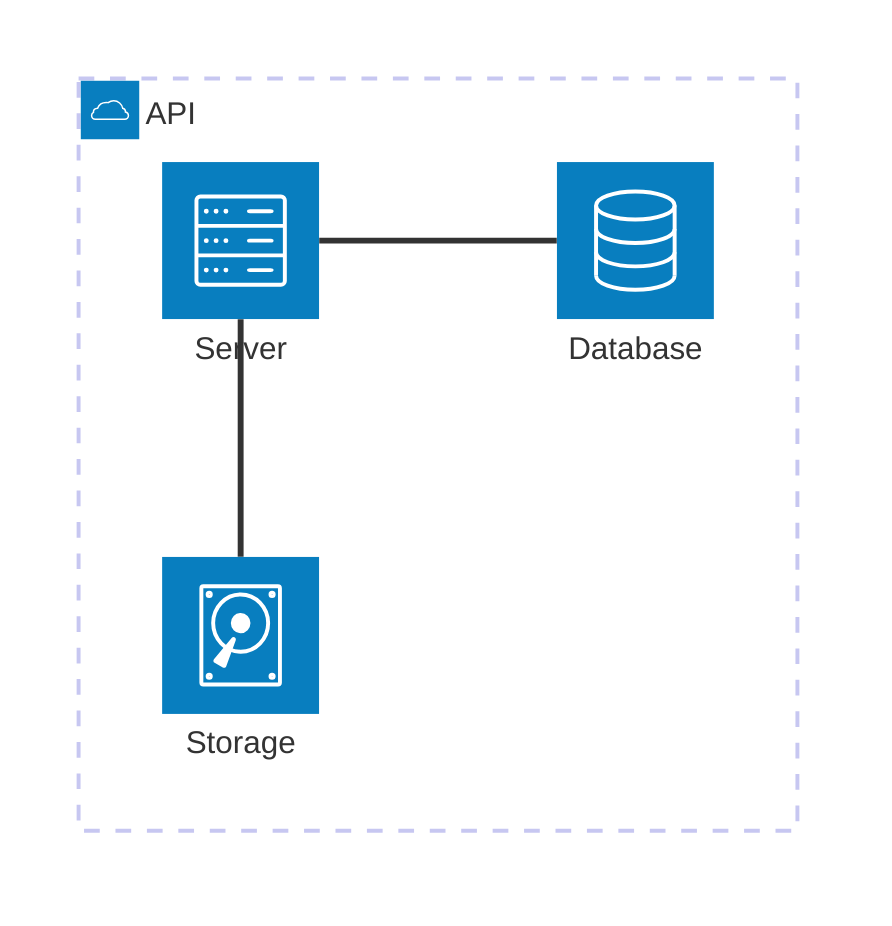
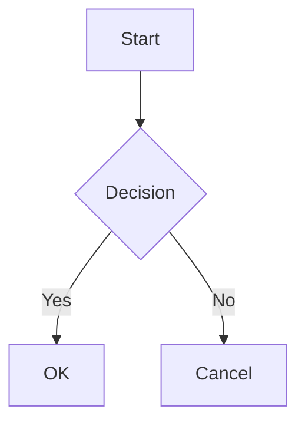
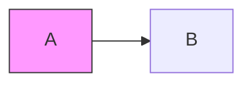

# 🛠️ GAIA AIR Architecture (General AI Architecture as Aerospace Infrastructural Requirement)

---

## 📐 Architecture Layers Overview

### 🧑‍💻 User Interface Layer
- **Web/Desktop Interface**: Unified access point for users.
- **3D Visualization**: Immersive display of models and simulations.
- **Collaboration Tools**: Team-based design and maintenance coordination.
- **Analytics Dashboard**: Real-time monitoring and KPI insights.

---

### 🧩 Application Layer
- **Design & Simulation Module**: Integrates AI in early-stage design and aerospace simulations.
- **Manufacturing & Production Module**: Smart factory interfaces and digital twin integration.
- **Maintenance, Repair & Overhaul (MRO)**: AI-driven predictive maintenance with visual inspections.
- **Regulatory Compliance Module**: Automates validation against standards (e.g., FAA, EASA).
- **Knowledge Management Module**: Links tribal knowledge with semantic context.

---

### 🧠 AI Services Layer
- **Generative Design Engine (GEN)**: Creates design variants under constraint models.
- **AI Simulation Accelerator (SIM)**: Speeds up simulations via surrogate modeling and quantum backends.
- **Predictive Analytics Engine (PRED)**: Degradation, anomaly, and failure forecasting.
- **NLP & Document Processing (NLP)**: Regulatory doc analysis and intelligent search.
- **Computer Vision Services (CV)**: Image-based detection in MRO and manufacturing.
- **Knowledge Graph (KG)**: Contextual linking of systems, materials, and processes.
- **Reinforcement Learning (RL)**: Adaptive policies for control and decision-making.

---

### 🔗 Data Integration Layer
- **API Gateway**: Secure and scalable access interface.
- **ETL Pipelines**: Structured extraction from legacy systems.
- **Data Streaming**: Real-time ingestion from sensor/IOT feeds.
- **Distributed Cache**: Fast access layer for AI computation and dashboards.

---

### 📡 Data Sources
- **CAD/CAM Systems**: Design files and manufacturing details.
- **PLM Systems**: Product lifecycle tracking.
- **ERP Systems**: Enterprise resource planning data.
- **IoT & Sensor Data**: Telemetry and condition monitoring.
- **Document Repositories**: Manuals, specifications, compliance records.
- **Regulatory Databases**: Certification rules and airworthiness directives.

---

## 📊 Visual Architecture Diagram


---

## 🔒 Future Enhancements (Optional)
- **🧬 Quantum Integration**: QAOA/VQE for advanced optimization tasks.
- **🔗 Blockchain Audit Trails**: Immutable compliance and process verification.
- **🌐 Federated Learning**: Secure model training across global partners.GAIA AIR Architecture Documentation
 GAIA AIR Functional Modules & System Architecture
This document presents two comprehensive diagrams outlining the **functional modules** and **system
architecture** of the GAIA AIR (General AI Architecture as Aerospace Infrastructural Requirement)
initiative.
---
 ## GAIA AIR Functional Modules
 
 ```mermaid
flowchart TD
    subgraph Design_Simulation_Module
        direction TB
        DS1["Generative Design"]
        DS1 --> DS2["Topology optimization algorithms"]
        DS1 --> DS3["Neural networks for design space exploration"]
        DS1 --> DS4["Cloud-based parallel computing"]
        DS1 --> DS5["Expected Benefits: 40-60% design cycle reduction, 15-30% weight reduction"]
    end

    subgraph Manufacturing_Production_Module
        direction TB
        MP1["Automated Manufacturing Planning"]
        MP1 --> MP2["Process planning AI"]
        MP1 --> MP3["Toolpath optimization"]
        MP1 --> MP4["Digital twin simulation"]
        MP1 --> MP5["Expected Benefits: 40-60% planning time reduction, optimized toolpaths"]
    end

    subgraph MRO_Module
        direction TB
        MRO1["Predictive Maintenance for Aircraft"]
        MRO1 --> MRO2["Time series analysis"]
        MRO1 --> MRO3["Remaining useful life prediction"]
        MRO1 --> MRO4["Digital twin modeling"]
        MRO1 --> MRO5["Expected Benefits: 30-50% reduction in unscheduled maintenance"]
    end

    subgraph Regulatory_Compliance_Module
        direction TB
        RC1["Automated Document Generation"]
        RC1 --> RC2["Natural language generation"]
        RC1 --> RC3["Graph-to-text generation"]
        RC1 --> RC4["Template-based generation"]
        RC1 --> RC5["Expected Benefits: 70-90% reduction in documentation time"]
    end

    DS1 --> MP1
    MP1 --> MRO1
    MRO1 --> RC1

    style DS1 fill:#ffcccc,color:#000
    style MP1 fill:#ccffcc,color:#000
    style MRO1 fill:#ccccff,color:#000
    style RC1 fill:#ffccee,color:#000
```
---
 ## GAIA AIR System Architecture
## Example Syntax for Architecture Diagram




```mermaid 
graph TB
  subgraph interfaceLayer [User Interface Layer]
    UI(Web/Desktop Interface)
    VIS(3D Visualization)
    COLLAB(Collaboration Tools)
    DASH(Analytics Dashboard)
  end
  
  subgraph applicationLayer [Application Layer]
    DES(Design & Simulation Module)
    MFG(Manufacturing & Production Module)
    MRO(Maintenance, Repair & Overhaul Module)
    REG(Regulatory Compliance Module)
    KM(Knowledge Management Module)
  end
  
  subgraph aiServicesLayer [AI Services Layer]
    GEN(Generative Design Engine)
    SIM(AI Simulation Accelerator)
    PRED(Predictive Analytics Engine)
    NLP(NLP & Document Processing)
    CV(Computer Vision Services)
    KG(Knowledge Graph)
    RL(Reinforcement Learning)
  end
  
  subgraph dataIntegrationLayer [Data Integration Layer]
    API(API Gateway)
    ETL(ETL Pipelines)
    STREAM(Data Streaming)
    CACHE(Distributed Cache)
  end
  
  subgraph dataSources [Data Sources]
    CAD(CAD/CAM Systems)
    PLM(PLM Systems)
    ERP(ERP Systems)
    IOT(IoT & Sensor Data)
    DOC(Document Repositories)
    REG_DB(Regulatory Databases)
  end
  
  subgraph securityGov [Security & Governance]
    AUTH(Authentication & Authorization)
    AUDIT(Audit & Compliance)
    ENCRYPT(Encryption Services)
    POLICY(Policy Management)
  end

  UI --> DES
  UI --> MFG
  COLLAB --> MRO
  DASH --> REG
  DES --> GEN
  SIM --> PRED
  NLP --> NLP
  API --> ETL
  ETL --> CAD
  STREAM --> IOT
  AUTH --> UI
  ENCRYPT --> API
````
---

## 1. Design and Simulation Module

### Generative Design

**Key Technologies:**

- Topology optimization algorithms
- Genetic algorithms and evolutionary computing
- Neural networks for design space exploration
- Cloud-based parallel computing


**Data Sources:**

- CAD models and design specifications
- Material properties databases
- Performance requirements
- Manufacturing constraints
- Historical design data


**AI Algorithms:**

- Multi-objective optimization algorithms
- Physics-informed neural networks
- Evolutionary algorithms for design exploration
- Reinforcement learning for design optimization


**Integration Points:**

- CATIA, Siemens NX, SolidWorks via APIs
- STEP/IGES data exchange formats
- PLM systems for design management


**Expected Benefits:**

- 40-60% reduction in design cycle time
- 15-30% weight reduction in components
- Exploration of novel design solutions
- Improved performance-to-weight ratios


Here's a conceptual implementation of the generative design engine:

```python project="Aerospace GenAI" file="generative_design_engine.py"
...
```

### AI-Powered Simulation

**Key Technologies:**

- Physics-informed neural networks
- Surrogate modeling
- Deep learning for simulation acceleration
- Gaussian process regression


**Data Sources:**

- CFD and FEA simulation results
- Flight test data
- Wind tunnel data
- Material models


**AI Algorithms:**

- Convolutional neural networks for spatial data
- Recurrent neural networks for time-series data
- Gaussian process regression for surrogate models
- Transfer learning for model adaptation


**Integration Points:**

- ANSYS, NASTRAN, Fluent, Abaqus
- Simulation data management systems
- High-performance computing clusters


**Expected Benefits:**

- 90-99% reduction in simulation time
- Broader design space exploration
- Real-time simulation capabilities
- Reduced computational costs


## 2. Manufacturing and Production Module

### Automated Manufacturing Planning

**Key Technologies:**

- Process planning AI
- Toolpath optimization
- Robotic path planning
- Digital twin simulation


**Data Sources:**

- CAD/CAM models
- Machine capabilities
- Tool libraries
- Material properties
- Manufacturing constraints


**AI Algorithms:**

- Hierarchical task network planning
- Genetic algorithms for process optimization
- Reinforcement learning for toolpath generation
- Machine learning for cost and time prediction


**Integration Points:**

- CAM software (Mastercam, Siemens NX CAM)
- Robotic programming systems
- Manufacturing execution systems
- ERP systems


**Expected Benefits:**

- 40-60% reduction in planning time
- 15-25% increase in machine utilization
- Optimized toolpaths and process sequences
- Reduced manufacturing costs


Here's a conceptual implementation of the manufacturing planning system:

```
TypeScript
/**
 * Aerospace GenAI 360 - Manufacturing Planning System
 * 
 * This module provides intelligent manufacturing planning capabilities for aerospace components.
 * It analyzes component features, determines required operations, selects appropriate machines and tools,
 * and generates optimized manufacturing plans with detailed operation parameters.
 */

interface Component {
  id: string;
  geometry: string; // Path to CAD file
  material: Material;
  tolerances: Tolerance[];
  features: Feature[];
  criticalCharacteristics: CriticalCharacteristic[];
}

interface Material {
  id: string;
  name: string;
  type: string;
  properties: MaterialProperties;
  specification: string; // e.g., "AMS4911"
}

interface MaterialProperties {
  density: number;
  tensileStrength: number;
  yieldStrength: number;
  elongation: number;
  hardness: number;
  thermalConductivity: number;
  // Other properties...
}

interface Tolerance {
  featureId: string;
  type: "dimensional" | "geometric" | "surface";
  value: number;
  unit: string;
}

interface Feature {
  id: string;
  type: "hole" | "pocket" | "slot" | "boss" | "fillet" | "chamfer" | "thread";
  parameters: Record<string, any>;
  position: [number, number, number];
  orientation: [number, number, number];
}

interface CriticalCharacteristic {
  id: string;
  featureId: string;
  description: string;
  inspectionMethod: string;
  acceptanceCriteria: string;
}

interface Machine {
  id: string;
  name: string;
  type: "mill" | "lathe" | "grinder" | "edm" | "additive";
  capabilities: MachineCapabilities;
  availability: number; // Percentage of time available
  costPerHour: number;
}

interface MachineCapabilities {
  maxWorkpieceSize: [number, number, number];
  accuracy: number;
  repeatability: number;
  maxSpindleSpeed: number;
  maxFeedRate: number;
  supportedMaterials: string[];
  supportedOperations: string[];
}

interface Tool {
  id: string;
  type: string;
  diameter: number;
  length: number;
  material: string;
  maxDepthOfCut: number;
  maxFeedRate: number;
  recommendedSpindleSpeed: number;
  supportedMaterials: string[];
}

interface Operation {
  id: string;
  type: string;
  featureId: string;
  machineId: string;
  toolId: string;
  setupTime: number;
  processingTime: number;
  parameters: Record<string, any>;
}

interface ManufacturingPlan {
  componentId: string;
  operations: Operation[];
  setupInstructions: string[];
  estimatedTime: number;
  estimatedCost: number;
  qualityCheckpoints: QualityCheckpoint[];
}

interface QualityCheckpoint {
  operationId: string;
  characteristics: string[];
  inspectionMethod: string;
  acceptanceCriteria: string;
}

class ManufacturingPlanningSystem {
  private components: Map<string, Component> = new Map();
  private machines: Map<string, Machine> = new Map();
  private tools: Map<string, Tool> = new Map();

  constructor() {
    // Initialize system
    console.log("Initializing Manufacturing Planning System");
  }

  public addComponent(component: Component): void {
    this.components.set(component.id, component);
    console.log(`Added component: ${component.id}`);
  }

  public addMachine(machine: Machine): void {
    this.machines.set(machine.id, machine);
    console.log(`Added machine: ${machine.id}`);
  }

  public addTool(tool: Tool): void {
    this.tools.set(tool.id, tool);
    console.log(`Added tool: ${tool.id}`);
  }

  public async generateManufacturingPlan(componentId: string): Promise<ManufacturingPlan> {
    console.log(`Generating manufacturing plan for component: ${componentId}`);
    
    const component = this.components.get(componentId);
    if (!component) {
      throw new Error(`Component not found: ${componentId}`);
    }
    
    // 1. Analyze component features
    const features = this.analyzeFeatures(component);
    
    // 2. Determine required operations for each feature
    const requiredOperations = this.determineRequiredOperations(features, component.material);
    
    // 3. Select appropriate machines and tools
    const selectedMachinesAndTools = this.selectMachinesAndTools(requiredOperations);
    
    // 4. Sequence operations for optimal efficiency
    const sequencedOperations = this.sequenceOperations(selectedMachinesAndTools);
    
    // 5. Generate detailed operation parameters
    const detailedOperations = this.generateOperationParameters(sequencedOperations, component);
    
    // 6. Define quality checkpoints
    const qualityCheckpoints = this.defineQualityCheckpoints(detailedOperations, component.criticalCharacteristics);
    
    // 7. Calculate estimated time and cost
    const estimatedTime = this.calculateEstimatedTime(detailedOperations);
    const estimatedCost = this.calculateEstimatedCost(detailedOperations);
    
    // 8. Generate setup instructions
    const setupInstructions = this.generateSetupInstructions(detailedOperations);
    
    // 9. Create and return the manufacturing plan
    const manufacturingPlan: ManufacturingPlan = {
      componentId,
      operations: detailedOperations,
      setupInstructions,
      estimatedTime,
      estimatedCost,
      qualityCheckpoints
    };
    
    console.log(`Manufacturing plan generated for component: ${componentId}`);
    console.log(`Estimated time: ${estimatedTime} minutes`);
    console.log(`Estimated cost: $${estimatedCost.toFixed(2)}`);
    
    return manufacturingPlan;
  }

  private analyzeFeatures(component: Component): Feature[] {
    console.log(`Analyzing features for component: ${component.id}`);
    // In a real implementation, this would analyze the CAD model to extract features
    return component.features;
  }

  private determineRequiredOperations(features: Feature[], material: Material): any[] {
    console.log(`Determining required operations for ${features.length} features`);
    
    // Map features to required operations
    const operations = features.map(feature => {
      switch (feature.type) {
        case "hole":
          return {
            featureId: feature.id,
            operations: ["center-drilling", "drilling", "reaming"]
          };
        case "pocket":
          return {
            featureId: feature.id,
            operations: ["roughing", "finishing"]
          };
        case "slot":
          return {
            featureId: feature.id,
            operations: ["roughing", "finishing"]
          };
        case "boss":
          return {
            featureId: feature.id,
            operations: ["roughing", "finishing"]
          };
        case "fillet":
          return {
            featureId: feature.id,
            operations: ["finishing"]
          };
        case "chamfer":
          return {
            featureId: feature.id,
            operations: ["chamfering"]
          };
        case "thread":
          return {
            featureId: feature.id,
            operations: ["threading"]
          };
        default:
          return {
            featureId: feature.id,
            operations: ["unknown"]
          };
      }
    });
    
    return operations;
  }

  private selectMachinesAndTools(requiredOperations: any[]): any[] {
    console.log(`Selecting machines and tools for operations`);
    
    // For each required operation, select appropriate machine and tool
    const machinesAndTools = requiredOperations.flatMap(reqOp => {
      return reqOp.operations.map(operation => {
        // Find suitable machines for this operation
        const suitableMachines = Array.from(this.machines.values()).filter(machine => 
          machine.capabilities.supportedOperations.includes(operation)
        );
        
        // Select the most appropriate machine (e.g., based on availability, cost)
        const selectedMachine = suitableMachines.reduce((best, current) => 
          current.availability > best.availability ? current : best
        , suitableMachines[0]);
        
        // Find suitable tools for this operation
        const suitableTools = Array.from(this.tools.values()).filter(tool => 
          tool.type === operation || tool.type.includes(operation)
        );
        
        // Select the most appropriate tool
        const selectedTool = suitableTools[0]; // Simplified selection
        
        return {
          featureId: reqOp.featureId,
          operation,
          machineId: selectedMachine?.id,
          toolId: selectedTool?.id
        };
      });
    });
    
    return machinesAndTools;
  }

  private sequenceOperations(operations: any[]): any[] {
    console.log(`Sequencing ${operations.length} operations for optimal efficiency`);
    
    // Group operations by machine to minimize setups
    const operationsByMachine = operations.reduce((groups, op) => {
      if (!groups[op.machineId]) {
        groups[op.machineId] = [];
      }
      groups[op.machineId].push(op);
      return groups;
    }, {});
    
    // For each machine, sequence operations to minimize tool changes
    const sequencedOperations = [];
    
    for (const machineId in operationsByMachine) {
      const machineOperations = operationsByMachine[machineId];
      
      // Group by tool
      const operationsByTool = machineOperations.reduce((groups, op) => {
        if (!groups[op.toolId]) {
          groups[op.toolId] = [];
        }
        groups[op.toolId].push(op);
        return groups;
      }, {});
      
      // Add all operations for each tool in sequence
      for (const toolId in operationsByTool) {
        sequencedOperations.push(...operationsByTool[toolId]);
      }
    }
    
    return sequencedOperations;
  }

  private generateOperationParameters(operations: any[], component: Component): Operation[] {
    console.log(`Generating detailed parameters for ${operations.length} operations`);
    
    return operations.map((op, index) => {
      const machine = this.machines.get(op.machineId);
      const tool = this.tools.get(op.toolId);
      const feature = component.features.find(f => f.id === op.featureId);
      
      // Calculate processing time based on feature, material, machine, and tool
      const setupTime = 5; // Simplified - would be calculated based on complexity
      const processingTime = this.calculateProcessingTime(feature, component.material, machine, tool);
      
      // Generate operation-specific parameters
      const parameters = this.generateOperationSpecificParameters(op.operation, feature, tool);
      
      return {
        id: `op-${index + 1}`,
        type: op.operation,
        featureId: op.featureId,
        machineId: op.machineId,
        toolId: op.toolId,
        setupTime,
        processingTime,
        parameters
      };
    });
  }

  private calculateProcessingTime(feature: Feature, material: Material, machine: Machine, tool: Tool): number {
    // Simplified calculation - would be much more complex in reality
    let baseTime = 0;
    
    switch (feature.type) {
      case "hole":
        baseTime = feature.parameters.depth / 10; // minutes per 10mm depth
        break;
      case "pocket":
        baseTime = (feature.parameters.length * feature.parameters.width * feature.parameters.depth) / 1000;
        break;
      case "slot":
        baseTime = (feature.parameters.length * feature.parameters.width * feature.parameters.depth) / 1500;
        break;
      default:
        baseTime = 5; // Default time in minutes
    }
    
    // Adjust for material hardness
    const materialFactor = material.properties.hardness / 100;
    
    // Adjust for machine efficiency
    const machineFactor = 1 / (machine.capabilities.maxFeedRate / 1000);
    
    return baseTime * materialFactor * machineFactor;
  }

  private generateOperationSpecificParameters(operation: string, feature: Feature, tool: Tool): Record<string, any> {
    // Generate operation-specific parameters based on the feature and tool
    switch (operation) {
      case "drilling":
        return {
          spindleSpeed: tool.recommendedSpindleSpeed,
          feedRate: tool.maxFeedRate * 0.8,
          depth: feature.parameters.depth,
          coolant: true
        };
      case "roughing":
        return {
          spindleSpeed: tool.recommendedSpindleSpeed * 0.9,
          feedRate: tool.maxFeedRate * 0.7,
          depthOfCut: tool.maxDepthOfCut * 0.8,
          stepover: tool.diameter * 0.5,
          coolant: true
        };
      case "finishing":
        return {
          spindleSpeed: tool.recommendedSpindleSpeed * 1.1,
          feedRate: tool.maxFeedRate * 0.5,
          depthOfCut: tool.maxDepthOfCut * 0.3,
          stepover: tool.diameter * 0.1,
          coolant: true
        };
      default:
        return {
          spindleSpeed: tool.recommendedSpindleSpeed,
          feedRate: tool.maxFeedRate * 0.6
        };
    }
  }

  private defineQualityCheckpoints(operations: Operation[], criticalCharacteristics: CriticalCharacteristic[]): QualityCheckpoint[] {
    console.log(`Defining quality checkpoints based on ${criticalCharacteristics.length} critical characteristics`);
    
    const checkpoints: QualityCheckpoint[] = [];
    
    // Map critical characteristics to relevant operations
    criticalCharacteristics.forEach(cc => {
      const relevantOperations = operations.filter(op => op.featureId === cc.featureId);
      
      if (relevantOperations.length > 0) {
        // Add checkpoint after the last operation for this feature
        const lastOperation = relevantOperations[relevantOperations.length - 1];
        
        checkpoints.push({
          operationId: lastOperation.id,
          characteristics: [cc.id],
          inspectionMethod: cc.inspectionMethod,
          acceptanceCriteria: cc.acceptanceCriteria
        });
      }
    });
    
    return checkpoints;
  }

  private calculateEstimatedTime(operations: Operation[]): number {
    // Sum setup and processing times for all operations
    return operations.reduce((total, op) => total + op.setupTime + op.processingTime, 0);
  }

  private calculateEstimatedCost(operations: Operation[]): number {
    // Calculate cost based on machine time and material
    let totalCost = 0;

    operations.forEach(op => {
      const machine = this.machines.get(op.machineId);
      if (machine) {
        // Cost = machine cost per hour * time in hours
        const operationTimeInHours = (op.setupTime + op.processingTime) / 60;
        totalCost += machine.costPerHour * operationTimeInHours;
      }
    });
    
    // Add material cost (would be calculated based on component volume and material)
    // This is simplified for the example
    totalCost += 100;
    
    return totalCost;
  }

  private generateSetupInstructions(operations: Operation[]): string[] {
    console.log(`Generating setup instructions for ${operations.length} operations`);
    
    const instructions: string[] = [];
    let currentMachine = '';
    
    operations.forEach(op => {
      const machine = this.machines.get(op.machineId);
      const tool = this.tools.get(op.toolId);
      
      if (machine && machine.id !== currentMachine) {
        currentMachine = machine.id;
        instructions.push(`Setup component on ${machine.name} (${machine.type})`);
      }
      
      if (tool) {
        instructions.push(`Load tool: ${tool.id} - ${tool.type} (${tool.diameter}mm diameter)`);
      }
      
      instructions.push(`Execute ${op.type} operation on feature ${op.featureId} with parameters: ${JSON.stringify(op.parameters)}`);
    });
    
    return instructions;
  }
}

// Example usage
async function demonstrateManufacturingPlanning() {
  const planningSystem = new ManufacturingPlanningSystem();

  // Add sample machines
  planningSystem.addMachine({
    id: "mill-1",
    name: "Haas VF-2",
    type: "mill",
    capabilities: {
      maxWorkpieceSize: [762, 406, 508],
      accuracy: 0.005,
      repeatability: 0.003,
      maxSpindleSpeed: 12000,
      maxFeedRate: 500,
      supportedMaterials: ["aluminum", "steel", "titanium"],
      supportedOperations: ["drilling", "milling", "boring", "tapping", "roughing", "finishing"]
    },
    availability: 0.8,
    costPerHour: 85
  });

  planningSystem.addMachine({
    id: "lathe-1",
    name: "Haas ST-20",
    type: "lathe",
    capabilities: {
      maxWorkpieceSize: [508, 508, 508],
      accuracy: 0.005,
      repeatability: 0.003,
      maxSpindleSpeed: 4000,
      maxFeedRate: 300,
      supportedMaterials: ["aluminum", "steel", "titanium"],
      supportedOperations: ["turning", "facing", "threading", "grooving"]
    },
    availability: 0.7,
    costPerHour: 75
  });

  // Add sample tools
  planningSystem.addTool({
    id: "drill-1",
    type: "drilling",
    diameter: 10,
    length: 100,
    material: "carbide",
    maxDepthOfCut: 30,
    maxFeedRate: 200,
    recommendedSpindleSpeed: 3000,
    supportedMaterials: ["aluminum", "steel"]
  });

  planningSystem.addTool({
    id: "endmill-1",
    type: "roughing",
    diameter: 20,
    length: 80,
    material: "carbide",
    maxDepthOfCut: 10,
    maxFeedRate: 300,
    recommendedSpindleSpeed: 4000,
    supportedMaterials: ["aluminum", "steel", "titanium"]
  });

  planningSystem.addTool({
    id: "endmill-2",
    type: "finishing",
    diameter: 10,
    length: 60,
    material: "carbide",
    maxDepthOfCut: 5,
    maxFeedRate: 400,
    recommendedSpindleSpeed: 6000,
    supportedMaterials: ["aluminum", "steel", "titanium"]
  });

  // Add sample component
  const sampleComponent: Component = {
    id: "bracket-1",
    geometry: "path/to/bracket.step",
    material: {
      id: "ti64",
      name: "Ti-6Al-4V",
      type: "titanium",
      properties: {
        density: 4.43,
        tensileStrength: 950,
        yieldStrength: 880,
        elongation: 14,
        hardness: 36,
        thermalConductivity: 6.7
      },
      specification: "AMS4911"
    },
    tolerances: [
      {
        featureId: "hole-1",
        type: "dimensional",
        value: 0.02,
        unit: "mm"
      },
      {
        featureId: "pocket-1",
        type: "surface",
        value: 1.6,
        unit: "Ra"
      }
    ],
    features: [
      {
        id: "hole-1",
        type: "hole",
        parameters: {
          diameter: 10,
          depth: 30,
          throughHole: true
        },
        position: [50, 50, 0],
        orientation: [0, 0, 1]
      },
      {
        id: "pocket-1",
        type: "pocket",
        parameters: {
          length: 100,
          width: 60,
          depth: 20,
          cornerRadius: 10
        },
        position: [100, 100, 0],
        orientation: [0, 0, 1]
      }
    ],
    criticalCharacteristics: [
      {
        id: "cc-1",
        featureId: "hole-1",
        description: "Hole diameter critical for assembly",
        inspectionMethod: "CMM",
        acceptanceCriteria: "10.00 ± 0.02 mm"
      }
    ]
  };

  planningSystem.addComponent(sampleComponent);

  // Generate manufacturing plan
  const plan = await planningSystem.generateManufacturingPlan("bracket-1");

  console.log("Manufacturing Plan:");
  console.log(JSON.stringify(plan, null, 2));
}

demonstrateManufacturingPlanning();
```
### Quality Control and Inspection

**Key Technologies:**

- Computer vision
- Deep learning for defect detection
- 3D scanning and point cloud analysis
- Automated non-destructive testing


**Data Sources:**

- Images from inspection cameras
- 3D scan data
- X-ray and CT scan data
- Ultrasonic testing data
- Design specifications and tolerances


**AI Algorithms:**

- Convolutional neural networks for defect detection
- Semantic segmentation for anomaly localization
- Point cloud processing algorithms
- Anomaly detection models


**Integration Points:**

- Automated inspection systems
- Coordinate measuring machines (CMMs)
- Quality management systems
- Digital twin platforms


**Expected Benefits:**

- 70-90% reduction in inspection time
- Improved defect detection accuracy
- Consistent quality assessment
- Reduced scrap rates


## 3. Maintenance, Repair, and Overhaul (MRO) Module

### Predictive Maintenance for Aircraft

**Key Technologies:**

- Time series analysis
- Anomaly detection
- Remaining useful life prediction
- Digital twin modeling


**Data Sources:**

- Aircraft sensor data
- Flight data recorder information
- Maintenance records
- Component lifecycle data
- Environmental conditions


**AI Algorithms:**

- LSTM networks for time series prediction
- Anomaly detection algorithms
- Survival analysis models
- Physics-informed neural networks


**Integration Points:**

- Aircraft health monitoring systems
- Airline maintenance systems
- Flight operations systems
- Supply chain management systems


**Expected Benefits:**

- 30-50% reduction in unscheduled maintenance
- 15-25% increase in aircraft availability
- Extended component life
- Reduced maintenance costs


### Automated Diagnostics and Troubleshooting

**Key Technologies:**

- Natural language processing
- Knowledge graphs
- Case-based reasoning
- Causal inference models


**Data Sources:**

- Maintenance manuals
- Fault codes
- Troubleshooting guides
- Historical repair data
- Sensor readings


**AI Algorithms:**

- Transformer models for text understanding
- Graph neural networks
- Bayesian networks for causal reasoning
- Classification models for fault diagnosis


**Integration Points:**

- Aircraft maintenance systems
- Electronic technical manuals
- Remote assistance platforms
- Training systems


**Expected Benefits:**

- 40-60% reduction in diagnostic time
- Improved first-time fix rates
- Knowledge capture from aging workforce
- Enhanced technician efficiency


## 4. Regulatory Compliance and Documentation Module

### Automated Document Generation

**Key Technologies:**

- Natural language generation
- Computer vision for diagram creation
- Knowledge extraction
- Template-based generation


**Data Sources:**

- Design data
- Simulation results
- Test reports
- Regulatory requirements
- Industry standards


**AI Algorithms:**

- Large language models for text generation
- Graph-to-text generation
- Template filling algorithms
- Document structure learning


**Integration Points:**

- PLM systems
- Document management systems
- Regulatory submission portals
- Configuration management systems


**Expected Benefits:**

- 70-90% reduction in documentation time
- Improved accuracy and consistency
- Ensured regulatory compliance
- Faster approval processes

```
import json
from typing import Dict, List, Any, Optional, Tuple
from dataclasses import dataclass
from enum import Enum

class ComplianceStatus(Enum):
    COMPLIANT = "compliant"
    NON_COMPLIANT = "non_compliant"
    NEEDS_REVIEW = "needs_review"
    NOT_APPLICABLE = "not_applicable"

@dataclass
class ComplianceRequirement:
    id: str
    description: str
    regulation_id: str
    section: str
    check_function: str
    severity: str  # "critical", "major", "minor"
    applicability_condition: Optional[str] = None

@dataclass
class ComplianceViolation:
    requirement_id: str
    description: str
    severity: str
    affected_elements: List[str]
    recommendation: str

@dataclass
class ComplianceCheckResult:
    status: ComplianceStatus
    score: float  # 0.0 to 1.0
    violations: List[ComplianceViolation]
    timestamp: str
    checked_by: str

class AerospaceComplianceChecker:
    def __init__(self, regulations_db_path: str):
        """Initialize the compliance checker with a regulations database."""
        self.regulations = self._load_regulations(regulations_db_path)
        self.check_functions = {
            # Material requirements
            "check_material_specification": self._check_material_specification,
            "check_material_properties": self._check_material_properties,
            "check_material_traceability": self._check_material_traceability,
            
            # Design requirements
            "check_stress_margins": self._check_stress_margins,
            "check_fatigue_life": self._check_fatigue_life,
            "check_damage_tolerance": self._check_damage_tolerance,
            "check_flammability": self._check_flammability,
            
            # Manufacturing requirements
            "check_process_qualification": self._check_process_qualification,
            "check_special_process_control": self._check_special_process_control,
            "check_nondestructive_testing": self._check_nondestructive_testing,
            
            # Documentation requirements
            "check_drawing_standards": self._check_drawing_standards,
            "check_part_marking": self._check_part_marking,
            "check_certification_documentation": self._check_certification_documentation
        }
    
    def _load_regulations(self, regulations_db_path: str) -> Dict[str, Any]:
        """Load regulations from a JSON database file."""
        try:
            with open(regulations_db_path, 'r') as f:
                return json.load(f)
        except Exception as e:
            print(f"Error loading regulations database: {e}")
            return {}
    
    def check_compliance(self, design_data: Dict[str, Any], regulation_ids: List[str] = None) -> Dict[str, ComplianceCheckResult]:
        """
        Check design data against specified regulations or all applicable regulations.
        
        Args:
            design_data: Dictionary containing design information
            regulation_ids: Optional list of regulation IDs to check against
            
        Returns:
            Dictionary mapping regulation IDs to compliance check results
        """
        results = {}
        
        # Determine which regulations to check
        if regulation_ids:
            regulations_to_check = [reg for reg in self.regulations.values() 
                                   if reg["id"] in regulation_ids]
        else:
            # Check all regulations that are applicable to the design
            regulations_to_check = [reg for reg in self.regulations.values() 
                                   if self._is_regulation_applicable(reg, design_data)]
        
        print(f"Checking compliance against {len(regulations_to_check)} regulations")
        
        # Check each regulation
        for regulation in regulations_to_check:
            reg_id = regulation["id"]
            print(f"Checking compliance with {reg_id}: {regulation['title']}")
            
            # Get requirements for this regulation
            requirements = regulation.get("requirements", [])
            
            violations = []
            total_requirements = len(requirements)
            compliant_requirements = 0
            
            # Check each requirement
            for req in requirements:
                req_id = req["id"]
                check_func_name = req.get("check_function")
                
                # Skip if no check function is specified
                if not check_func_name:
                    print(f"  Warning: No check function specified for requirement {req_id}")
                    continue
                
                # Get the check function
                check_func = self.check_functions.get(check_func_name)
                if not check_func:
                    print(f"  Warning: Check function '{check_func_name}' not implemented for requirement {req_id}")
                    continue
                
                # Check if the requirement is applicable
                if not self._is_requirement_applicable(req, design_data):
                    print(f"  Requirement {req_id} is not applicable to this design")
                    continue
                
                # Check compliance with the requirement
                print(f"  Checking requirement {req_id}: {req['description']}")
                is_compliant, violation_details = check_func(design_data, req)
                
                if is_compliant:
                    compliant_requirements += 1
                    print(f"  ✓ Compliant with requirement {req_id}")
                else:
                    # Create a violation record
                    violation = ComplianceViolation(
                        requirement_id=req_id,
                        description=req["description"],
                        severity=req["severity"],
                        affected_elements=violation_details.get("affected_elements", []),
                        recommendation=violation_details.get("recommendation", "Review and address the non-compliance")
                    )
                    violations.append(violation)
                    print(f"  ✗ Non-compliant with requirement {req_id}: {violation_details.get('reason', 'Unknown reason')}")
            
            # Calculate compliance score
            compliance_score = compliant_requirements / total_requirements if total_requirements > 0 else 1.0
            
            # Determine overall compliance status
            if len(violations) == 0:
                status = ComplianceStatus.COMPLIANT
            elif any(v.severity == "critical" for v in violations):
                status = ComplianceStatus.NON_COMPLIANT
            else:
                status = ComplianceStatus.NEEDS_REVIEW
            
            # Create the compliance check result
            result = ComplianceCheckResult(
                status=status,
                score=compliance_score,
                violations=violations,
                timestamp="2025-03-21T12:34:56Z",  # Would use actual timestamp in real implementation
                checked_by="Aerospace GenAI Compliance Checker v1.0"
            )
            
            results[reg_id] = result
            
            print(f"Compliance check for {reg_id} complete. Status: {status.value}, Score: {compliance_score:.2f}, Violations: {len(violations)}")
        
        return results
    
    def _is_regulation_applicable(self, regulation: Dict[str, Any], design_data: Dict[str, Any]) -> bool:
        """Determine if a regulation is applicable to the given design."""
        # Check applicability based on design attributes
        applicability = regulation.get("applicability", {})
        
        for key, value in applicability.items():
            if key in design_data:
                # If the value is a list, check if design value is in the list
                if isinstance(value, list):
                    if design_data[key] not in value:
                        return False
                # Otherwise, check for exact match
                elif design_data[key] != value:
                    return False
            else:
                # If the key is not in design data, the regulation might not be applicable
                return False
        
        return True
    
    def _is_requirement_applicable(self, requirement: Dict[str, Any], design_data: Dict[str, Any]) -> bool:
        """Determine if a requirement is applicable to the given design."""
        # If no applicability condition is specified, the requirement is applicable
        if "applicability_condition" not in requirement:
            return True
        
        # Parse and evaluate the applicability condition
        condition = requirement["applicability_condition"]
        
        # This is a simplified implementation - in a real system, this would be more sophisticated
        if condition == "has_composite_materials" and design_data.get("has_composite_materials", False):
            return True
        elif condition == "is_primary_structure" and design_data.get("is_primary_structure", False):
            return True
        elif condition == "is_flight_critical" and design_data.get("is_flight_critical", False):
            return True
        elif condition == "has_electrical_systems" and design_data.get("has_electrical_systems", False):
            return True
        elif condition == "is_pressurized" and design_data.get("is_pressurized", False):
            return True
        
        # Default case - if the condition is not recognized, assume it's not applicable
        return False
    
    # Check functions for different requirements
    
    def _check_material_specification(self, design_data: Dict[str, Any], requirement: Dict[str, Any]) -> Tuple[bool, Dict[str, Any]]:
        """Check if materials meet required specifications."""
        materials = design_data.get("materials", [])
        non_compliant_materials = []
        
        for material in materials:
            spec = material.get("specification")
            if not spec or not self._is_valid_material_spec(spec):
                non_compliant_materials.append(material.get("id", "unknown"))
        
        if non_compliant_materials:
            return False, {
                "reason": "Some materials do not meet required specifications",
                "affected_elements": non_compliant_materials,
                "recommendation": "Ensure all materials have valid aerospace material specifications (AMS, MIL, etc.)"
            }
        
        return True, {}
    
    def _is_valid_material_spec(self, spec: str) -> bool:
        """Check if a material specification is valid."""
        valid_prefixes = ["AMS", "MIL", "ASTM", "SAE", "ISO"]
        return any(spec.startswith(prefix) for prefix in valid_prefixes)
    
    def _check_material_properties(self, design_data: Dict[str, Any], requirement: Dict[str, Any]) -> Tuple[bool, Dict[str, Any]]:
        """Check if material properties meet minimum requirements."""
        materials = design_data.get("materials", [])
        non_compliant_materials = []
        
        for material in materials:
            properties = material.get("properties", {})
            
            # Check tensile strength
            if properties.get("tensile_strength", 0) < requirement.get("min_tensile_strength", 0):
                non_compliant_materials.append(material.get("id", "unknown"))
                continue
            
            # Check yield strength
            if properties.get("yield_strength", 0) < requirement.get("min_yield_strength", 0):
                non_compliant_materials.append(material.get("id", "unknown"))
                continue
            
            # Check elongation
            if properties.get("elongation", 0) < requirement.get("min_elongation", 0):
                non_compliant_materials.append(material.get("id", "unknown"))
                continue
        
        if non_compliant_materials:
            return False, {
                "reason": "Some materials do not meet minimum property requirements",
                "affected_elements": non_compliant_materials,
                "recommendation": "Review material properties and ensure they meet minimum requirements"
            }
        
        return True, {}
    
    def _check_material_traceability(self, design_data: Dict[str, Any], requirement: Dict[str, Any]) -> Tuple[bool, Dict[str, Any]]:
        """Check if materials have proper traceability information."""
        materials = design_data.get("materials", [])
        non_compliant_materials = []
        
        for material in materials:
            # Check if traceability information is present
            if not material.get("lot_number") or not material.get("supplier") or not material.get("certification"):
                non_compliant_materials.append(material.get("id", "unknown"))
        
        if non_compliant_materials:
            return False, {
                "reason": "Some materials lack proper traceability information",
                "affected_elements": non_compliant_materials,
                "recommendation": "Ensure all materials have lot numbers, supplier information, and material certifications"
            }
        
        return True, {}
    
    def _check_stress_margins(self, design_data: Dict[str, Any], requirement: Dict[str, Any]) -> Tuple[bool, Dict[str, Any]]:
        """Check if stress margins meet requirements."""
        components = design_data.get("components", [])
        non_compliant_components = []
        
        min_margin = requirement.get("min_margin", 1.5)
        
        for component in components:
            stress_analysis = component.get("stress_analysis", {})
            margin = stress_analysis.get("margin_of_safety", 0)
            
            if margin < min_margin:
                non_compliant_components.append(component.get("id", "unknown"))
        
        if non_compliant_components:
            return False, {
                "reason": f"Some components have stress margins below the required minimum of {min_margin}",
                "affected_elements": non_compliant_components,
                "recommendation": "Review and strengthen components to achieve required stress margins"
            }
        
        return True, {}
    
    def _check_fatigue_life(self, design_data: Dict[str, Any], requirement: Dict[str, Any]) -> Tuple[bool, Dict[str, Any]]:
        """Check if fatigue life meets requirements."""
        components = design_data.get("components", [])
        non_compliant_components = []
        
        min_cycles = requirement.get("min_cycles", 10000)
        
        for component in components:
            fatigue_analysis = component.get("fatigue_analysis", {})
            cycles = fatigue_analysis.get("cycles_to_failure", 0)
            
            if cycles < min_cycles:
                non_compliant_components.append(component.get("id", "unknown"))
        
        if non_compliant_components:
            return False, {
                "reason": f"Some components have fatigue life below the required minimum of {min_cycles} cycles",
                "affected_elements": non_compliant_components,
                "recommendation": "Review and improve fatigue life through design changes or material selection"
            }
        
        return True, {}
    
    def _check_damage_tolerance(self, design_data: Dict[str, Any], requirement: Dict[str, Any]) -> Tuple[bool, Dict[str, Any]]:
        """Check if damage tolerance analysis meets requirements."""
        components = design_data.get("components", [])
        non_compliant_components = []
        
        for component in components:
            if component.get("is_primary_structure", False):
                damage_tolerance = component.get("damage_tolerance_analysis", {})
                
                if not damage_tolerance or not damage_tolerance.get("completed", False):
                    non_compliant_components.append(component.get("id", "unknown"))
                    continue
                
                # Check if critical crack size is sufficient
                min_critical_crack = requirement.get("min_critical_crack_size", 0.5)
                if damage_tolerance.get("critical_crack_size", 0) < min_critical_crack:
                    non_compliant_components.append(component.get("id", "unknown"))
                    continue
        
        if non_compliant_components:
            return False, {
                "reason": "Some primary structure components lack adequate damage tolerance analysis",
                "affected_elements": non_compliant_components,
                "recommendation": "Perform or update damage tolerance analysis for all primary structure components"
            }
        
        return True, {}
    
    def _check_flammability(self, design_data: Dict[str, Any], requirement: Dict[str, Any]) -> Tuple[bool, Dict[str, Any]]:
        """Check if flammability requirements are met."""
        materials = design_data.get("materials", [])
        non_compliant_materials = []
        
        for material in materials:
            if material.get("location", "") == "cabin" or material.get("location", "") == "cockpit":
                flammability = material.get("flammability", {})
                
                if not flammability:
                    non_compliant_materials.append(material.get("id", "unknown"))
                    continue
                
                # Check flame propagation
                if flammability.get("flame_propagation_rate", 0) > requirement.get("max_flame_propagation", 0):
                    non_compliant_materials.append(material.get("id", "unknown"))
                    continue
                
                # Check smoke density
                if flammability.get("smoke_density", 0) > requirement.get("max_smoke_density", 0):
                    non_compliant_materials.append(material.get("id", "unknown"))
                    continue
                
                # Check heat release
                if flammability.get("heat_release", 0) > requirement.get("max_heat_release", 0):
                    non_compliant_materials.append(material.get("id", "unknown"))
                    continue
        
        if non_compliant_materials:
            return False, {
                "reason": "Some cabin/cockpit materials do not meet flammability requirements",
                "affected_elements": non_compliant_materials,
                "recommendation": "Replace non-compliant materials with ones that meet FAR 25.853 flammability requirements"
            }
        
        return True, {}
    
    def _check_process_qualification(self, design_data: Dict[str, Any], requirement: Dict[str, Any]) -> Tuple[bool, Dict[str, Any]]:
        """Check if manufacturing processes are properly qualified."""
        processes = design_data.get("manufacturing_processes", [])
        non_compliant_processes = []
        
        for process in processes:
            qualification = process.get("qualification", {})
            
            if not qualification or not qualification.get("is_qualified", False):
                non_compliant_processes.append(process.get("id", "unknown"))
                continue
            
            # Check if qualification is current
            if qualification.get("expiration_date", "") < "2025-01-01":  # Simplified date check
                non_compliant_processes.append(process.get("id", "unknown"))
                continue
        
        if non_compliant_processes:
            return False, {
                "reason": "Some manufacturing processes are not properly qualified",
                "affected_elements": non_compliant_processes,
                "recommendation": "Ensure all manufacturing processes are qualified according to applicable standards"
            }
        
        return True, {}
    
    def _check_special_process_control(self, design_data: Dict[str, Any], requirement: Dict[str, Any]) -> Tuple[bool, Dict[str, Any]]:
        """Check if special processes have proper controls."""
        processes = design_data.get("manufacturing_processes", [])
        non_compliant_processes = []
        
        for process in processes:
            if process.get("is_special_process", False):
                controls = process.get("process_controls", {})
                
                if not controls or len(controls) == 0:
                    non_compliant_processes.append(process.get("id", "unknown"))
                    continue
                
                # Check if all required controls are in place
                required_controls = ["procedure", "training", "equipment_calibration", "process_monitoring"]
                for control in required_controls:
                    if control not in controls:
                        non_compliant_processes.append(process.get("id", "unknown"))
                        break
        
        if non_compliant_processes:
            return False, {
                "reason": "Some special processes lack proper controls",
                "affected_elements": non_compliant_processes,
                "recommendation": "Implement comprehensive controls for all special processes per AS9100 requirements"
            }
        
        return True, {}
    
    def _check_nondestructive_testing(self, design_data: Dict[str, Any], requirement: Dict[str, Any]) -> Tuple[bool, Dict[str, Any]]:
        """Check if nondestructive testing requirements are met."""
        components = design_data.get("components", [])
        non_compliant_components = []
        
        for component in components:
            if component.get("requires_ndt", False):
                ndt = component.get("nondestructive_testing", {})
                
                if not ndt or not ndt.get("methods", []):
                    non_compliant_components.append(component.get("id", "unknown"))
                    continue
                
                # Check if required NDT methods are specified
                required_methods = requirement.get("required_methods", [])
                for method in required_methods:
                    if method not in ndt.get("methods", []):
                        non_compliant_components.append(component.get("id", "unknown"))
                        break
        
        if non_compliant_components:
            return False, {
                "reason": "Some components lack required nondestructive testing methods",
                "affected_elements": non_compliant_components,
                "recommendation": "Specify appropriate NDT methods for all components requiring inspection"
            }
        
        return True, {}
    
    def _check_drawing_standards(self, design_data: Dict[str, Any], requirement: Dict[str, Any]) -> Tuple[bool, Dict[str, Any]]:
        """Check if drawings meet required standards."""
        drawings = design_data.get("drawings", [])
        non_compliant_drawings = []
        
        for drawing in drawings:
            # Check if drawing has all required elements
            required_elements = ["title_block", "revision_history", "material_specification", 
                                "dimensions", "tolerances", "notes"]
            
            for element in required_elements:
                if element not in drawing or not drawing[element]:
                    non_compliant_drawings.append(drawing.get("id", "unknown"))
                    break
            
            # Check if drawing standard is specified and valid
            standard = drawing.get("standard")
            valid_standards = ["ASME Y14.5", "ISO 128", "MIL-STD-100"]
            
            if not standard or standard not in valid_standards:
                if drawing.get("id") not in non_compliant_drawings:
                    non_compliant_drawings.append(drawing.get("id", "unknown"))
        
        if non_compliant_drawings:
            return False, {
                "reason": "Some drawings do not meet required standards",
                "affected_elements": non_compliant_drawings,
                "recommendation": "Update drawings to comply with aerospace drawing standards (ASME Y14.5, ISO 128, or MIL-STD-100)"
            }
        
        return True, {}
    
    def _check_part_marking(self, design_data: Dict[str, Any], requirement: Dict[str, Any]) -> Tuple[bool, Dict[str, Any]]:
        """Check if part marking requirements are met."""
        components = design_data.get("components", [])
        non_compliant_components = []
        
        for component in components:
            marking = component.get("part_marking", {})
            
            if not marking:
                non_compliant_components.append(component.get("id", "unknown"))
                continue
            
            # Check if all required marking elements are present
            required_elements = ["part_number", "serial_number", "manufacturer_code", "date_code"]
            for element in required_elements:
                if element not in marking or not marking[element]:
                    non_compliant_components.append(component.get("id", "unknown"))
                    break
        
        if non_compliant_components:
            return False, {
                "reason": "Some components do not meet part marking requirements",
                "affected_elements": non_compliant_components,
                "recommendation": "Ensure all components have proper part marking per applicable standards"
            }
        
        return True, {}
    
    def _check_certification_documentation(self, design_data: Dict[str, Any], requirement: Dict[str, Any]) -> Tuple[bool, Dict[str, Any]]:
        """Check if certification documentation is complete."""
        certification = design_data.get("certification_documentation", {})
        missing_documents = []
        
        # Check if all required documents are present
        required_documents = requirement.get("required_documents", [])
        for doc in required_documents:
            if doc not in certification or not certification[doc]:
                missing_documents.append(doc)
        
        if missing_documents:
            return False, {
                "reason": "Some required certification documents are missing",
                "affected_elements": missing_documents,
                "recommendation": "Complete all required certification documentation"
            }
        
        return True, {}

# Example usage
if __name__ == "__main__":
    # Create a compliance checker
    checker = AerospaceComplianceChecker("aerospace_regulations.json")
    
    # Sample design data for a bracket
    bracket_design = {
        "id": "BRACKET-001",
        "name": "Engine Mount Bracket",
        "type": "structural",
        "is_primary_structure": True,
        "is_flight_critical": True,
        "has_composite_materials": False,
        "has_electrical_systems": False,
        "is_pressurized": False,
        
        "materials": [
            {
                "id": "MAT-001",
                "name": "Titanium Alloy",
                "specification": "AMS4911",
                "lot_number": "TI-12345",
                "supplier": "Aerospace Metals Inc.",
                "certification": "CERT-TI-12345",
                "properties": {
                    "tensile_strength": 950,
                    "yield_strength": 880,
                    "elongation": 14,
                    "density": 4.43
                }
            }
        ],
        
        "components": [
            {
                "id": "COMP-001",
                "name": "Main Body",
                "is_primary_structure": True,
                "requires_ndt": True,
                "stress_analysis": {
                    "margin_of_safety": 1.8,
                    "analysis_method": "FEA",
                    "load_cases": ["1G", "3G", "9G"]
                },
                "fatigue_analysis": {
                    "cycles_to_failure": 50000,
                    "analysis_method": "S-N Curve"
                },
                "damage_tolerance_analysis": {
                    "completed": True,
                    "critical_crack_size": 0.8,
                    "crack_growth_rate": 0.00001
                },
                "nondestructive_testing": {
                    "methods": ["ultrasonic", "penetrant"],
                    "acceptance_criteria": "MIL-STD-1907"
                },
                "part_marking": {
                    "part_number": "BRACKET-001",
                    "serial_number": "SN-12345",
                    "manufacturer_code": "ABC",
                    "date_code": "2025-03"
                }
            }
        ],
        
        "manufacturing_processes": [
            {
                "id": "PROC-001",
                "name": "CNC Machining",
                "is_special_process": False,
                "qualification": {
                    "is_qualified": True,
                    "qualification_date": "2024-06-15",
                    "expiration_date": "2026-06-15"
                }
            },
            {
                "id": "PROC-002",
                "name": "Heat Treatment",
                "is_special_process": True,
                "qualification": {
                    "is_qualified": True,
                    "qualification_date": "2024-05-10",
                    "expiration_date": "2026-05-10"
                },
                "process_controls": {
                    "procedure": "HT-PROC-001",
                    "training": "HT-TRAIN-001",
                    "equipment_calibration": "CAL-OVEN-001",
                    "process_monitoring": "MONITOR-HT-001"
                }
            }
        ],
        
        "drawings": [
            {
                "id": "DWG-001",
                "name": "Engine Mount Bracket Assembly",
                "standard": "ASME Y14.5",
                "title_block": True,
                "revision_history": True,
                "material_specification": True,
                "dimensions": True,
                "tolerances": True,
                "notes": True
            }
        ],
        
        "certification_documentation": {
            "design_data_sheet": "DDS-BRACKET-001",
            "material_certificates": "MATCERT-BRACKET-001",
            "test_reports": "TESTREP-BRACKET-001",
            "declaration_of_conformity": "DOC-BRACKET-001"
        }
    }
    
    # Check compliance against FAA regulations
    results = checker.check_compliance(bracket_design, ["FAR25.603", "FAR25.605", "FAR25.613"])
    
    # Print results
    for reg_id, result in results.items():
        print(f"\nCompliance with {reg_id}:")
        print(f"Status: {result.status.value}")
        print(f"Score: {result.score:.2f}")
        print(f"Violations: {len(result.violations)}")
        
        for i, violation in enumerate(result.violations):
            print(f"\nViolation {i+1}:")
            print(f"  Requirement: {violation.requirement_id}")
            print(f"  Description: {violation.description}")
            print(f"  Severity: {violation.severity}")
            print(f"  Affected Elements: {', '.join(violation.affected_elements)}")
            print(f"  Recommendation: {violation.recommendation}")
```
### Compliance Checking and Validation

**Key Technologies:**

- Rule-based systems
- Semantic reasoning
- Knowledge graphs
- Natural language processing


**Data Sources:**

- Regulatory documents (FAA, EASA)
- Industry standards (AS9100, RTCA DO-178C)
- Design specifications
- Manufacturing processes
- Test reports


**AI Algorithms:**

- Rule engines for regulatory enforcement
- NLP for regulatory text interpretation
- Knowledge graph reasoning
- Machine learning for compliance risk assessment


**Integration Points:**

- PLM systems
- Document management systems
- Quality management systems
- Regulatory submission portals


**Expected Benefits:**

- 50-70% reduction in compliance issues
- Faster regulatory approvals
- Reduced risk of penalties
- Streamlined audit processes


## 5. Implementation Roadmap

### Phase 1: Foundation Building (6-9 months)

**Key Milestones:**

- Establish core data platform (data lake, knowledge graph)
- Develop initial data integration pipelines
- Implement requirements management module
- Create knowledge management foundation
- Design user interface framework
- Implement basic security measures


**Deliverables:**

- Working prototype of core platform
- Initial data integration framework
- Basic knowledge base


### Phase 2: Design & Simulation (9-12 months)

**Key Milestones:**

- Implement generative design module
- Develop AI-powered simulation capabilities
- Enhance requirements management
- Improve knowledge management
- Implement visualization capabilities


**Deliverables:**

- Functional design and simulation modules
- Enhanced requirements traceability
- Initial reporting dashboards


### Phase 3: Manufacturing & Production (12-15 months)

**Key Milestones:**

- Implement manufacturing planning module
- Develop predictive maintenance for equipment
- Create quality control & inspection module
- Integrate with ERP systems


**Deliverables:**

- Functional manufacturing modules
- Integration with production systems
- Quality control capabilities


### Phase 4: MRO & Compliance (15-18 months)

**Key Milestones:**

- Implement aircraft predictive maintenance
- Develop diagnostics & troubleshooting
- Create document generation module
- Implement compliance checking


**Deliverables:**

- Functional MRO modules
- Regulatory compliance capabilities
- Documentation automation


### Phase 5: Optimization & Expansion (Ongoing)

**Key Milestones:**

- Continuous model improvement
- Expand regulatory coverage
- Add integration with additional systems
- Enhance visualization and reporting


**Deliverables:**

- Enhanced platform capabilities
- Broader integration ecosystem
- Advanced analytics


## 6. Key Challenges and Mitigation Strategies

| Challenge | Mitigation Strategy
|-----|-----
| Data Quality & Integration | Implement robust data governance, cleansing pipelines, and standardization protocols
| Integration Complexity | Adopt industry-standard formats, develop custom connectors, collaborate with system vendors
| Regulatory Acceptance | Adopt phased implementation, engage with regulators early, ensure explainability
| AI Model Accuracy | Employ rigorous validation, use diverse training data, implement model monitoring
| Data Security | Implement encryption, access controls, regular security audits
| User Adoption | Develop intuitive interfaces, provide training, involve users in design
| Ethical Considerations | Implement bias detection, ensure transparency, establish ethical guidelines


## 7. Commercialization Model

**Pricing:**

- Subscription-based with tiered pricing
- Based on users, modules, and data volume
- Enterprise agreements for large organizations


**Target Customers:**

- Aerospace manufacturers (OEMs and suppliers)
- Airlines and MRO providers
- Defense contractors
- Engineering firms
- Regulatory agencies


## 8. Team Structure

**Core Team:**

- Project Management
- AI/ML Engineering
- Software Engineering
- Aerospace Domain Experts
- Data Engineering
- UI/UX Design
- Cybersecurity
- Quality Assurance
- Regulatory Compliance
- Customer Success


This comprehensive 360-degree GenAI application for aerospace engineering will transform how the industry approaches design, manufacturing, maintenance, and compliance. By leveraging cutting-edge AI technologies and deep aerospace domain knowledge, the platform will drive innovation, efficiency, and safety across the entire aerospace lifecycle.
---

## I. Introduction to COAFI

The Cosmic Omnidevelopable Aero Foresights Index (COAFI) is a documentation framework designed specifically for the GAIA AIR project. It provides a structured, consistent, and scalable way to organize and manage the vast amount of technical information associated with this complex project. The framework is designed to support *living documentation*, adapting and evolving alongside the project itself. This Master Index, as indicated by the "Draft" status and date in the document header, will be regularly updated to reflect the latest revisions and project documentation structure.

**Purpose of COAFI:**

*   To manage the inherent complexity of the GAIA AIR project documentation.
*   To ensure consistency in documentation style, format, and referencing across all systems and components.
*   To facilitate seamless collaboration and information sharing among diverse engineering and operational teams.
*   To enable efficient searching, retrieval, and contextualization of technical information for various user roles.
*   To rigorously support regulatory compliance and airworthiness/spaceworthiness certification processes.
*   To provide end-to-end traceability and audit trails from high-level system requirements down to detailed component design and implementation specifics.
*   To establish a **contextualized** documentation approach where data is presented with appropriate processing and filtering for specific user needs.
*   To facilitate **circular** documentation processes, allowing for iterative refinement and continuous improvement based on feedback and operational experience.

**Benefits of COAFI:**

*   **Modularity:** Documentation is broken down into independent modules (Parts, Chapters, Documents), enabling focused updates and improvements without impacting the entire framework.
*   **Scalability:** The hierarchical and coded structure is designed to accommodate the continuous growth and expansion of the GAIA AIR project documentation as new systems and technologies are integrated.
*   **Flexibility:** The framework is adaptable and can be modified to incorporate changes in project scope, technology advancements, and evolving documentation requirements.
*   **Enhanced Discoverability:** Facilitates efficient information retrieval through optimized navigation and search functionalities (planned GAIA Quantum Portal integration).
*   **Contextualization:** The "Views" system (planned for future implementation) allows for tailoring documentation presentation to specific user roles, ensuring users access only the most relevant information for their tasks.

**Relationship to ATA Chapters:** COAFI Part I (Airframes) and Part II (Spaceframes) are aligned with the Air Transport Association (ATA) chapter system and Air Transport Association Space (AS) chapter system respectively. This alignment ensures compatibility with industry-standard documentation practices while extending beyond traditional ATA to encompass the unique aspects of GAIA AIR, including quantum technologies, AI, and space operations.

**For a complete overview of the COAFI structure, see [COAFI Structure and Guidelines](Part0/GP-OV-COAFI-0001-A.md).**

---

## II. GAIA AIR Project Overview

The **GAIA AIR (Global Aerospace Infrastructural Agentic AI Intercepting Robotics)** project is a groundbreaking initiative focused on developing a next-generation aerospace platform that seamlessly integrates:

*   **GAIA PULSE (Quantum Propulsion):** A revolutionary quantum propulsion system, designated Q-01, designed to provide efficient, sustainable, and high-performance thrust, potentially harnessing novel physics principles for aerospace propulsion.
*   **GAIA CONTROL (AI-Powered Flight Control - Heuritmática):** An advanced, AI-driven autonomous flight control system, codenamed "Heuritmática (GP-HEUR)", enabling enhanced flight stability, adaptive control laws, flight envelope protection, and optimized flight management through sophisticated AI algorithms and quantum-enhanced computing.
*   **GAIA FAB (Sustainable Materials - AMPEL):** The utilization of advanced, lightweight, and sustainable materials under the AMPEL (Atmospheric Modular Program Enveloped Logics) initiative, focusing on Boron Nitride Nanotube (BNNT) composites, carbon lattice structures, and bio-derived materials to minimize environmental impact and maximize structural performance.
*   **GAIA SPACE (Atmospheric and Space Operations):** A dual-domain aerospace platform with capabilities for both atmospheric flight (AMPEL360XWLRGA airframe) and suborbital/orbital space travel (GAIA SPACE spaceframe), enabling a wide range of missions from sustainable air transport to space tourism and scientific research in both domains.
*   **GAIA COMPUTE (AI and Quantum Computing - HPC/QPU Nodes):**  A distributed, high-performance computing infrastructure, integrating both High-Performance Computing (HPC) and Quantum Processing Units (QPUs), codenamed "Node (GP-NOD)", to support AI model training, complex simulations, real-time data processing, and quantum algorithm execution for various GAIA AIR systems.

GAIA AIR aims to pioneer a new era of sustainable and versatile aerospace transportation, revolutionizing both atmospheric and space travel. The project's overarching objective is to develop a highly efficient, adaptable, and environmentally responsible aerospace platform that not only transforms transportation but also contributes to a deeper understanding of our cosmos and promotes sustainable practices in the aerospace industry.

---

## III. COAFI Documentation Structure

The COAFI documentation system is organized using a hierarchical structure, designed for modularity, scalability, and ease of navigation. The hierarchy consists of the following levels:

*   **Master Index:** The top-level entry point for the entire COAFI documentation set, providing a comprehensive table of contents and links to all Parts, Sections, and key documents (this document - `COAFI.MD`).
*   **Parts:** Major divisions representing distinct domains or aspects of the GAIA AIR project. COAFI is currently divided into Parts 0 through IX, each focusing on a specific area (e.g., Airframes, Spaceframes, Propulsion, Project Management).
*   **Sections (Optional):** Subdivisions within Parts, used for logical grouping of related chapters or documents within a Part. Sections are used as needed to further organize content within larger Parts.
*   **Chapters:** Within each Part (or Section), content is further divided into Chapters, which represent specific systems, subsystems, or functional areas. Part I and Part II utilize an adapted ATA/AS chapter numbering system (00-99, 00-100) for detailed system documentation.
*   **Documents:** The fundamental units of COAFI documentation. Each chapter is composed of individual Markdown files (`.md`) that contain specific information, specifications, procedures, analyses, or reports related to a particular topic within the COAFI framework.

### Document Codes

Each document within the COAFI framework is assigned a unique and structured document code to facilitate organization, identification, and cross-referencing. The document code follows a standardized format:

`[Part Code]-[System Code]-[Subsystem Code]-[Assembly Code]-[Disassembly Code]-[Disassy Code Variant]-[Info Code]-[Info Code Variant]-[Item Location Code]`

| Code Component         | Description                                                                    | Example          |
|-----------------------|--------------------------------------------------------------------------------|------------------|
| **Part Code**         | Identifies the main project area (Part I, Part II, etc.)                         | GP-OV, GP-AM      |
| **System Code**        | Identifies the major system or domain (Airframe, Propulsion, Avionics, etc.)    | GAI, AMPEL, HEUR    |
| **Subsystem Code (Opt)**| Identifies a specific subsystem within a system (optional, used for granularity)| QEE, SSS, IAH     |
| **Assembly Code**       | Numeric code identifying a major assembly or module.                             | 0100, 0200        |
| **Disassembly Code**    | Numeric code identifying a sub-assembly or component within an assembly.       | 001, 005          |
| **Disassembly Code Variant**| Alphanumeric character indicating a variant or revision of a sub-assembly. | A, B, Q01         |
| **Info Code**           | Identifies the type of information contained in the document (Overview, Specification, Procedure, etc.). | OV, SP, DS        |
| **Info Code Variant**   | Alphanumeric character indicating a variant or revision of the information type.| A, B, THEO       |
| **Item Location Code**  | Numeric code indicating the physical location or zone within the aircraft or spaceframe (often "00" for general documents). | 00, FUS, CAB      |

**Refer to [COAFI System and Subsystem Codes (Part0/GP-OV-NUM-0004-001-A.md)](Part0/GP-OV-NUM-0004-001-A.md) for a complete and detailed list of all System Codes, Subsystem Codes, and their corresponding descriptions used within the COAFI framework.**

---

## IV. COAFI Parts Index

The COAFI documentation framework is divided into the following Parts, each representing a major domain within the GAIA AIR project. Click on the Part titles below to navigate to the index page for each Part:

*   **Part 0: Project Overarching Principles (GP-OV)** ([Part0/index.md](Part0/index.md)): Project-wide principles, definitions, introductory material, business plan, and market analysis.
*   **Part 0A: Heuritmática (GP-HEUR)** ([Part0A/index.md](Part0A/index.md)): The foundational principles of Heuritmática.
*   **Part I: Airframes – AMPEL360XWLRGA (GP-AM)** ([PartI/index.md](PartI/index.md)):  Documentation for the atmospheric aircraft, organized by ATA chapters.
*   **Part II: Spaceframes – GAIA SPACE Modules (GP-SM)** ([PartII/index.md](PartII/index.md)): Documentation for space-based systems and operations, organized by AS chapters.
*   **Part III: GAIA Propulsion Modules (GP-PM)** ([PartIII/index.md](PartIII/index.md)): Documentation for all propulsion systems, including GAIA PULSE.
*   **Part IV: GAIA Common Modules (GP-CM)** ([PartIV/index.md](PartIV/index.md)): Cross-cutting technologies and methodologies used across multiple GAIA systems (AI, Quantum, Materials, etc.).
*   **Part V: GAIA AIR Computing & Simulation (GP-GACMS)** ([PartV/index.md](PartV/index.md)): Documentation for computing and material simulation.
*   **Part VI: Project Management and Operations (GP-PMO)** ([PartVI/index.md](PartVI/index.md)): Project management and operational procedures.
*   **Part VII: Appendices and Reference Material (GP-APP)** ([PartVII/index.md](PartVII/index.md)): Supporting documentation, standards, and procedures.
*   **Future Expansions:**
    *   **Part VIII: GAIA GALACTIC MINING OPERATIONS (GP-GMO)** ([PartVIII/index.md](PartVIII/index.md)): Documentation related to the long-term vision for resource extraction in space.

**(Note:** The links within Part IV (COAFI Parts Index) are relative Markdown links, intended to function within a complete COAFI documentation repository. In a live deployment (e.g., a website generated using MkDocs), these links will resolve to the corresponding Part index pages based on the repository's file structure.)*

---

## V. COAFI Views

COAFI supports the concept of "Views," which are designed to tailor the presentation and accessibility of documentation based on specific user roles and needs. This ensures that users can efficiently access and navigate the information most relevant to their responsibilities.  **COAFI Views Implementation:** The implementation of COAFI Views is a planned feature. It is envisioned to leverage technologies such as MkDocs plugins, custom JavaScript, and potentially integration with the GAIA Quantum Portal (GQP) to provide role-based access and dynamic content filtering, tailoring the documentation presentation to specific user needs.

*   **Engineer View:**  Specifications, designs, test procedures, and results.
*   **Regulatory View:**  Certification documents, safety analyses, and compliance reports.
*   **Project Manager View:**  Project schedules, requirements, progress reports, and risk assessments.
*   **Maintenance View:**  Maintenance procedures, parts lists, and troubleshooting guides.
*   **Executive View:**  High-level overviews, key performance indicators, and strategic summaries.

**For more information on COAFI Views and their implementation roadmap, see [COAFI Views Implementation Guide](Part0/views_guide.md).**

---

## VI. Getting Started

*   **Explore COAFI Structure and Guidelines:** To gain a comprehensive understanding of the COAFI documentation framework, its principles, and organizational structure, refer to the **[COAFI Structure and Guidelines](Part0/GP-OV-COAFI-0001-A.md)** document in Part 0.
*   **Navigate to Relevant Parts:** To access documentation related to specific areas of the GAIA AIR project, navigate to the appropriate Part index page (listed in Section IV above) based on your area of interest (e.g., Part I for Airframes, Part III for Propulsion, Part VI for Project Management).
*   **Utilize Document Codes for Direct Access:** Use the structured document codes (outlined in Section III) to directly access specific documents if you know the relevant code. Document codes are consistently used throughout the COAFI framework for easy searching and cross-referencing.
*   **Contribute to COAFI Documentation:** For information on contributing to the COAFI documentation, including guidelines for creating new documents, updating existing content, and adhering to COAFI standards, refer to the **[Contribution Guidelines](Part0/contribution_guidelines.md)** document in Part 0.

---

**End of Master Index - COAFI.MD**


