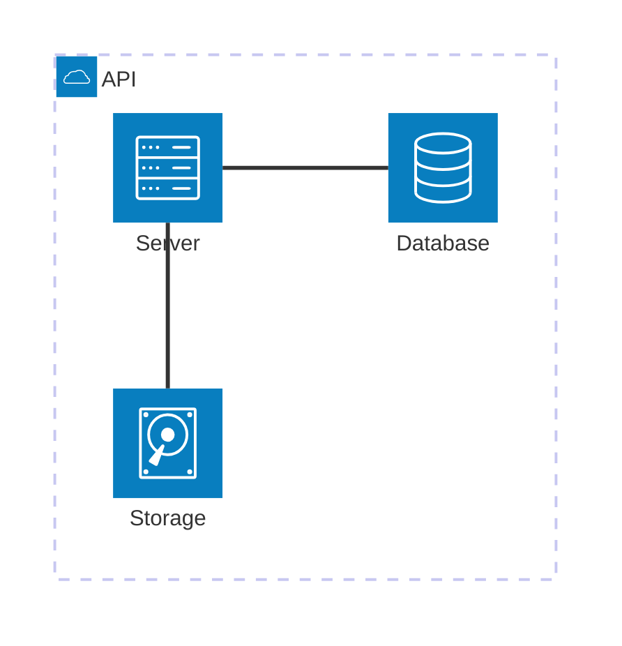
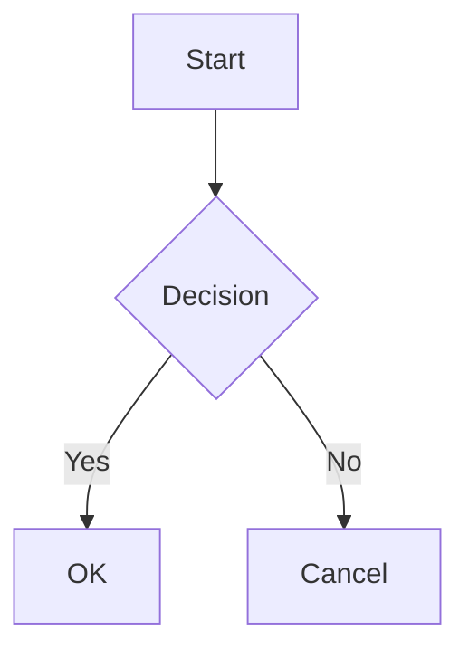
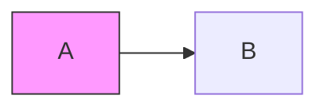
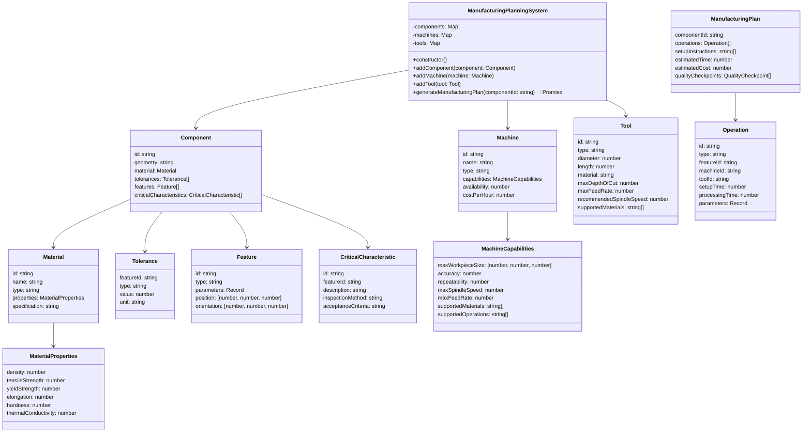
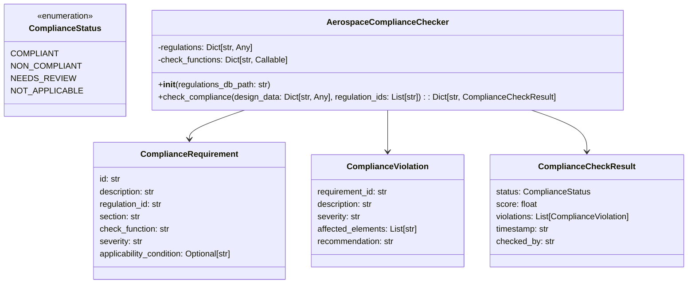

```mermaid
flowchart TD
    %% Define styles
    classDef uiLayer fill:#3498db,color:#fff,stroke:#2980b9
    classDef appLayer fill:#2ecc71,color:#fff,stroke:#27ae60
    classDef aiLayer fill:#9b59b6,color:#fff,stroke:#8e44ad
    classDef dataIntLayer fill:#e74c3c,color:#fff,stroke:#c0392b
    classDef dataSourceLayer fill:#f39c12,color:#fff,stroke:#d35400
    classDef secLayer fill:#1abc9c,color:#fff,stroke:#16a085

    %% User Interface Layer
    subgraph UI_Layer["User Interface Layer"]
        UI["Web/Desktop Interface"]
        VIS["3D Visualization"]
        COLLAB["Collaboration Tools"]
        DASH["Analytics Dashboard"]
    end
    
    %% Application Layer
    subgraph APP_Layer["Application Layer"]
        DES["Design & Simulation"]
        MFG["Manufacturing"]
        MRO["Maintenance & Overhaul"]
        REG["Regulatory Compliance"]
        KM["Knowledge Management"]
    end
    
    %% AI Services Layer
    subgraph AI_Layer["AI Services Layer"]
        GEN["Generative Design"]
        SIM["AI Simulation"]
        PRED["Predictive Analytics"]
        NLP["NLP & Doc Processing"]
        CV["Computer Vision"]
        KG["Knowledge Graph"]
        RL["Reinforcement Learning"]
    end
    
    %% Data Integration Layer
    subgraph Data_Int_Layer["Data Integration Layer"]
        API["API Gateway"]
        ETL["ETL Pipelines"]
        STREAM["Data Streaming"]
        CACHE["Distributed Cache"]
    end
    
    %% Data Sources Layer
    subgraph Data_Sources["Data Sources"]
        CAD["CAD/CAM Systems"]
        PLM["PLM Systems"]
        ERP["ERP Systems"]
        IOT["IoT & Sensor Data"]
        DOC["Document Repositories"]
        REG_DB["Regulatory DBs"]
        DB["Relational DB"]
        NO_SQL["NoSQL DB"]
        DW["Data Warehouse"]
    end
    
    %% Security & Governance Layer
    subgraph Security_Gov["Security & Governance"]
        AUTH["Authentication"]
        AUDIT["Audit & Compliance"]
        ENCRYPT["Encryption"]
        POLICY["Policy Management"]
    end
    
    %% User Interface Dependencies
    UI --> DES
    UI --> MFG
    UI <--> DASH
    VIS --> DES
    VIS --> MRO
    COLLAB --> KM
    
    %% Application Layer Dependencies
    DES <--> GEN
    DES --> SIM
    DES --> DB
    MFG --> DB
    MRO --> DB
    REG --> REG_DB
    KM --> DOC
    
    %% AI Services Layer Dependencies
    GEN --> KG
    SIM --> PRED
    PRED --> KG
    PRED --> DW
    RL --> SIM
    NLP --> KG
    CV --> IOT
    
    %% Data Integration Layer Dependencies
    API <--> DES
    API <--> MFG
    API <--> MRO
    API <--> KM
    ETL --> CAD
    ETL --> PLM
    ETL --> ERP
    ETL --> DB
    STREAM --> IOT
    CACHE --> DB
    
    %% Security & Governance Dependencies
    AUTH --> UI
    AUTH --> API
    AUDIT --> DB
    ENCRYPT --> API
    ENCRYPT --> DB
    POLICY --> AUTH
    
    %% Apply styles
    class UI,VIS,COLLAB,DASH uiLayer
    class DES,MFG,MRO,REG,KM appLayer
    class GEN,SIM,PRED,NLP,CV,KG,RL aiLayer
    class API,ETL,STREAM,CACHE dataIntLayer
    class CAD,PLM,ERP,IOT,DOC,REG_DB,DB,NO_SQL,DW dataSourceLayer
    class AUTH,AUDIT,ENCRYPT,POLICY secLayer
```

# 🛠️ GAIA AIR Architecture (General AI Architecture as Aerospace Infrastructural Requirement)

---

## 📐 Architecture Layers Overview

### 🧑‍💻 User Interface Layer
- **Web/Desktop Interface**: Unified access point for users.
- **3D Visualization**: Immersive display of models and simulations.
- **Collaboration Tools**: Team-based design and maintenance coordination.
- **Analytics Dashboard**: Real-time monitoring and KPI insights.

---

### 🧩 Application Layer
- **Design & Simulation Module**: Integrates AI in early-stage design and aerospace simulations.
- **Manufacturing & Production Module**: Smart factory interfaces and digital twin integration.
- **Maintenance, Repair & Overhaul (MRO)**: AI-driven predictive maintenance with visual inspections.
- **Regulatory Compliance Module**: Automates validation against standards (e.g., FAA, EASA).
- **Knowledge Management Module**: Links tribal knowledge with semantic context.

---

### 🧠 AI Services Layer
- **Generative Design Engine (GEN)**: Creates design variants under constraint models.
- **AI Simulation Accelerator (SIM)**: Speeds up simulations via surrogate modeling and quantum backends.
- **Predictive Analytics Engine (PRED)**: Degradation, anomaly, and failure forecasting.
- **NLP & Document Processing (NLP)**: Regulatory doc analysis and intelligent search.
- **Computer Vision Services (CV)**: Image-based detection in MRO and manufacturing.
- **Knowledge Graph (KG)**: Contextual linking of systems, materials, and processes.
- **Reinforcement Learning (RL)**: Adaptive policies for control and decision-making.

---

### 🔗 Data Integration Layer
- **API Gateway**: Secure and scalable access interface.
- **ETL Pipelines**: Structured extraction from legacy systems.
- **Data Streaming**: Real-time ingestion from sensor/IOT feeds.
- **Distributed Cache**: Fast access layer for AI computation and dashboards.

---

### 📡 Data Sources
- **CAD/CAM Systems**: Design files and manufacturing details.
- **PLM Systems**: Product lifecycle tracking.
- **ERP Systems**: Enterprise resource planning data.
- **IoT & Sensor Data**: Telemetry and condition monitoring.
- **Document Repositories**: Manuals, specifications, compliance records.
- **Regulatory Databases**: Certification rules and airworthiness directives.

---

## 📊 Visual Architecture Diagram



---

## 🔒 Future Enhancements (Optional)
- **🧬 Quantum Integration**: QAOA/VQE for advanced optimization tasks.
- **🔗 Blockchain Audit Trails**: Immutable compliance and process verification.
- **🌐 Federated Learning**: Secure model training across global partners.GAIA AIR Architecture Documentation
 GAIA AIR Functional Modules & System Architecture
This document presents two comprehensive diagrams outlining the **functional modules** and **system
architecture** of the GAIA AIR (General AI Architecture as Aerospace Infrastructural Requirement)
initiative.
---
 ## GAIA AIR Functional Modules
 
 ```mermaid
flowchart TD
    subgraph Design_Simulation_Module
        direction TB
        DS1["Generative Design"]
        DS1 --> DS2["Topology optimization algorithms"]
        DS1 --> DS3["Neural networks for design space exploration"]
        DS1 --> DS4["Cloud-based parallel computing"]
        DS1 --> DS5["Expected Benefits: 40-60% design cycle reduction, 15-30% weight reduction"]
    end

    subgraph Manufacturing_Production_Module
        direction TB
        MP1["Automated Manufacturing Planning"]
        MP1 --> MP2["Process planning AI"]
        MP1 --> MP3["Toolpath optimization"]
        MP1 --> MP4["Digital twin simulation"]
        MP1 --> MP5["Expected Benefits: 40-60% planning time reduction, optimized toolpaths"]
    end

    subgraph MRO_Module
        direction TB
        MRO1["Predictive Maintenance for Aircraft"]
        MRO1 --> MRO2["Time series analysis"]
        MRO1 --> MRO3["Remaining useful life prediction"]
        MRO1 --> MRO4["Digital twin modeling"]
        MRO1 --> MRO5["Expected Benefits: 30-50% reduction in unscheduled maintenance"]
    end

    subgraph Regulatory_Compliance_Module
        direction TB
        RC1["Automated Document Generation"]
        RC1 --> RC2["Natural language generation"]
        RC1 --> RC3["Graph-to-text generation"]
        RC1 --> RC4["Template-based generation"]
        RC1 --> RC5["Expected Benefits: 70-90% reduction in documentation time"]
    end

    DS1 --> MP1
    MP1 --> MRO1
    MRO1 --> RC1

    style DS1 fill:#ffcccc,color:#000
    style MP1 fill:#ccffcc,color:#000
    style MRO1 fill:#ccccff,color:#000
    style RC1 fill:#ffccee,color:#000
```
---
 ## GAIA AIR System Architecture
## Example Syntax for Architecture Diagram




```mermaid 
graph TB
  subgraph interfaceLayer [User Interface Layer]
    UI(Web/Desktop Interface)
    VIS(3D Visualization)
    COLLAB(Collaboration Tools)
    DASH(Analytics Dashboard)
  end
  
  subgraph applicationLayer [Application Layer]
    DES(Design & Simulation Module)
    MFG(Manufacturing & Production Module)
    MRO(Maintenance, Repair & Overhaul Module)
    REG(Regulatory Compliance Module)
    KM(Knowledge Management Module)
  end
  
  subgraph aiServicesLayer [AI Services Layer]
    GEN(Generative Design Engine)
    SIM(AI Simulation Accelerator)
    PRED(Predictive Analytics Engine)
    NLP(NLP & Document Processing)
    CV(Computer Vision Services)
    KG(Knowledge Graph)
    RL(Reinforcement Learning)
  end
  
  subgraph dataIntegrationLayer [Data Integration Layer]
    API(API Gateway)
    ETL(ETL Pipelines)
    STREAM(Data Streaming)
    CACHE(Distributed Cache)
  end
  
  subgraph dataSources [Data Sources]
    CAD(CAD/CAM Systems)
    PLM(PLM Systems)
    ERP(ERP Systems)
    IOT(IoT & Sensor Data)
    DOC(Document Repositories)
    REG_DB(Regulatory Databases)
  end
  
  subgraph securityGov [Security & Governance]
    AUTH(Authentication & Authorization)
    AUDIT(Audit & Compliance)
    ENCRYPT(Encryption Services)
    POLICY(Policy Management)
  end

  UI --> DES
  UI --> MFG
  COLLAB --> MRO
  DASH --> REG
  DES --> GEN
  SIM --> PRED
  NLP --> NLP
  API --> ETL
  ETL --> CAD
  STREAM --> IOT
  AUTH --> UI
  ENCRYPT --> API
````
---

## 1. Design and Simulation Module

### Generative Design

**Key Technologies:**

- Topology optimization algorithms
- Genetic algorithms and evolutionary computing
- Neural networks for design space exploration
- Cloud-based parallel computing


**Data Sources:**

- CAD models and design specifications
- Material properties databases
- Performance requirements
- Manufacturing constraints
- Historical design data


**AI Algorithms:**

- Multi-objective optimization algorithms
- Physics-informed neural networks
- Evolutionary algorithms for design exploration
- Reinforcement learning for design optimization


**Integration Points:**

- CATIA, Siemens NX, SolidWorks via APIs
- STEP/IGES data exchange formats
- PLM systems for design management


**Expected Benefits:**

- 40-60% reduction in design cycle time
- 15-30% weight reduction in components
- Exploration of novel design solutions
- Improved performance-to-weight ratios


Here's a conceptual implementation of the generative design engine:

```python project="Aerospace GenAI" file="generative_design_engine.py"
...
```

### AI-Powered Simulation

**Key Technologies:**

- Physics-informed neural networks
- Surrogate modeling
- Deep learning for simulation acceleration
- Gaussian process regression


**Data Sources:**

- CFD and FEA simulation results
- Flight test data
- Wind tunnel data
- Material models


**AI Algorithms:**

- Convolutional neural networks for spatial data
- Recurrent neural networks for time-series data
- Gaussian process regression for surrogate models
- Transfer learning for model adaptation


**Integration Points:**

- ANSYS, NASTRAN, Fluent, Abaqus
- Simulation data management systems
- High-performance computing clusters


**Expected Benefits:**

- 90-99% reduction in simulation time
- Broader design space exploration
- Real-time simulation capabilities
- Reduced computational costs


## 2. Manufacturing and Production Module

### Automated Manufacturing Planning

**Key Technologies:**

- Process planning AI
- Toolpath optimization
- Robotic path planning
- Digital twin simulation


**Data Sources:**

- CAD/CAM models
- Machine capabilities
- Tool libraries
- Material properties
- Manufacturing constraints


**AI Algorithms:**

- Hierarchical task network planning
- Genetic algorithms for process optimization
- Reinforcement learning for toolpath generation
- Machine learning for cost and time prediction


**Integration Points:**

- CAM software (Mastercam, Siemens NX CAM)
- Robotic programming systems
- Manufacturing execution systems
- ERP systems


**Expected Benefits:**

- 40-60% reduction in planning time
- 15-25% increase in machine utilization
- Optimized toolpaths and process sequences
- Reduced manufacturing costs


Here's a conceptual implementation of the manufacturing planning system:



### Quality Control and Inspection

**Key Technologies:**

- Computer vision
- Deep learning for defect detection
- 3D scanning and point cloud analysis
- Automated non-destructive testing


**Data Sources:**

- Images from inspection cameras
- 3D scan data
- X-ray and CT scan data
- Ultrasonic testing data
- Design specifications and tolerances


**AI Algorithms:**

- Convolutional neural networks for defect detection
- Semantic segmentation for anomaly localization
- Point cloud processing algorithms
- Anomaly detection models


**Integration Points:**

- Automated inspection systems
- Coordinate measuring machines (CMMs)
- Quality management systems
- Digital twin platforms


**Expected Benefits:**

- 70-90% reduction in inspection time
- Improved defect detection accuracy
- Consistent quality assessment
- Reduced scrap rates


## 3. Maintenance, Repair, and Overhaul (MRO) Module

### Predictive Maintenance for Aircraft

**Key Technologies:**

- Time series analysis
- Anomaly detection
- Remaining useful life prediction
- Digital twin modeling


**Data Sources:**

- Aircraft sensor data
- Flight data recorder information
- Maintenance records
- Component lifecycle data
- Environmental conditions


**AI Algorithms:**

- LSTM networks for time series prediction
- Anomaly detection algorithms
- Survival analysis models
- Physics-informed neural networks


**Integration Points:**

- Aircraft health monitoring systems
- Airline maintenance systems
- Flight operations systems
- Supply chain management systems


**Expected Benefits:**

- 30-50% reduction in unscheduled maintenance
- 15-25% increase in aircraft availability
- Extended component life
- Reduced maintenance costs


### Automated Diagnostics and Troubleshooting

**Key Technologies:**

- Natural language processing
- Knowledge graphs
- Case-based reasoning
- Causal inference models


**Data Sources:**

- Maintenance manuals
- Fault codes
- Troubleshooting guides
- Historical repair data
- Sensor readings


**AI Algorithms:**

- Transformer models for text understanding
- Graph neural networks
- Bayesian networks for causal reasoning
- Classification models for fault diagnosis


**Integration Points:**

- Aircraft maintenance systems
- Electronic technical manuals
- Remote assistance platforms
- Training systems


**Expected Benefits:**

- 40-60% reduction in diagnostic time
- Improved first-time fix rates
- Knowledge capture from aging workforce
- Enhanced technician efficiency


## 4. Regulatory Compliance and Documentation Module

### Automated Document Generation

**Key Technologies:**

- Natural language generation
- Computer vision for diagram creation
- Knowledge extraction
- Template-based generation


**Data Sources:**

- Design data
- Simulation results
- Test reports
- Regulatory requirements
- Industry standards


**AI Algorithms:**

- Large language models for text generation
- Graph-to-text generation
- Template filling algorithms
- Document structure learning


**Integration Points:**

- PLM systems
- Document management systems
- Regulatory submission portals
- Configuration management systems


**Expected Benefits:**

- 70-90% reduction in documentation time
- Improved accuracy and consistency
- Ensured regulatory compliance
- Faster approval processes


## Compliance Checker Class Diagram



## I. Introduction to COAFI

The Cosmic Omnidevelopable Aero Foresights Index (COAFI) is a documentation framework designed specifically for the GAIA AIR project. It provides a structured, consistent, and scalable way to organize and manage the vast amount of technical information associated with this complex project. The framework is designed to support *living documentation*, adapting and evolving alongside the project itself. This Master Index, as indicated by the "Draft" status and date in the document header, will be regularly updated to reflect the latest revisions and project documentation structure.

**Purpose of COAFI:**

*   To manage the inherent complexity of the GAIA AIR project documentation.
*   To ensure consistency in documentation style, format, and referencing across all systems and components.
*   To facilitate seamless collaboration and information sharing among diverse engineering and operational teams.
*   To enable efficient searching, retrieval, and contextualization of technical information for various user roles.
*   To rigorously support regulatory compliance and airworthiness/spaceworthiness certification processes.
*   To provide end-to-end traceability and audit trails from high-level system requirements down to detailed component design and implementation specifics.
*   To establish a **contextualized** documentation approach where data is presented with appropriate processing and filtering for specific user needs.
*   To facilitate **circular** documentation processes, allowing for iterative refinement and continuous improvement based on feedback and operational experience.

**Benefits of COAFI:**

*   **Modularity:** Documentation is broken down into independent modules (Parts, Chapters, Documents), enabling focused updates and improvements without impacting the entire framework.
*   **Scalability:** The hierarchical and coded structure is designed to accommodate the continuous growth and expansion of the GAIA AIR project documentation as new systems and technologies are integrated.
*   **Flexibility:** The framework is adaptable and can be modified to incorporate changes in project scope, technology advancements, and evolving documentation requirements.
*   **Enhanced Discoverability:** Facilitates efficient information retrieval through optimized navigation and search functionalities (planned GAIA Quantum Portal integration).
*   **Contextualization:** The "Views" system (planned for future implementation) allows for tailoring documentation presentation to specific user roles, ensuring users access only the most relevant information for their tasks.

**Relationship to ATA Chapters:** COAFI Part I (Airframes) and Part II (Spaceframes) are aligned with the Air Transport Association (ATA) chapter system and Air Transport Association Space (AS) chapter system respectively. This alignment ensures compatibility with industry-standard documentation practices while extending beyond traditional ATA to encompass the unique aspects of GAIA AIR, including quantum technologies, AI, and space operations.

**For a complete overview of the COAFI structure, see [COAFI Structure and Guidelines](Part0/GP-OV-COAFI-0001-A.md).**

---

## II. GAIA AIR Project Overview

The **GAIA AIR (Global Aerospace Infrastructural Agentic AI Intercepting Robotics)** project is a groundbreaking initiative focused on developing a next-generation aerospace platform that seamlessly integrates:

*   **GAIA PULSE (Quantum Propulsion):** A revolutionary quantum propulsion system, designated Q-01, designed to provide efficient, sustainable, and high-performance thrust, potentially harnessing novel physics principles for aerospace propulsion.
*   **GAIA CONTROL (AI-Powered Flight Control - Heuritmática):** An advanced, AI-driven autonomous flight control system, codenamed "Heuritmática (GP-HEUR)", enabling enhanced flight stability, adaptive control laws, flight envelope protection, and optimized flight management through sophisticated AI algorithms and quantum-enhanced computing.
*   **GAIA FAB (Sustainable Materials - AMPEL):** The utilization of advanced, lightweight, and sustainable materials under the AMPEL (Atmospheric Modular Program Enveloped Logics) initiative, focusing on Boron Nitride Nanotube (BNNT) composites, carbon lattice structures, and bio-derived materials to minimize environmental impact and maximize structural performance.
*   **GAIA SPACE (Atmospheric and Space Operations):** A dual-domain aerospace platform with capabilities for both atmospheric flight (AMPEL360XWLRGA airframe) and suborbital/orbital space travel (GAIA SPACE spaceframe), enabling a wide range of missions from sustainable air transport to space tourism and scientific research in both domains.
*   **GAIA COMPUTE (AI and Quantum Computing - HPC/QPU Nodes):**  A distributed, high-performance computing infrastructure, integrating both High-Performance Computing (HPC) and Quantum Processing Units (QPUs), codenamed "Node (GP-NOD)", to support AI model training, complex simulations, real-time data processing, and quantum algorithm execution for various GAIA AIR systems.

GAIA AIR aims to pioneer a new era of sustainable and versatile aerospace transportation, revolutionizing both atmospheric and space travel. The project's overarching objective is to develop a highly efficient, adaptable, and environmentally responsible aerospace platform that not only transforms transportation but also contributes to a deeper understanding of our cosmos and promotes sustainable practices in the aerospace industry.

---

## III. COAFI Documentation Structure

The COAFI documentation system is organized using a hierarchical structure, designed for modularity, scalability, and ease of navigation. The hierarchy consists of the following levels:

*   **Master Index:** The top-level entry point for the entire COAFI documentation set, providing a comprehensive table of contents and links to all Parts, Sections, and key documents (this document - `COAFI.MD`).
*   **Parts:** Major divisions representing distinct domains or aspects of the GAIA AIR project. COAFI is currently divided into Parts 0 through IX, each focusing on a specific area (e.g., Airframes, Spaceframes, Propulsion, Project Management).
*   **Sections (Optional):** Subdivisions within Parts, used for logical grouping of related chapters or documents within a Part. Sections are used as needed to further organize content within larger Parts.
*   **Chapters:** Within each Part (or Section), content is further divided into Chapters, which represent specific systems, subsystems, or functional areas. Part I and Part II utilize an adapted ATA/AS chapter numbering system (00-99, 00-100) for detailed system documentation.
*   **Documents:** The fundamental units of COAFI documentation. Each chapter is composed of individual Markdown files (`.md`) that contain specific information, specifications, procedures, analyses, or reports related to a particular topic within the COAFI framework.

### Document Codes

Each document within the COAFI framework is assigned a unique and structured document code to facilitate organization, identification, and cross-referencing. The document code follows a standardized format:

`[Part Code]-[System Code]-[Subsystem Code]-[Assembly Code]-[Disassembly Code]-[Disassy Code Variant]-[Info Code]-[Info Code Variant]-[Item Location Code]`

| Code Component         | Description                                                                    | Example          |
|-----------------------|--------------------------------------------------------------------------------|------------------|
| **Part Code**         | Identifies the main project area (Part I, Part II, etc.)                         | GP-OV, GP-AM      |
| **System Code**        | Identifies the major system or domain (Airframe, Propulsion, Avionics, etc.)    | GAI, AMPEL, HEUR    |
| **Subsystem Code (Opt)**| Identifies a specific subsystem within a system (optional, used for granularity)| QEE, SSS, IAH     |
| **Assembly Code**       | Numeric code identifying a major assembly or module.                             | 0100, 0200        |
| **Disassembly Code**    | Numeric code identifying a sub-assembly or component within an assembly.       | 001, 005          |
| **Disassembly Code Variant**| Alphanumeric character indicating a variant or revision of a sub-assembly. | A, B, Q01         |
| **Info Code**           | Identifies the type of information contained in the document (Overview, Specification, Procedure, etc.). | OV, SP, DS        |
| **Info Code Variant**   | Alphanumeric character indicating a variant or revision of the information type.| A, B, THEO       |
| **Item Location Code**  | Numeric code indicating the physical location or zone within the aircraft or spaceframe (often "00" for general documents). | 00, FUS, CAB      |

**Refer to [COAFI System and Subsystem Codes (Part0/GP-OV-NUM-0004-001-A.md)](Part0/GP-OV-NUM-0004-001-A.md) for a complete and detailed list of all System Codes, Subsystem Codes, and their corresponding descriptions used within the COAFI framework.**

---

## IV. COAFI Parts Index

The COAFI documentation framework is divided into the following Parts, each representing a major domain within the GAIA AIR project. Click on the Part titles below to navigate to the index page for each Part:

*   **Part 0: Project Overarching Principles (GP-OV)** ([Part0/index.md](Part0/index.md)): Project-wide principles, definitions, introductory material, business plan, and market analysis.
*   **Part 0A: Heuritmática (GP-HEUR)** ([Part0A/index.md](Part0A/index.md)): The foundational principles of Heuritmática.
*   **Part I: Airframes – AMPEL360XWLRGA (GP-AM)** ([PartI/index.md](PartI/index.md)):  Documentation for the atmospheric aircraft, organized by ATA chapters.
*   **Part II: Spaceframes – GAIA SPACE Modules (GP-SM)** ([PartII/index.md](PartII/index.md)): Documentation for space-based systems and operations, organized by AS chapters.
*   **Part III: GAIA Propulsion Modules (GP-PM)** ([PartIII/index.md](PartIII/index.md)): Documentation for all propulsion systems, including GAIA PULSE.
*   **Part IV: GAIA Common Modules (GP-CM)** ([PartIV/index.md](PartIV/index.md)): Cross-cutting technologies and methodologies used across multiple GAIA systems (AI, Quantum, Materials, etc.).
*   **Part V: GAIA AIR Computing & Simulation (GP-GACMS)** ([PartV/index.md](PartV/index.md)): Documentation for computing and material simulation.
*   **Part VI: Project Management and Operations (GP-PMO)** ([PartVI/index.md](PartVI/index.md)): Project management and operational procedures.
*   **Part VII: Appendices and Reference Material (GP-APP)** ([PartVII/index.md](PartVII/index.md)): Supporting documentation, standards, and procedures.
*   **Future Expansions:**
    *   **Part VIII: GAIA GALACTIC MINING OPERATIONS (GP-GMO)** ([PartVIII/index.md](PartVIII/index.md)): Documentation related to the long-term vision for resource extraction in space.

**(Note:** The links within Part IV (COAFI Parts Index) are relative Markdown links, intended to function within a complete COAFI documentation repository. In a live deployment (e.g., a website generated using MkDocs), these links will resolve to the corresponding Part index pages based on the repository's file structure.)*

---

## V. COAFI Views

COAFI supports the concept of "Views," which are designed to tailor the presentation and accessibility of documentation based on specific user roles and needs. This ensures that users can efficiently access and navigate the information most relevant to their responsibilities.  **COAFI Views Implementation:** The implementation of COAFI Views is a planned feature. It is envisioned to leverage technologies such as MkDocs plugins, custom JavaScript, and potentially integration with the GAIA Quantum Portal (GQP) to provide role-based access and dynamic content filtering, tailoring the documentation presentation to specific user needs.

*   **Engineer View:**  Specifications, designs, test procedures, and results.
*   **Regulatory View:**  Certification documents, safety analyses, and compliance reports.
*   **Project Manager View:**  Project schedules, requirements, progress reports, and risk assessments.
*   **Maintenance View:**  Maintenance procedures, parts lists, and troubleshooting guides.
*   **Executive View:**  High-level overviews, key performance indicators, and strategic summaries.

**For more information on COAFI Views and their implementation roadmap, see [COAFI Views Implementation Guide](Part0/views_guide.md).**

---

## VI. Getting Started

*   **Explore COAFI Structure and Guidelines:** To gain a comprehensive understanding of the COAFI documentation framework, its principles, and organizational structure, refer to the **[COAFI Structure and Guidelines](Part0/GP-OV-COAFI-0001-A.md)** document in Part 0.
*   **Navigate to Relevant Parts:** To access documentation related to specific areas of the GAIA AIR project, navigate to the appropriate Part index page (listed in Section IV above) based on your area of interest (e.g., Part I for Airframes, Part III for Propulsion, Part VI for Project Management).
*   **Utilize Document Codes for Direct Access:** Use the structured document codes (outlined in Section III) to directly access specific documents if you know the relevant code. Document codes are consistently used throughout the COAFI framework for easy searching and cross-referencing.
*   **Contribute to COAFI Documentation:** For information on contributing to the COAFI documentation, including guidelines for creating new documents, updating existing content, and adhering to COAFI standards, refer to the **[Contribution Guidelines](Part0/contribution_guidelines.md)** document in Part 0.

---

**End of Master Index - COAFI.MD**


