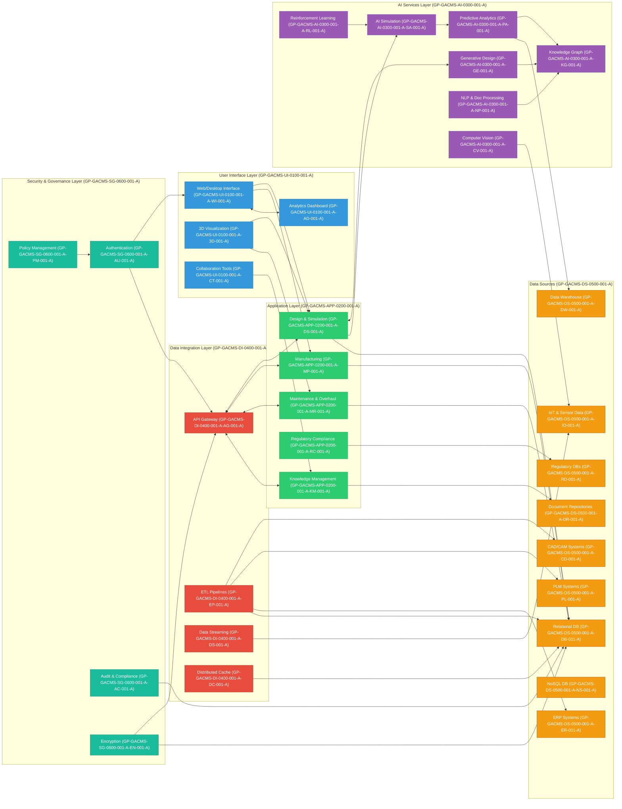
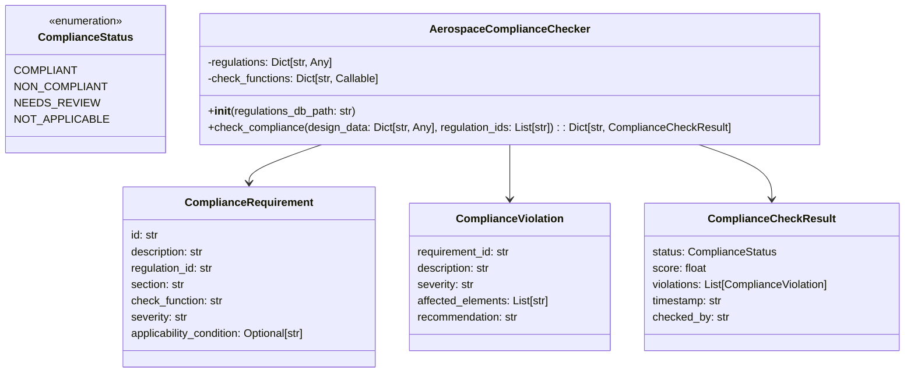

# 🛠️ GAIA AIR Architecture (General AI Architecture as Aerospace Infrastructural Requirement)

---

## 📐 Architecture Layers Overview

### 🧑‍💻 User Interface Layer (COAFI Assembly: `GP-GACMS-UI-0100-001-A`)

This layer provides the user interface and interaction components for the GAIA AIR system.

- **Web/Desktop Interface** (COAFI Object: `GP-GACMS-UI-0100-001-A-WI-001-A`): Unified access point for users. *COAFI Function:* Provide a user-friendly interface for interacting with GAIA AIR systems.
- **3D Visualization** (COAFI Object: `GP-GACMS-UI-0100-001-A-3D-001-A`): Immersive display of models and simulations. *COAFI Function:* Visually explore designs, simulations, and data.
- **Collaboration Tools** (COAFI Object: `GP-GACMS-UI-0100-001-A-CT-001-A`): Team-based design and maintenance coordination. *COAFI Function:* Facilitate team collaboration on GAIA AIR projects.
- **Analytics Dashboard** (COAFI Object: `GP-GACMS-UI-0100-001-A-AD-001-A`): Real-time monitoring and KPI insights. *COAFI Function:* Provide real-time monitoring and performance analytics.

---

### 🧩 Application Layer (COAFI Assembly: `GP-GACMS-APP-0200-001-A`)

This layer encompasses the core application modules that drive the functionalities of GAIA AIR.

- **Design & Simulation Module** (COAFI Object: `GP-GACMS-APP-0200-001-A-DS-001-A`): Integrates AI in early-stage design and aerospace simulations. *COAFI Function:* Enable AI-powered design and simulation capabilities.
- **Manufacturing & Production Module** (COAFI Object: `GP-GACMS-APP-0200-001-A-MP-001-A`): Smart factory interfaces and digital twin integration. *COAFI Function:* Automate and optimize manufacturing and production processes.
- **Maintenance, Repair & Overhaul (MRO)** (COAFI Object: `GP-GACMS-APP-0200-001-A-MR-001-A`): AI-driven predictive maintenance with visual inspections. *COAFI Function:* Predict and prevent aircraft maintenance issues.
- **Regulatory Compliance Module** (COAFI Object: `GP-GACMS-APP-0200-001-A-RC-001-A`): Automates validation against standards (e.g., FAA, EASA). *COAFI Function:* Ensure automated compliance with regulatory requirements.
- **Knowledge Management Module** (COAFI Object: `GP-GACMS-APP-0200-001-A-KM-001-A`): Links tribal knowledge with semantic context. *COAFI Function:* Manage and leverage project-specific knowledge effectively.

---

### 🧠 AI Services Layer (COAFI Assembly: `GP-GACMS-AI-0300-001-A`)

This layer provides the core AI capabilities and services used throughout GAIA AIR.

- **Generative Design Engine (GEN)** (COAFI Object: `GP-GACMS-AI-0300-001-A-GE-001-A`): Creates design variants under constraint models. *COAFI Function:* Generate optimized design options automatically.  *COAFI Algorithm:* Topology optimization, genetic algorithms.
- **AI Simulation Accelerator (SIM)** (COAFI Object: `GP-GACMS-AI-0300-001-A-SA-001-A`): Speeds up simulations via surrogate modeling and quantum backends. *COAFI Function:* Accelerate complex simulation processes efficiently. *COAFI Algorithm:* Physics-informed neural networks, surrogate modeling.
- **Predictive Analytics Engine (PRED)** (COAFI Object: `GP-GACMS-AI-0300-001-A-PA-001-A`): Degradation, anomaly, and failure forecasting. *COAFI Function:* Predict system failures and performance degradation proactively. *COAFI Algorithm:* Time series analysis, anomaly detection.
- **NLP & Document Processing (NLP)** (COAFI Object: `GP-GACMS-AI-0300-001-A-NP-001-A`): Regulatory doc analysis and intelligent search. *COAFI Function:* Process and understand natural language documents intelligently. *COAFI Algorithm:* Transformer models, information extraction.
- **Computer Vision Services (CV)** (COAFI Object: `GP-GACMS-AI-0300-001-A-CV-001-A`): Image-based detection in MRO and manufacturing. *COAFI Function:* Analyze images for defects and anomalies visually. *COAFI Algorithm:* Convolutional neural networks, object detection.
- **Knowledge Graph (KG)** (COAFI Object: `GP-GACMS-AI-0300-001-A-KG-001-A`): Contextual linking of systems, materials, and processes. *COAFI Function:* Provide contextual understanding of project data semantically. *COAFI Algorithm:* Graph embedding, knowledge representation. *COAFI Interface:* SPARQL endpoint (GP-GACMS-AI-0300-001-A-KG-001-A-IF-SPARQL-001-A), graph database API (GP-GACMS-AI-0300-001-A-KG-001-A-API-GRAPHDB-001-A).
- **Reinforcement Learning (RL)** (COAFI Object: `GP-GACMS-AI-0300-001-A-RL-001-A`): Adaptive policies for control and decision-making. *COAFI Function:* Optimize control policies and decision-making adaptively. *COAFI Algorithm:* Deep Q-Networks (DQN), Proximal Policy Optimization (PPO).

---

### 🔗 Data Integration Layer (COAFI Assembly: `GP-GACMS-DI-0400-001-A`)

This layer handles the integration and management of data from various sources.

- **API Gateway** (COAFI Object: `GP-GACMS-DI-0400-001-A-AG-001-A`): Secure and scalable access interface. *COAFI Function:* Provide secure access to GAIA AIR data and services centrally. *COAFI Interface:* REST API (GP-GACMS-DI-0400-001-A-AG-001-A-API-REST-001-A), GraphQL API (GP-GACMS-DI-0400-001-A-AG-001-A-API-GQL-001-A), gRPC API (GP-GACMS-DI-0400-001-A-AG-001-A-API-GRPC-001-A), Authentication Interface (OAuth 2.0) (GP-GACMS-DI-0400-001-A-AG-001-A-INT-AUTH-001-A).
- **ETL Pipelines** (COAFI Object: `GP-GACMS-DI-0400-001-A-EP-001-A`): Structured extraction from legacy systems. *COAFI Function:* Extract, transform, and load data from various heterogeneous sources. *COAFI Interface:* Apache Spark, Apache Kafka, AWS Glue, custom Python scripts.
- **Data Streaming** (COAFI Object: `GP-GACMS-DI-0400-001-A-DS-001-A`): Real-time ingestion from sensor/IOT feeds. *COAFI Function:* Enable real-time data ingestion and processing continuously. *COAFI Interface:* Apache Kafka, Amazon Kinesis.
- **Distributed Cache** (COAFI Object: `GP-GACMS-DI-0400-001-A-DC-001-A`): Fast access layer for AI computation and dashboards. *COAFI Function:* Provide fast access to frequently used data for performance optimization. *COAFI Interface:* Redis, Memcached.

---

### 📡 Data Sources Layer (COAFI Assembly: `GP-GACMS-DS-0500-001-A`)

This layer lists the various data sources that feed into the GAIA AIR system, each as a COAFI Object within the Data Sources Assembly.

- **CAD/CAM Systems** (COAFI Object: `GP-GACMS-DS-0500-001-A-CD-001-A`)
- **PLM Systems** (COAFI Object: `GP-GACMS-DS-0500-001-A-PL-001-A`)
- **ERP Systems** (COAFI Object: `GP-GACMS-DS-0500-001-A-ER-001-A`)
- **IoT & Sensor Data** (COAFI Object: `GP-GACMS-DS-0500-001-A-IO-001-A`)
- **Document Repositories** (COAFI Object: `GP-GACMS-DS-0500-001-A-DR-001-A`)
- **Regulatory DBs** (COAFI Object: `GP-GACMS-DS-0500-001-A-RD-001-A`)
- **Relational DB** (COAFI Object: `GP-GACMS-DS-0500-001-A-DB-001-A`)
- **NoSQL DB** (COAFI Object: `GP-GACMS-DS-0500-001-A-NS-001-A`)
- **Data Warehouse** (COAFI Object: `GP-GACMS-DS-0500-001-A-DW-001-A`)

---

### 🔒 Security & Governance Layer (COAFI Assembly: `GP-GACMS-SG-0600-001-A`)

This layer encompasses security and governance services, with each service as a COAFI Object.

- **Authentication** (COAFI Object: `GP-GACMS-SG-0600-001-A-AU-001-A`)
- **Audit & Compliance** (COAFI Object: `GP-GACMS-SG-0600-001-A-AC-001-A`)
- **Encryption** (COAFI Object: `GP-GACMS-SG-0600-001-A-EN-001-A`)
- **Policy Management** (COAFI Object: `GP-GACMS-SG-0600-001-A-PM-001-A`)

---

## 📊 Visual Architecture Diagram



---

## 🔒 Future Enhancements (Optional)

- **🧬 Quantum Integration**: QAOA/VQE for advanced optimization tasks.  *Benefit:* Potentially solve computationally intractable optimization problems.
- **🔗 Blockchain Audit Trails**: Immutable compliance and process verification. *Benefit:* Enhance trust and transparency in regulatory processes.
- **🌐 Federated Learning**: Secure model training across global partners. *Benefit:* Enable collaborative AI development while preserving data privacy.

---

## 1. Design and Simulation Module

### Generative Design (COAFI Object: `GP-GACMS-AI-0300-001-A-GE-001-A`)

**Key Technologies:**

- Topology optimization algorithms
- Genetic algorithms and evolutionary computing
- Neural networks for design space exploration
- Cloud-based parallel computing

**Data Sources (COAFI Objects within Data Sources Assembly `GP-GACMS-DS-0500-001-A`):**

- CAD models and design specifications (`GP-GACMS-DS-0500-001-A-CD-001-A`)
- Material properties databases (`GP-GACMS-DS-0500-001-A-DB-001-A`)
- Performance requirements (`GP-GACMS-DS-0500-001-A-DR-001-A`)
- Manufacturing constraints (`GP-GACMS-DS-0500-001-A-DR-001-A`)
- Historical design data (`GP-GACMS-DS-0500-001-A-DW-001-A`)

**AI Algorithms (COAFI Algorithms within AI Services Layer `GP-GACMS-AI-0300-001-A`):**

- Multi-objective optimization algorithms (`GP-GACMS-AI-0300-001-A-GE-001-A-ALG-MOO-001-A`)
- Physics-informed neural networks (`GP-GACMS-AI-0300-001-A-GE-001-A-ALG-PINN-001-A`)
- Evolutionary algorithms for design exploration (`GP-GACMS-AI-0300-001-A-GE-001-A-ALG-EA-001-A`)
- Reinforcement learning for design optimization (`GP-GACMS-AI-0300-001-A-GE-001-A-ALG-RL-001-A`)

**Integration Points (COAFI Interfaces within Data Integration Layer `GP-GACMS-DI-0400-001-A` & UI Layer `GP-GACMS-UI-0100-001-A`):**

- CATIA, Siemens NX, SolidWorks via APIs (`GP-GACMS-DI-0400-001-A-AG-001-A`)
- STEP/IGES data exchange formats (`GP-GACMS-DI-0400-001-A-EP-001-A`)
- PLM systems for design management (`GP-GACMS-DI-0400-001-A-EP-001-A`)
- 3D Visualization Module (`GP-GACMS-UI-0100-001-A-3D-001-A`)

**Expected Benefits (COAFI Functions):**

- *COAFI Function (GP-GACMS-AI-0300-001-A-GE-001-A-FNC-REDUC-CYCLE-TIME-001-A):* Reduce design cycle time by 40-60%.
- *COAFI Function (GP-GACMS-AI-0300-001-A-GE-001-A-FNC-REDUC-WEIGHT-001-A):* Achieve 15-30% weight reduction in components.
- *COAFI Function (GP-GACMS-AI-0300-001-A-GE-001-A-FNC-EXPLORE-NOVEL-DESIGNS-001-A):* Explore novel design solutions effectively.
- *COAFI Function (GP-GACMS-AI-0300-001-A-GE-001-A-FNC-IMPROVE-PERF-WEIGHT-001-A):* Improve performance-to-weight ratios significantly.

Conceptual implementation:

```python project="Aerospace GenAI" file="generative_design_engine.py"
class GenerativeDesignEngine:
    def __init__(self):
        pass # Initialize connection to databases, APIs, etc.

    def generate_designs(self, requirements, constraints):
        """
        Generates design options based on requirements and constraints.

        Args:
            requirements (dict): Design requirements (e.g., lift, drag, weight).
            constraints (dict): Design constraints (e.g., material properties, manufacturing limitations).

        Returns:
            list: A list of design options, each represented as a dictionary.
        """
        pass # Implement generative design logic here

    def evaluate_design(self, design):
        """
        Evaluates a given design option.
        Args:
            design (dict): A design option to evaluate.
        Returns:
            dict: Evaluation results (e.g., performance metrics, feasibility).
        """
        pass
```

### AI-Powered Simulation
### AI-Powered Simulation (COAFI Object: `GP-GACMS-AI-0300-001-A-SA-001-A`)

**Key Technologies:**

- Physics-informed neural networks
- Surrogate modeling
- Deep learning for simulation acceleration
- Gaussian process regression

**Data Sources (COAFI Objects within Data Sources Assembly `GP-GACMS-DS-0500-001-A`):**

- CFD and FEA simulation results (`GP-GACMS-DS-0500-001-A-DB-001-A`)
- Flight test data (`GP-GACMS-DS-0500-001-A-DR-001-A`)
- Wind tunnel data (`GP-GACMS-DS-0500-001-A-DR-001-A`)
- Material models (`GP-GACMS-DS-0500-001-A-DB-001-A`)

**AI Algorithms (COAFI Algorithms within AI Services Layer `GP-GACMS-AI-0300-001-A`):**

- Convolutional neural networks for spatial data (`GP-GACMS-AI-0300-001-A-SA-001-A-ALG-CNN-001-A`)
- Recurrent neural networks for time-series data (`GP-GACMS-AI-0300-001-A-SA-001-A-ALG-RNN-001-A`)
- Gaussian process regression for surrogate models (`GP-GACMS-AI-0300-001-A-SA-001-A-ALG-GPR-001-A`)
- Transfer learning for model adaptation (`GP-GACMS-AI-0300-001-A-SA-001-A-ALG-TL-001-A`)

**Integration Points (COAFI Interfaces within Data Integration Layer `GP-GACMS-DI-0400-001-A` & UI Layer `GP-GACMS-UI-0100-001-A`):**

- ANSYS, NASTRAN, Fluent, Abaqus (`GP-GACMS-DI-0400-001-A-AG-001-A`)
- Simulation data management systems (`GP-GACMS-DI-0400-001-A-EP-001-A`)
- High-performance computing clusters (`GP-GACMS-DI-0400-001-A-DC-001-A`)
- 3D Visualization Module (`GP-GACMS-UI-0100-001-A-3D-001-A`)

**Expected Benefits (COAFI Functions):**

- *COAFI Function (GP-GACMS-AI-0300-001-A-SA-001-A-FNC-REDUC-SIM-TIME-001-A):* Achieve 90-99% reduction in simulation time.
- *COAFI Function (GP-GACMS-AI-0300-001-A-SA-001-A-FNC-BROADEN-DESIGN-SPACE-001-A):* Broaden design space exploration capabilities.
- *COAFI Function (GP-GACMS-AI-0300-001-A-SA-001-A-FNC-ENABLE-REALTIME-SIM-001-A):* Enable real-time simulation capabilities for interactive design.
- *COAFI Function (GP-GACMS-AI-0300-001-A-SA-001-A-FNC-REDUC-COMP-COSTS-001-A):* Reduce computational costs significantly.


## 2. Manufacturing and Production Module

### Automated Manufacturing Planning (COAFI Object: `GP-GACMS-APP-0200-001-A-MP-001-A`)

**Key Technologies:**

- Process planning AI
- Toolpath optimization
- Robotic path planning
- Digital twin simulation

**Data Sources (COAFI Objects within Data Sources Assembly `GP-GACMS-DS-0500-001-A`):**

- CAD/CAM models (`GP-GACMS-DS-0500-001-A-CD-001-A`)
- Machine capabilities (`GP-GACMS-DS-0500-001-A-DB-001-A`)
- Tool libraries (`GP-GACMS-DS-0500-001-A-DB-001-A`)
- Material properties (`GP-GACMS-DS-0500-001-A-DB-001-A`)
- Manufacturing constraints (`GP-GACMS-DS-0500-001-A-DR-001-A`)

**AI Algorithms (COAFI Algorithms within AI Services Layer `GP-GACMS-AI-0300-001-A`):**

- Hierarchical task network planning (`GP-GACMS-AI-0300-001-A-MP-001-A-ALG-HTN-001-A`)
- Genetic algorithms for process optimization (`GP-GACMS-AI-0300-001-A-MP-001-A-ALG-GA-001-A`)
- Reinforcement learning for toolpath generation (`GP-GACMS-AI-0300-001-A-MP-001-A-ALG-RL-001-A`)
- Machine learning for cost and time prediction (`GP-GACMS-AI-0300-001-A-MP-001-A-ALG-ML-PRED-001-A`)

**Integration Points (COAFI Interfaces within Data Integration Layer `GP-GACMS-DI-0400-001-A` & UI Layer `GP-GACMS-UI-0100-001-A`):**

- CAM software (Mastercam, Siemens NX CAM) (`GP-GACMS-DI-0400-001-A-AG-001-A`)
- Robotic programming systems (`GP-GACMS-DI-0400-001-A-AG-001-A`)
- Manufacturing execution systems (MES) (`GP-GACMS-DI-0400-001-A-EP-001-A`)
- ERP systems (`GP-GACMS-DI-0400-001-A-EP-001-A`)
- Web/Desktop Interface (`GP-GACMS-UI-0100-001-A-WI-001-A`)

**Expected Benefits (COAFI Functions):**

- *COAFI Function (GP-GACMS-APP-0200-001-A-MP-001-A-FNC-REDUC-PLAN-TIME-001-A):* Reduce manufacturing planning time by 40-60%.
- *COAFI Function (GP-GACMS-APP-0200-001-A-MP-001-A-FNC-INCREASE-MACHINE-UTIL-001-A):* Increase machine utilization by 15-25%.
- *COAFI Function (GP-GACMS-APP-0200-001-A-MP-001-A-FNC-OPTIMIZE-TOOLPATHS-001-A):* Optimize toolpaths and process sequences effectively.
- *COAFI Function (GP-GACMS-APP-0200-001-A-MP-001-A-FNC-REDUC-MANUF-COSTS-001-A):* Reduce overall manufacturing costs significantly.


Here's a conceptual implementation of the manufacturing planning system:


### Quality Control and Inspection (COAFI Object: `GP-GACMS-APP-0200-001-A-QC-001-A`)

**Key Technologies:**

- Computer vision
- Deep learning for defect detection
- 3D scanning and point cloud analysis
- Automated non-destructive testing

**Data Sources (COAFI Objects within Data Sources Assembly `GP-GACMS-DS-0500-001-A`):**

- Images from inspection cameras (`GP-GACMS-DS-0500-001-A-IO-001-A`)
- 3D scan data (`GP-GACMS-DS-0500-001-A-IO-001-A`)
- X-ray and CT scan data (`GP-GACMS-DS-0500-001-A-IO-001-A`)
- Ultrasonic testing data (`GP-GACMS-DS-0500-001-A-IO-001-A`)
- Design specifications and tolerances (`GP-GACMS-DS-0500-001-A-DR-001-A`)

**AI Algorithms (COAFI Algorithms within AI Services Layer `GP-GACMS-AI-0300-001-A`):**

- Convolutional neural networks for defect detection (`GP-GACMS-AI-0300-001-A-CV-001-A-ALG-CNN-DETECTION-001-A`)
- Semantic segmentation for anomaly localization (`GP-GACMS-AI-0300-001-A-CV-001-A-ALG-SEM-SEG-001-A`)
- Point cloud processing algorithms (`GP-GACMS-AI-0300-001-A-CV-001-A-ALG-PCL-001-A`)
- Anomaly detection models (`GP-GACMS-AI-0300-001-A-PRED-001-A-ALG-ANOMALY-DETECTION-001-A`)

**Integration Points (COAFI Interfaces within Data Integration Layer `GP-GACMS-DI-0400-001-A` & UI Layer `GP-GACMS-UI-0100-001-A`):**

- Automated inspection systems (`GP-GACMS-DI-0400-001-A-AG-001-A`)
- Coordinate measuring machines (CMMs) (`GP-GACMS-DI-0400-001-A-AG-001-A`)
- Quality management systems (QMS) (`GP-GACMS-DI-0400-001-A-EP-001-A`)
- Digital twin platforms (`GP-GACMS-APP-0200-001-A-MP-001-A`)
- 3D Visualization Module (`GP-GACMS-UI-0100-001-A-3D-001-A`)
- Analytics Dashboard (`GP-GACMS-UI-0100-001-A-AD-001-A`)

**Expected Benefits (COAFI Functions):**

- *COAFI Function (GP-GACMS-APP-0200-001-A-QC-001-A-FNC-REDUC-INSP-TIME-001-A):* Achieve 70-90% reduction in inspection time.
- *COAFI Function (GP-GACMS-APP-0200-001-A-QC-001-A-FNC-IMPROVE-DEFECT-ACCURACY-001-A):* Improve defect detection accuracy significantly.
- *COAFI Function (GP-GACMS-APP-0200-001-A-QC-001-A-FNC-ENSURE-CONSISTENT-QUALITY-001-A):* Ensure consistent quality assessment across production.
- *COAFI Function (GP-GACMS-APP-0200-001-A-QC-001-A-FNC-REDUC-SCRAP-RATES-001-A):* Reduce material scrap rates and waste effectively.

## 3. Maintenance, Repair, and Overhaul (MRO) Module

### Predictive Maintenance for Aircraft (COAFI Object: `GP-GACMS-APP-0200-001-A-MR-001-A`)

**Key Technologies:**

- Time series analysis
- Anomaly detection
- Remaining useful life prediction
- Digital twin modeling

**Data Sources (COAFI Objects within Data Sources Assembly `GP-GACMS-DS-0500-001-A`):**

- Aircraft sensor data (`GP-GACMS-DS-0500-001-A-IO-001-A`)
- Flight data recorder information (`GP-GACMS-DS-0500-001-A-IO-001-A`)
- Maintenance records (`GP-GACMS-DS-0500-001-A-DR-001-A`)
- Component lifecycle data (`GP-GACMS-DS-0500-001-A-PLM-001-A`)
- Environmental conditions (`GP-GACMS-DS-0500-001-A-IO-001-A`)

**AI Algorithms (COAFI Algorithms within AI Services Layer `GP-GACMS-AI-0300-001-A`):**

- LSTM networks for time series prediction (`GP-GACMS-AI-0300-001-A-PRED-001-A-ALG-LSTM-001-A`)
- Anomaly detection algorithms (`GP-GACMS-AI-0300-001-A-PRED-001-A-ALG-ANOMALY-DETECTION-001-A`)
- Survival analysis models (`GP-GACMS-AI-0300-001-A-PRED-001-A-ALG-SURVIVAL-ANALYSIS-001-A`)
- Physics-informed neural networks (`GP-GACMS-AI-0300-001-A-SIM-001-A-ALG-PINN-001-A`)

**Integration Points (COAFI Interfaces within Data Integration Layer `GP-GACMS-DI-0400-001-A` & UI Layer `GP-GACMS-UI-0100-001-A`):**

- Aircraft health monitoring systems (`GP-GACMS-DI-0400-001-A-EP-001-A`)
- Airline maintenance systems (`GP-GACMS-DI-0400-001-A-EP-001-A`)
- Flight operations systems (`GP-GACMS-DI-0400-001-A-EP-001-A`)
- Supply chain management systems (`GP-GACMS-DI-0400-001-A-EP-001-A`)
- Digital twin platforms (`GP-GACMS-APP-0200-001-A-MP-001-A`)
- 3D Visualization Module (`GP-GACMS-UI-0100-001-A-3D-001-A`)
- Analytics Dashboard (`GP-GACMS-UI-0100-001-A-AD-001-A`)

**Expected Benefits (COAFI Functions):**

- *COAFI Function (GP-GACMS-APP-0200-001-A-MR-001-A-FNC-REDUC-UNSCHED-MAINT-001-A):* Reduce unscheduled maintenance by 30-50%.
- *COAFI Function (GP-GACMS-APP-0200-001-A-MR-001-A-FNC-INCREASE-AIRCRAFT-AVAIL-001-A):* Increase aircraft availability by 15-25%.
- *COAFI Function (GP-GACMS-APP-0200-001-A-MR-001-A-FNC-EXTEND-COMPONENT-LIFE-001-A):* Extend component useful life through proactive maintenance.
- *COAFI Function (GP-GACMS-APP-0200-001-A-MR-001-A-FNC-REDUC-MAINT-COSTS-001-A):* Reduce overall maintenance costs effectively.

### Automated Diagnostics and Troubleshooting (COAFI Object: `GP-GACMS-APP-0200-001-A-DT-001-A`)

**Key Technologies:**

- Natural language processing
- Knowledge graphs
- Case-based reasoning
- Causal inference models

**Data Sources (COAFI Objects within Data Sources Assembly `GP-GACMS-DS-0500-001-A` & AI Services Layer `GP-GACMS-AI-0300-001-A`):**

- Maintenance manuals (`GP-GACMS-DS-0500-001-A-DR-001-A`)
- Fault codes (`GP-GACMS-DS-0500-001-A-DR-001-A`)
- Troubleshooting guides (`GP-GACMS-DS-0500-001-A-DR-001-A`)
- Historical repair data (`GP-GACMS-DS-0500-001-A-DW-001-A`)
- Sensor readings (`GP-GACMS-DS-0500-001-A-IO-001-A`)
- Knowledge Graph (`GP-GACMS-AI-0300-001-A-KG-001-A`)

**AI Algorithms (COAFI Algorithms within AI Services Layer `GP-GACMS-AI-0300-001-A`):**

- Transformer models for text understanding (`GP-GACMS-AI-0300-001-A-NLP-001-A-ALG-TRANSFORMER-001-A`)
- Graph neural networks (`GP-GACMS-AI-0300-001-A-KG-001-A-ALG-GNN-001-A`)
- Bayesian networks for causal reasoning (`GP-GACMS-AI-0300-001-A-PRED-001-A-ALG-BAYESIAN-NET-001-A`)
- Classification models for fault diagnosis (`GP-GACMS-AI-0300-001-A-PRED-001-A-ALG-CLASSIFICATION-001-A`)

**Integration Points (COAFI Interfaces within Data Integration Layer `GP-GACMS-DI-0400-001-A` & UI Layer `GP-GACMS-UI-0100-001-A`):**

- Aircraft maintenance systems (`GP-GACMS-DI-0400-001-A-EP-001-A`)
- Electronic technical manuals (ETMs) (`GP-GACMS-DI-0400-001-A-DR-001-A`)
- Remote assistance platforms (`GP-GACMS-UI-0100-001-A-WI-001-A`, `GP-GACMS-UI-0100-001-A-CT-001-A`)
- Training systems (`GP-GACMS-APP-0200-001-A-KM-001-A`)
- Web/Desktop Interface (`GP-GACMS-UI-0100-001-A-WI-001-A`)
- Collaboration Tools (`GP-GACMS-UI-0100-001-A-CT-001-A`)
- Knowledge Management Module (`GP-GACMS-APP-0200-001-A-KM-001-A`)

**Expected Benefits (COAFI Functions):**

- *COAFI Function (GP-GACMS-APP-0200-001-A-DT-001-A-FNC-REDUC-DIAG-TIME-001-A):* Reduce diagnostic time by 40-60% significantly.
- *COAFI Function (GP-GACMS-APP-0200-001-A-DT-001-A-FNC-IMPROVE-FIRST-TIME-FIX-001-A):* Improve first-time fix rates for maintenance tasks.
- *COAFI Function (GP-GACMS-APP-0200-001-A-DT-001-A-FNC-CAPTURE-EXPERT-KNOWLEDGE-001-A):* Capture expert knowledge from aging workforce effectively.
- *COAFI Function (GP-GACMS-APP-0200-001-A-DT-001-A-FNC-ENHANCE-TECHNICIAN-EFFICIENCY-001-A):* Enhance maintenance technician efficiency and productivity.

## 4. Regulatory Compliance and Documentation Module

### Automated Document Generation (COAFI Object: `GP-GACMS-APP-0200-001-A-RC-001-A`)

**Key Technologies:**

- Natural language generation
- Computer vision for diagram creation
- Knowledge extraction
- Template-based generation

**Data Sources (COAFI Objects within Data Sources Assembly `GP-GACMS-DS-0500-001-A` & AI Services Layer `GP-GACMS-AI-0300-001-A`):**

- Design data (`GP-GACMS-DS-0500-001-A-CD-001-A`)
- Simulation results (`GP-GACMS-DS-0500-001-A-DB-001-A`)
- Test reports (`GP-GACMS-DS-0500-001-A-DR-001-A`)
- Regulatory requirements (`GP-GACMS-DS-0500-001-A-RD-001-A`)
- Industry standards (`GP-GACMS-DS-0500-001-A-RD-001-A`)
- Knowledge Graph (`GP-GACMS-AI-0300-001-A-KG-001-A`)

**AI Algorithms (COAFI Algorithms within AI Services Layer `GP-GACMS-AI-0300-001-A`):**

- Large language models for text generation (`GP-GACMS-AI-0300-001-A-NLP-001-A-ALG-LLM-001-A`)
- Graph-to-text generation (`GP-GACMS-AI-0300-001-A-NLP-001-A-ALG-GRAPH2TEXT-001-A`)
- Template filling algorithms (`GP-GACMS-APP-0200-001-A-RC-001-A-ALG-TEMPLATE-FILL-001-A`)
- Document structure learning (`GP-GACMS-AI-0300-001-A-NLP-001-A-ALG-DOCSTRUCT-LEARN-001-A`)

**Integration Points (COAFI Interfaces within Data Integration Layer `GP-GACMS-DI-0400-001-A` & UI Layer `GP-GACMS-UI-0100-001-A`):**

- PLM systems (`GP-GACMS-DI-0400-001-A-EP-001-A`)
- Document management systems (DMS) (`GP-GACMS-DI-0400-001-A-EP-001-A`)
- Regulatory submission portals (`GP-GACMS-DI-0400-001-A-AG-001-A`)
- Configuration management systems (CMS) (`GP-GACMS-DI-0400-001-A-EP-001-A`)
- Web/Desktop Interface (`GP-GACMS-UI-0100-001-A-WI-001-A`)

**Expected Benefits (COAFI Functions):**

- *COAFI Function (GP-GACMS-APP-0200-001-A-RC-001-A-FNC-REDUC-DOC-TIME-001-A):* Reduce documentation time by 70-90% dramatically.
- *COAFI Function (GP-GACMS-APP-0200-001-A-RC-001-A-FNC-IMPROVE-DOC-ACCURACY-001-A):* Improve accuracy and consistency of compliance documentation.
- *COAFI Function (GP-GACMS-APP-0200-001-A-RC-001-A-FNC-ENSURE-REG-COMPLIANCE-001-A):* Ensure consistent and verifiable regulatory compliance.
- *COAFI Function (GP-GACMS-APP-0200-001-A-RC-001-A-FNC-FASTER-APPROVALS-001-A):* Achieve faster regulatory approval processes effectively.

## Compliance Checker Class Diagram



## I. Introduction to COAFI

El **Diagrama de Bloques COAFI (Constituent Objects → Assembly → Functional Items)** es una herramienta estructurada que organiza los componentes de un sistema en tres niveles jerárquicos: **Objetos Constituyentes (Constituent Objects)**, **Ensamblajes (Assembly)** y **Elementos Funcionales (Functional Items)**. Este enfoque permite una gestión clara del diseño, fabricación y mantenimiento de sistemas complejos como los de la aeronave **AMPEL360XWLRGA**.

A continuación, se presenta el diagrama de bloques COAFI con números de partes (Part Numbers) asociados a cada nivel:

---

### **Diagrama de Bloques COAFI**

#### **Nivel 1: Constituent Objects (CO)**  
Son los materiales o componentes básicos que forman la base de todos los ensamblajes. Cada objeto constituyente tiene un número de parte único.

| **Part Number** | **Description**                          | **Material/Component**         |
|------------------|------------------------------------------|--------------------------------|
| CO-001          | Aleación de aluminio ligero              | Material estructural           |
| CO-002          | Fibra de carbono                        | Material compuesto             |
| CO-003          | Titanio                                  | Material resistente            |
| CO-004          | Polímero termoplástico                  | Material interior              |
| CO-005          | Vidrio laminado                         | Material para ventanas         |

---

#### **Nivel 2: Assembly (AS)**  
Los objetos constituyentes se combinan para formar ensamblajes intermedios. Estos ensamblajes son subcomponentes funcionales o estructurales.

| **Part Number** | **Description**                          | **Constituent Objects**        |
|------------------|------------------------------------------|--------------------------------|
| AS-101           | Fuselaje principal                       | CO-001, CO-002                |
| AS-102           | Alas estructurales                       | CO-002, CO-003                |
| AS-103           | Tren de aterrizaje                       | CO-003, CO-004                |
| AS-104           | Sistema de control de vuelo              | CO-001, CO-005                |
| AS-105           | Interiores de cabina                     | CO-004, CO-005                |

---

#### **Nivel 3: Functional Items (FI)**  
Los ensamblajes se integran en elementos funcionales completos que realizan tareas específicas dentro del sistema global de la aeronave.

| **Part Number** | **Description**                          | **Assemblies**                 |
|------------------|------------------------------------------|--------------------------------|
| FI-201           | Sistema estructural completo             | AS-101, AS-102               |
| FI-202           | Sistema de propulsión                    | AS-103, AS-104               |
| FI-203           | Sistema de navegación                    | AS-104, AS-105               |
| FI-204           | Sistema de comunicaciones seguras        | AS-105                        |
| FI-205           | Sistema de gestión ambiental             | AS-101, AS-105               |

---

### **Diagrama Visual COAFI**

```plaintext
┌───────────────────────────────────────────────────────────────────────┐
│                             Functional Items (FI)                      │
│                                                                         │
│   FI-201: Sistema estructural completo                                 │
│   FI-202: Sistema de propulsión                                        │
│   FI-203: Sistema de navegación                                        │
│   FI-204: Sistema de comunicaciones seguras                            │
│   FI-205: Sistema de gestión ambiental                                 │
└───────────────────────────────────────────────────────────────────────┘
                                   ↑
                                   │
┌───────────────────────────────────────────────────────────────────────┐
│                              Assembly (AS)                             │
│                                                                         │
│   AS-101: Fuselaje principal                                           │
│   AS-102: Alas estructurales                                           │
│   AS-103: Tren de aterrizaje                                           │
│   AS-104: Sistema de control de vuelo                                  │
│   AS-105: Interiores de cabina                                         │
└───────────────────────────────────────────────────────────────────────┘
                                   ↑
                                   │
┌───────────────────────────────────────────────────────────────────────┐
│                        Constituent Objects (CO)                        │
│                                                                         │
│   CO-001: Aleación de aluminio ligero                                  │
│   CO-002: Fibra de carbono                                             │
│   CO-003: Titanio                                                      │
│   CO-004: Polímero termoplástico                                       │
│   CO-005: Vidrio laminado                                              │
└───────────────────────────────────────────────────────────────────────┘
```

---

### **Descripción del Diagrama**

1. **Constituent Objects (CO):**  
   Representan los materiales o componentes básicos utilizados en la fabricación. Son los "ladrillos" del diseño.

2. **Assembly (AS):**  
   Los objetos constituyentes se ensamblan para formar subcomponentes estructurales o funcionales. Por ejemplo, el fuselaje (AS-101) está hecho de aleación de aluminio (CO-001) y fibra de carbono (CO-002).

3. **Functional Items (FI):**  
   Los ensamblajes se integran en sistemas funcionales completos. Por ejemplo, el sistema estructural completo (FI-201) incluye el fuselaje (AS-101) y las alas (AS-102).

---

### **Beneficios del Diagrama COAFI**

- **Claridad Organizativa:** Facilita la comprensión de cómo se construyen y relacionan los componentes.
- **Trazabilidad:** Permite rastrear cada componente desde su origen hasta su función final.
- **Optimización:** Identifica oportunidades para mejorar materiales, ensamblajes o sistemas funcionales.
- **Mantenimiento:** Simplifica el diagnóstico y reemplazo de componentes durante operaciones de mantenimiento.

---

### **Ejemplo Práctico**

Para el **Sistema de Propulsión (FI-202)**:
1. **Constituent Objects (CO):** Titanio (CO-003) y polímero termoplástico (CO-004).
2. **Assembly (AS):** Tren de aterrizaje (AS-103) y sistema de control de vuelo (AS-104).
3. **Functional Item (FI):** Sistema de propulsión integrado (FI-202).

Este enfoque asegura que cada componente cumpla con los requisitos de diseño y funcionalidad.

---

$$
\boxed{\text{El Diagrama COAFI proporciona una estructura clara para gestionar los componentes de la aeronave AMPEL360XWLRGA.}}
$$

**Purpose of COAFI:**

*   To manage the inherent complexity of the GAIA AIR project documentation.
*   To ensure consistency in documentation style, format, and referencing across all systems and components.
*   To facilitate seamless collaboration and information sharing among diverse engineering and operational teams.
*   To enable efficient searching, retrieval, and contextualization of technical information for various user roles.
*   To rigorously support regulatory compliance and airworthiness/spaceworthiness certification processes.
*   To provide end-to-end traceability and audit trails from high-level system requirements down to detailed component design and implementation specifics.
*   To establish a **contextualized** documentation approach where data is presented with appropriate processing and filtering for specific user needs.
*   To facilitate **circular** documentation processes, allowing for iterative refinement and continuous improvement based on feedback and operational experience.

**Benefits of COAFI:**

*   **Modularity:** Documentation is broken down into independent modules (Parts, Chapters, Documents), enabling focused updates and improvements without impacting the entire framework.
*   **Scalability:** The hierarchical and coded structure is designed to accommodate the continuous growth and expansion of the GAIA AIR project documentation as new systems and technologies are integrated.
*   **Flexibility:** The framework is adaptable and can be modified to incorporate changes in project scope, technology advancements, and evolving documentation requirements.
*   **Enhanced Discoverability:** Facilitates efficient information retrieval through optimized navigation and search functionalities (planned GAIA Quantum Portal integration).
*   **Contextualization:** The "Views" system (planned for future implementation) allows for tailoring documentation presentation to specific user roles, ensuring users access only the most relevant information for their tasks.

**Relationship to ATA Chapters:** COAFI Part I (Airframes) and Part II (Spaceframes) are aligned with the Air Transport Association (ATA) chapter system and Air Transport Association Space (AS) chapter system respectively. This alignment ensures compatibility with industry-standard documentation practices while extending beyond traditional ATA to encompass the unique aspects of GAIA AIR, including quantum technologies, AI, and space operations.

**For a complete overview of the COAFI structure, see [COAFI Structure and Guidelines](Part0/GP-OV-COAFI-0001-A.md).**

---

## II. GAIA AIR Project Overview

The **GAIA AIR (Global Aerospace Infrastructural Agentic AI Intercepting Robotics)** project is a groundbreaking initiative focused on developing a next-generation aerospace platform that seamlessly integrates:

*   **GAIA PULSE (Quantum Propulsion):** A revolutionary quantum propulsion system, designated Q-01, designed to provide efficient, sustainable, and high-performance thrust, potentially harnessing novel physics principles for aerospace propulsion.
*   **GAIA CONTROL (AI-Powered Flight Control - Heuritmática):** An advanced, AI-driven autonomous flight control system, codenamed "Heuritmática (GP-HEUR)", enabling enhanced flight stability, adaptive control laws, flight envelope protection, and optimized flight management through sophisticated AI algorithms and quantum-enhanced computing.
*   **GAIA FAB (Sustainable Materials - AMPEL):** The utilization of advanced, lightweight, and sustainable materials under the AMPEL (Atmospheric Modular Program Enveloped Logics) initiative, focusing on Boron Nitride Nanotube (BNNT) composites, carbon lattice structures, and bio-derived materials to minimize environmental impact and maximize structural performance.
*   **GAIA SPACE (Atmospheric and Space Operations):** A dual-domain aerospace platform with capabilities for both atmospheric flight (AMPEL360XWLRGA airframe) and suborbital/orbital space travel (GAIA SPACE spaceframe), enabling a wide range of missions from sustainable air transport to space tourism and scientific research in both domains.
*   **GAIA COMPUTE (AI and Quantum Computing - HPC/QPU Nodes):**  A distributed, high-performance computing infrastructure, integrating both High-Performance Computing (HPC) and Quantum Processing Units (QPUs), codenamed "Node (GP-NOD)", to support AI model training, complex simulations, real-time data processing, and quantum algorithm execution for various GAIA AIR systems.

GAIA AIR aims to pioneer a new era of sustainable and versatile aerospace transportation, revolutionizing both atmospheric and space travel. The project's overarching objective is to develop a highly efficient, adaptable, and environmentally responsible aerospace platform that not only transforms transportation but also contributes to a deeper understanding of our cosmos and promotes sustainable practices in the aerospace industry.

---

## III. COAFI Documentation Structure

The COAFI documentation system is organized using a hierarchical structure, designed for modularity, scalability, and ease of navigation. The hierarchy consists of the following levels:

*   **Master Index:** The top-level entry point for the entire COAFI documentation set, providing a comprehensive table of contents and links to all Parts, Sections, and key documents (this document - `COAFI.MD`).
*   **Parts:** Major divisions representing distinct domains or aspects of the GAIA AIR project. COAFI is currently divided into Parts 0 through IX, each focusing on a specific area (e.g., Airframes, Spaceframes, Propulsion, Project Management).
*   **Sections (Optional):** Subdivisions within Parts, used for logical grouping of related chapters or documents within a Part. Sections are used as needed to further organize content within larger Parts.
*   **Chapters:** Within each Part (or Section), content is further divided into Chapters, which represent specific systems, subsystems, or functional areas. Part I and Part II utilize an adapted ATA/AS chapter numbering system (00-99, 00-100) for detailed system documentation.
*   **Documents:** The fundamental units of COAFI documentation. Each chapter is composed of individual Markdown files (`.md`) that contain specific information, specifications, procedures, analyses, or reports related to a particular topic within the COAFI framework.

### Document Codes

Each document within the COAFI framework is assigned a unique and structured document code to facilitate organization, identification, and cross-referencing. The document code follows a standardized format:

`[Part Code]-[System Code]-[Subsystem Code]-[Assembly Code]-[Disassembly Code]-[Disassy Code Variant]-[Info Code]-[Info Code Variant]-[Item Location Code]`

| Code Component         | Description                                                                    | Example          |
|-----------------------|--------------------------------------------------------------------------------|------------------|
| **Part Code**         | Identifies the main project area (Part I, Part II, etc.)                         | GP-OV, GP-AM      |
| **System Code**        | Identifies the major system or domain (Airframe, Propulsion, Avionics, etc.)    | GAI, AMPEL, HEUR    |
| **Subsystem Code (Opt)**| Identifies a specific subsystem within a system (optional, used for granularity)| QEE, SSS, IAH     |
| **Assembly Code**       | Numeric code identifying a major assembly or module.                             | 0100, 0200        |
| **Disassembly Code**    | Numeric code identifying a sub-assembly or component within an assembly.       | 001, 005          |
| **Disassembly Code Variant**| Alphanumeric character indicating a variant or revision of a sub-assembly. | A, B, Q01         |
| **Info Code**           | Identifies the type of information contained in the document (Overview, Specification, Procedure, etc.). | OV, SP, DS        |
| **Info Code Variant**   | Alphanumeric character indicating a variant or revision of the information type.| A, B, THEO       |
| **Item Location Code**  | Numeric code indicating the physical location or zone within the aircraft or spaceframe (often "00" for general documents). | 00, FUS, CAB      |

**Refer to [COAFI System and Subsystem Codes (Part0/GP-OV-NUM-0004-001-A.md)](Part0/GP-OV-NUM-0004-001-A.md) for a complete and detailed list of all System Codes, Subsystem Codes, and their corresponding descriptions used within the COAFI framework.**

---

## IV. COAFI Parts Index

The COAFI documentation framework is divided into the following Parts, each representing a major domain within the GAIA AIR project. Click on the Part titles below to navigate to the index page for each Part:

*   **Part 0: Project Overarching Principles (GP-OV)** ([Part0/index.md](Part0/index.md)): Project-wide principles, definitions, introductory material, business plan, and market analysis.
*   **Part 0A: Heuritmática (GP-HEUR)** ([Part0A/index.md](Part0A/index.md)):  The foundational principles of Heuritmática.
*   **Part I: Airframes – AMPEL360XWLRGA (GP-AM)** ([PartI/index.md](PartI/index.md)):  Documentation for the atmospheric aircraft, organized by ATA chapters.
*   **Part II: Spaceframes – GAIA SPACE Modules (GP-SM)** ([PartII/index.md](PartII/index.md)): Documentation for space-based systems and operations, organized by AS chapters.
*   **Part III: GAIA Propulsion Modules (GP-PM)** ([PartIII/index.md](PartIII/index.md)): Documentation for all propulsion systems, including GAIA PULSE.
*   **Part IV: GAIA Common Modules (GP-CM)** ([PartIV/index.md](PartIV/index.md)): Cross-cutting technologies and methodologies used across multiple GAIA systems (AI, Quantum, Materials, etc.).
*   **Part V: GAIA AIR Computing & Simulation (GP-GACMS)** ([PartV/index.md](PartV/index.md)): Documentation for computing and material simulation.
*   **Part VI: Project Management and Operations (GP-PMO)** ([PartVI/index.md](PartVI/index.md)): Project management and operational procedures.
*   **Part VII: Appendices and Reference Material (GP-APP)** ([PartVII/index.md](PartVII/index.md)): Supporting documentation, standards, and procedures.
*   **Future Expansions:**
    *   **Part VIII: GAIA GALACTIC MINING OPERATIONS (GP-GMO)** ([PartVIII/index.md](PartVIII/index.md)): Documentation related to the long-term vision for resource extraction in space.

**(Note:** The links within Part IV (COAFI Parts Index) are relative Markdown links, intended to function within a complete COAFI documentation repository. In a live deployment (e.g., a website generated using MkDocs), these links will resolve to the corresponding Part index pages based on the repository's file structure.)*

---

## V. COAFI Views

COAFI supports the concept of "Views," which are designed to tailor the presentation and accessibility of documentation based on specific user roles and needs. This ensures that users can efficiently access and navigate the information most relevant to their responsibilities.  **COAFI Views Implementation:** The implementation of COAFI Views is a planned feature. It is envisioned to leverage technologies such as MkDocs plugins, custom JavaScript, and potentially integration with the GAIA Quantum Portal (GQP) to provide role-based access and dynamic content filtering, tailoring the documentation presentation to specific user needs.

*   **Engineer View:**  Specifications, designs, test procedures, and results.
*   **Regulatory View:**  Certification documents, safety analyses, and compliance reports.
*   **Project Manager View:**  Project schedules, requirements, progress reports, and risk assessments.
*   **Maintenance View:**  Maintenance procedures, parts lists, and troubleshooting guides.
*   **Executive View:**  High-level overviews, key performance indicators, and strategic summaries.

**For more information on COAFI Views and their implementation roadmap, see [COAFI Views Implementation Guide](Part0/views_guide.md).**

---

## VI. Getting Started

*   **Explore COAFI Structure and Guidelines:** To gain a comprehensive understanding of the COAFI documentation framework, its principles, and organizational structure, refer to the **[COAFI Structure and Guidelines](Part0/GP-OV-COAFI-0001-A.md)** document in Part 0.
*   **Navigate to Relevant Parts:** To access documentation related to specific areas of the GAIA AIR project, navigate to the appropriate Part index page (listed in Section IV above) based on your area of interest (e.g., Part I for Airframes, Part III for Propulsion, Part VI for Project Management).
*   **Utilize Document Codes for Direct Access:** Use the structured document codes (outlined in Section III) to directly access specific documents if you know the relevant code. Document codes are consistently used throughout the COAFI framework for easy searching and cross-referencing.
*   **Contribute to COAFI Documentation:** For information on contributing to the COAFI documentation, including guidelines for creating new documents, updating existing content, and adhering to COAFI standards, refer to the **[Contribution Guidelines](Part0/contribution_guidelines.md)** document in Part 0.

---

**End of Master Index - COAFI.MD**
```


