###  **Part 0A: Heuritmática (GP-HEUR)**  
#### **Definición General**
La **Heuritmática (GP-HEUR)** es la capa fundacional del sistema GAIA AIR para la **toma de decisiones autónoma y adaptativa** basada en una integración matemática entre:

- **Heurísticas dinámicas**
- **Aprendizaje bayesiano**
- **Refuerzo adaptativo**
- **Optimización cuántica**
- **Representación en espacio de Hilbert**

Esta capa permite que el sistema no solo actúe reactivamente ante estímulos del entorno, sino que **genere, refine y proyecte estrategias** de manera autoevolutiva en dominios de alta incertidumbre.

---

## 🔧 **Componentes Técnicos Clave de GP-HEUR**

### 1. **GP Engine (Generative Policy Engine)**
Generador de políticas heurísticas evolutivas:
- Se basa en **algoritmos genéticos híbridos** y modelos de aprendizaje por refuerzo (Dyna-Q, Q-Learning).
- Implementa un sistema de “*mutación semántica*” sobre estructuras heurísticas representadas en grafos dirigidos.
- Utiliza **Grafo de Política Adaptativa (APG)**, que actualiza reglas basadas en recompensas estimadas del entorno.

### 2. **Bayesian Inference Core (BIC)**
Motor de inferencia probabilística que:
- Calcula la **credibilidad de hipótesis heurísticas** en base a observaciones.
- Integra modelos de **Markov ocultos (HMM)** y redes bayesianas dinámicas.
- Ejecuta **screening bayesiano** para priorizar la exploración de estrategias con mayor valor esperado.

### 3. **Quantum Heuristic Optimizer (QHO)**
Optimización cuántica basada en:
- **Quantum Approximate Optimization Algorithm (QAOA)** y **Quantum Annealing**.
- Operadores de evolución cuántica sobre el **espacio de Hilbert de heurísticas**, representando superposiciones de políticas.
- Simula **transiciones de fase heurísticas**: cambios abruptos en el comportamiento del sistema al cambiar condiciones del entorno.

### 4. **Hilbert Projection System (HPS)**
- Proyección de políticas en el espacio de funciones mediante operadores lineales.
- Representa cada heurística como un **estado vectorial**.
- Permite aplicar **operadores unitarios y de evolución temporal** sobre las estrategias.

---

## 🔍 **Extensión del Modelo GP-HEUR en GAIA AIR**
Para una integración más profunda en la **arquitectura GAIA AIR**, definimos **tres niveles operativos** en los que GP-HEUR se implementa.

### **1️⃣ Nivel Micro: Autoaprendizaje y Adaptación Local**
#### **Tareas Principales:**
- **Micro-heurísticas en sensores y UAVs:** Se usa **aprendizaje por refuerzo local** para optimizar la detección de eventos en drones y sensores autónomos.
- **Ajuste de parámetros dinámicos:** Uso de **procesos estocásticos** para modificar el control de vuelo y evitar obstáculos en tiempo real.
- **Feedback rápido con modelos de Markov:** Incorporación de **modelos HMM y bayesianos** para actualizar heurísticas en escenarios de alta variabilidad.

#### **Ejemplo Aplicativo 🚀**
> En un **UAV de reconocimiento**, GP-HEUR ajusta la estrategia de navegación en función de la densidad de tráfico aéreo en zonas urbanas. Se usan operadores de Hilbert para proyectar rutas óptimas y minimizar el **riesgo de colisión**.

---

### **2️⃣ Nivel Meso: Interacción con Modelos Predictivos**
#### **Tareas Principales:**
- **Optimización Cuántica Multiagente:** Uso de **QAOA** para coordinar múltiples UAVs en la optimización de rutas cuánticas dinámicas.
- **Políticas heurísticas federadas:** Unificación de decisiones entre **agentes autónomos** mediante redes de grafos dinámicas (APG).
- **Evaluación en tiempo real con Hilbert Screening:** Implementación de **screening predictivo** para priorizar rutas o estrategias en función de cambios ambientales.

#### **Ejemplo Aplicativo 🛫**
> En una **flota de UAVs de logística aérea**, GP-HEUR ajusta rutas dinámicamente para minimizar el **consumo de energía y maximizar la eficiencia operativa** en función de datos de tráfico aéreo y meteorología cuántica.

---

### **3️⃣ Nivel Macro: Gobernanza Inteligente y Estrategia Global**
#### **Tareas Principales:**
- **Coordinación con redes cuánticas:** Integración con el **Quantum Entanglement Engine (QEE)** para optimizar decisiones a nivel global.
- **Gestión de incertidumbre en escalas planetarias:** Uso de **Redes Bayesianas Dinámicas (DBNs)** para modelar escenarios a gran escala.
- **Proyección de Heurísticas en Superposición:** Aplicación de **transformadas unitarias en el espacio de Hilbert** para evaluar múltiples soluciones en paralelo.

#### **Ejemplo Aplicativo 🌎**
> En un **sistema de tráfico aéreo cuántico**, GP-HEUR usa **computación distribuida cuántica** para analizar **múltiples escenarios futuros de congestión aérea** y seleccionar estrategias óptimas en tiempo real.

---

## 🔢 **Expansión del Formalismo Matemático**
### **1️⃣ Proyección en Espacio de Hilbert**
Cada heurística \( h \) es tratada como un vector de estado cuántico \( \ket{h} \). La evolución de estrategias se modela mediante operadores unitarios \( \hat{U} \):
\[
\ket{h(t)} = \hat{U}(t) \ket{h(0)}
\]
donde \( \hat{U}(t) = e^{-i \hat{H} t} \), siendo \( \hat{H} \) el **Hamiltoniano heurístico** que gobierna la dinámica del sistema.

### **2️⃣ Screening Predictivo Bayesiano**
El sistema actualiza su credibilidad heurística mediante:
\[
P(h | D) = \frac{P(D | h) P(h)}{P(D)}
\]
donde **\( P(D | h) \)** evalúa la consistencia de la heurística con los datos observados.

### **3️⃣ Superposición Cuántica de Estrategias**
El sistema explora **múltiples estrategias en paralelo** como una superposición:
\[
\ket{\Psi} = \sum_i \alpha_i \ket{h_i}
\]
donde los coeficientes \( \alpha_i \) determinan la probabilidad de colapso en cada estrategia.

---

## ⚙️ **Capacidades Funcionales de GP-HEUR**

| Función | Descripción |
|--------|-------------|
| **Exploración Activa** | Genera nuevas heurísticas en función del cambio del entorno. |
| **Autoajuste Cuántico** | Ajusta pesos heurísticos mediante circuitos simulados QAOA/VQE. |
| **Retroalimentación Multiescala** | Integra señales de bajo nivel (sensores) y de alto nivel (estrategias). |
| **Screening Predictivo** | Filtra y prioriza rutas heurísticas con base en proyecciones dinámicas. |
| **Aprendizaje por Refuerzo Evolutivo** | Optimiza políticas mediante simulaciones, simulacros y realimentación operativa. |

---

## 📡 **Aplicaciones de GP-HEUR en GAIA AIR**

- **Ruteo dinámico cuántico (QTO)** con adaptación al tráfico aéreo, clima y zonas restringidas.
- **Mantenimiento predictivo autoajustado** según patrones emergentes y señales sensoriales.
- **Gobernanza algorítmica dinámica (GenLegAI)** con políticas generadas en tiempo real.
- **Simulación y detección de anomalías** a través de heurísticas proyectadas y colapsos de superposición.

```mermaid
graph TD
  GPHEUR[GP-HEUR: Heuritmática Adaptativa]

  GPHEUR --> GPENGINE[GP Engine - Generative Policy]
  GPHEUR --> BIC[Bayesian Inference Core - Inferencia Bayesiana]
  GPHEUR --> QHO[Quantum Heuristic Optimizer - QAOA y Annealing]
  GPHEUR --> HPS[Hilbert Projection System - Espacio de Hilbert]

  %% GP Engine Submodules
  GPENGINE --> G1[Micro-heurísticas en Sensores y UAVs]
  GPENGINE --> G2[Ajuste de Parámetros Dinámicos]
  GPENGINE --> G3[Feedback con Modelos de Markov]

  %% Bayesian Inference Core Submodules
  BIC --> B1[Credibilidad de Hipótesis]
  BIC --> B2[Modelos de Markov Ocultos - HMM]
  BIC --> B3[Screening Bayesiano]

  %% Quantum Heuristic Optimizer Submodules
  QHO --> Q1[QAOA - Quantum Approximate Optimization Algorithm]
  QHO --> Q2[Quantum Annealing]
  QHO --> Q3[Transiciones de Fase Heurísticas]

  %% Hilbert Projection System Submodules
  HPS --> H1[Proyección de Políticas]
  HPS --> H2[Representación Vectorial de Estados]
  HPS --> H3[Operadores de Evolución Temporal]
```

---

## Introduction

This document details the extensive integration of **Robotics and Machine Learning (ML)** across the GAIA AIR initiative. These technologies are not just supplementary but are core enablers for realizing GAIA AIR's vision of efficient, safe, and innovative cosmic-oriented aviation. From advanced manufacturing and automated maintenance to intelligent flight operations and space infrastructure development, robotics and ML are strategically deployed to optimize performance, enhance safety, and drive unprecedented levels of automation.

---

## Key Integration Areas

### 1. Airframe Manufacturing & Assembly (AMPEL360XWLRGA)

*   **Robotic Precision Manufacturing for Advanced Composites:**
    *   **Automated Fiber Placement (AFP) Systems:** High-precision robotic AFP systems are employed for the automated layup of Boron Nitride Nanotube (BNNT) reinforced composites and advanced carbon fiber structures, ensuring consistent quality and minimizing material waste.
    *   **Robotic Machining and Finishing:** Robots equipped with advanced tooling are utilized for automated drilling, trimming, and surface finishing of complex composite airframe components, achieving tight tolerances and reducing manual labor.
    *   **AI-Driven Quality Assurance (Machine Vision):** Integrated AI-powered quality control systems leverage machine vision and deep learning algorithms to perform real-time, non-destructive inspection of composite layups, detect manufacturing defects, and ensure adherence to stringent quality standards throughout the manufacturing process.
*   **Intelligent Robotic Assembly Lines for Airframe Structures:**
    *   **Automated Fuselage Assembly:** Multi-robot assembly lines are deployed for the automated joining and integration of fuselage sections, utilizing precision robotic arms for accurate alignment and fastening of large structural components.
    *   **Wing and Control Surface Assembly Automation:** Robotic systems are used for the automated assembly of wing structures, including spar and rib integration, skin panel attachment, and control surface integration, enhancing production efficiency and assembly precision.
    *   **Robotic Fastening and Torque Control:**  Robots are equipped with advanced fastening tools and torque control systems to ensure accurate and consistent installation of fasteners throughout the airframe structure, with AI-driven verification of torque values and fastener integrity, guaranteeing structural reliability.

### 2. Aircraft Maintenance and Inspection (AMPEL360XWLRGA)

*   **i-Aher0 Predictive Maintenance Integration with Robotic Inspection:**
    *   **Automated Non-Destructive Testing (NDT) Robotics:** Robotic crawlers and drones are integrated with Non-Destructive Testing (NDT) sensors (ultrasonic, eddy current, visual) to perform automated inspections of the AMPEL360XWLRGA airframe and propulsion systems, collecting comprehensive data for structural health monitoring.
    *   **AI-Powered Predictive Maintenance Data Analysis:** Machine learning algorithms within the i-Aher0 predictive maintenance system analyze the data collected by robotic inspection systems, along with real-time sensor data from aircraft systems, to predict potential component failures, optimize maintenance schedules, and enable proactive maintenance interventions, minimizing aircraft downtime.
*   **Robotic Systems for Automated Maintenance and Repair Tasks:**
    *   **Robotic Visual Inspection Drones and Crawlers:**  Autonomous robotic drones and crawlers are utilized for visual inspections of hard-to-reach areas of the airframe, such as wing interiors, fuselage crowns, and confined spaces, providing detailed visual data for structural assessments without extensive manual disassembly.
    *   **Robotic Arms for Composite Repair and Servicing:** Robotic arms equipped with specialized end-effectors and tooling are deployed for automated composite patching, sealant application, and minor structural repairs on the airframe, guided by AI-based diagnostics and repair planning algorithms, enhancing repair precision and efficiency.
    *   **Modular Robotic Maintenance Units:** Modular robotic maintenance units are designed for automated component replacement and routine servicing tasks within maintenance hangars, including fluid replenishment, filter changes, and line inspections, streamlining maintenance workflows and reducing human error.

### 3. Ground Operations & Servicing (Airports & Spaceports)

*   **Autonomous and Intelligent Ground Support Equipment (GSE):**
    *   **AI-Driven Autonomous Tow Tractors and Pushback Vehicles:** Autonomous tow tractors and pushback vehicles, guided by AI-based navigation and obstacle avoidance systems, are employed for efficient and safe aircraft ground movement, optimizing taxiing operations and reducing ramp congestion.
    *   **Robotic Baggage Handling and Loading Systems:** Robotic systems are implemented for automated baggage handling, including baggage sorting, loading onto aircraft, and unloading upon arrival, increasing baggage handling speed, accuracy, and efficiency, and reducing manual labor.
    *   **Autonomous Robotic Arms for Aircraft Servicing Operations:** Autonomous robotic arms are being developed for various aircraft servicing operations, including automated refueling with hydrogen or sustainable aviation fuels, automated catering loading and unloading, and automated cabin cleaning and waste management, streamlining ground servicing processes and improving turnaround times.
*   **AI-Optimized Ground Traffic and Resource Management:**
    *   **Machine Learning for Real-Time Taxi Route Optimization:** Machine learning algorithms analyze real-time airport traffic data, weather conditions, and aircraft schedules to dynamically optimize aircraft taxiing routes, minimizing taxi times, fuel consumption, and airport ground congestion.
    *   **AI-Powered GSE and Personnel Resource Allocation:** AI-powered resource allocation systems optimize the deployment and scheduling of ground support equipment (GSE) and personnel, ensuring efficient allocation of resources based on flight schedules, aircraft maintenance needs, and real-time operational demands, minimizing delays and maximizing resource utilization.
*   **Robotic Systems for Enhanced Passenger Assistance (Future Exploration):**
    *   **Exploration of Robotic Passenger Assistance Systems:** GAIA AIR is exploring the potential of robotic systems to enhance passenger assistance within airport terminals and during boarding and deplaning processes, including robotic information kiosks, autonomous mobility aids for passengers with reduced mobility, and robotic assistance with baggage and wayfinding, aiming to improve passenger experience and airport accessibility in the future.

### 4. Spaceframe Construction & On-Orbit Operations (GAIA SPACE)

*   **Autonomous Robotic Systems for On-Orbit Spaceframe Assembly:**
    *   **Specialized Robotic Arms and Manipulators for Space Assembly:** Highly specialized robotic arms and manipulators, designed for operation in the vacuum and microgravity of space, are crucial for the autonomous assembly of modular GAIA SPACE spaceframe components in orbit, enabling the construction of large-scale space habitats and infrastructure.
    *   **AI-Driven Path Planning and Control for Complex Assembly Sequences:** AI-driven path planning and control algorithms are essential for managing the complex robotic assembly sequences required for spaceframe construction, ensuring precise and efficient module handling, alignment, and interconnection in the challenging on-orbit environment.
    *   **Vision-Based Robotic Docking and Interconnection Systems:**  Robotic systems equipped with advanced vision-based guidance and control systems are used for the precise docking and interconnection of GAIA SPACE modules in orbit, ensuring secure and leak-proof connections between spaceframe segments for habitable module construction.
*   **Robotic Spacecraft for On-Orbit Servicing and Repair of Spaceframes:**
    *   **Autonomous Robotic Servicing Spacecraft:** Autonomous robotic spacecraft are being developed for on-orbit inspection, maintenance, and repair of GAIA SPACE spaceframes and other orbital assets, extending the lifespan and operational capabilities of space infrastructure through robotic servicing missions.
    *   **AI-Powered Fault Diagnostics and Autonomous Repair Planning:** AI-powered fault diagnostics systems, integrated into robotic servicing spacecraft, enable autonomous detection of structural damage or system malfunctions on spaceframes, and AI algorithms generate autonomous repair plans for robotic execution, minimizing human intervention in space maintenance tasks.
    *   **Teleoperated Robotics for Intricate Space Repairs:** Teleoperated robotic systems, allowing ground-based operators to remotely control robots in space, provide a capability for performing intricate and complex repairs on spaceframes, leveraging human expertise for delicate on-orbit maintenance tasks through advanced telepresence interfaces.
*   **AI-Driven Autonomous Operations for Spacecraft and Spaceframes:**
    *   **Machine Learning Algorithms for Autonomous Spacecraft Navigation:** Machine learning algorithms are deployed for autonomous spacecraft navigation, enabling precise orbital maneuvering, rendezvous, and docking procedures for GAIA SPACE spaceframes and spacecraft, enhancing mission autonomy and reducing reliance on ground control for routine operations.
    *   **AI-Based Resource Management and Optimization in Space Habitats:** AI-based resource management systems optimize resource utilization within GAIA SPACE spaceframes, including life support system management (air, water recycling), power distribution optimization, thermal control, and propellant management, maximizing efficiency and sustainability for long-duration space missions.

### 5. Data Analysis & System-Wide Optimization (COAFI Integration)

*   **AI-Powered Data Analytics from Robotics for Continuous Improvement:**
    *   **Machine Learning for NDT Data Analysis and Defect Prediction:** Machine learning algorithms are used for advanced analysis of Non-Destructive Testing (NDT) data collected by robotic inspection systems, enhancing defect detection accuracy, identifying subtle structural anomalies, and improving predictive maintenance capabilities through data-driven insights.
    *   **Data Analytics for Robotic Maintenance Process Optimization:** Data analytics from robotic maintenance operations, including task completion times, repair effectiveness data, and resource utilization metrics, are analyzed to continuously optimize maintenance procedures, improve robotic task efficiency, and identify areas for automation enhancements.
*   **Federated AI for Collaborative Learning and Distributed Robotics:**
    *   **Federated Learning for Collaborative Robotics Improvement:** Federated learning techniques are implemented to enable collaborative learning and continuous improvement across distributed robotic systems, allowing robots to share learned best practices, optimize task execution strategies, and adapt to new environments or tasks more effectively through decentralized AI model training.
    *   **AI-Driven Orchestration of Robotic Fleets for Coordinated Operations:** AI-driven orchestration systems manage fleets of robots for coordinated operations across different domains, including manufacturing, ground handling, and space-based assembly, optimizing task allocation, resource sharing, and overall operational efficiency through intelligent multi-agent coordination.
*   **Intuitive Human-Robot Collaboration and Enhanced Interfaces:**
    *   **Development of Intuitive Human-Robot Interfaces (HRIs):** GAIA AIR is focused on developing intuitive and user-friendly Human-Robot Interfaces (HRIs) for seamless collaboration between human operators and robotic systems, incorporating natural language processing, gesture recognition, and augmented reality (AR) interfaces for enhanced human-robot interaction.
    *   **AI-Powered Task Planning and Delegation for Human-Robot Teams:** AI-powered task planning and delegation systems enable efficient collaboration between human operators and robotic systems, intelligently allocating tasks based on human expertise and robotic capabilities, optimizing workload distribution, and enhancing overall team performance and safety in complex operational environments.

---

## Conclusion

Robotics and Machine Learning are strategically interwoven into the very fabric of GAIA AIR, serving as fundamental technologies that empower the project's ambitious vision. This deep integration is not merely about automation; it represents a paradigm shift towards intelligent, adaptive, and self-improving aerospace systems. By continuously advancing and refining these core technologies, GAIA AIR is positioned to redefine the boundaries of cosmic-oriented aviation, setting new benchmarks for operational excellence, sustainability, and groundbreaking innovation within the industry.

