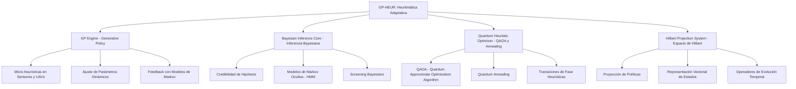

###  **Part I/: Heuritmática (GP-HEUR)**  
#### **Definición General**
La **Heuritmática (GP-HEUR)** es la capa fundacional del sistema GAIA AIR para la **toma de decisiones autónoma y adaptativa** basada en una integración matemática entre:

- **Heurísticas dinámicas**
- **Aprendizaje bayesiano**
- **Refuerzo adaptativo**
- **Optimización cuántica**
- **Representación en espacio de Hilbert**

Esta capa permite que el sistema no solo actúe reactivamente ante estímulos del entorno, sino que **genere, refine y proyecte estrategias** de manera autoevolutiva en dominios de alta incertidumbre.

---

## 🔧 **Componentes Técnicos Clave de GP-HEUR**

### 1. **GP Engine (Generative Policy Engine)**
Generador de políticas heurísticas evolutivas:
- Se basa en **algoritmos genéticos híbridos** y modelos de aprendizaje por refuerzo (Dyna-Q, Q-Learning).
- Implementa un sistema de “*mutación semántica*” sobre estructuras heurísticas representadas en grafos dirigidos.
- Utiliza **Grafo de Política Adaptativa (APG)**, que actualiza reglas basadas en recompensas estimadas del entorno.

### 2. **Bayesian Inference Core (BIC)**
Motor de inferencia probabilística que:
- Calcula la **credibilidad de hipótesis heurísticas** en base a observaciones.
- Integra modelos de **Markov ocultos (HMM)** y redes bayesianas dinámicas.
- Ejecuta **screening bayesiano** para priorizar la exploración de estrategias con mayor valor esperado.

### 3. **Quantum Heuristic Optimizer (QHO)**
Optimización cuántica basada en:
- **Quantum Approximate Optimization Algorithm (QAOA)** y **Quantum Annealing**.
- Operadores de evolución cuántica sobre el **espacio de Hilbert de heurísticas**, representando superposiciones de políticas.
- Simula **transiciones de fase heurísticas**: cambios abruptos en el comportamiento del sistema al cambiar condiciones del entorno.

### 4. **Hilbert Projection System (HPS)**
- Proyección de políticas en el espacio de funciones mediante operadores lineales.
- Representa cada heurística como un **estado vectorial**.
- Permite aplicar **operadores unitarios y de evolución temporal** sobre las estrategias.

---

## 🔍 **Extensión del Modelo GP-HEUR en GAIA AIR**
Para una integración más profunda en la **arquitectura GAIA AIR**, definimos **tres niveles operativos** en los que GP-HEUR se implementa.

### **1️⃣ Nivel Micro: Autoaprendizaje y Adaptación Local**
#### **Tareas Principales:**
- **Micro-heurísticas en sensores y UAVs:** Se usa **aprendizaje por refuerzo local** para optimizar la detección de eventos en drones y sensores autónomos.
- **Ajuste de parámetros dinámicos:** Uso de **procesos estocásticos** para modificar el control de vuelo y evitar obstáculos en tiempo real.
- **Feedback rápido con modelos de Markov:** Incorporación de **modelos HMM y bayesianos** para actualizar heurísticas en escenarios de alta variabilidad.

#### **Ejemplo Aplicativo 🚀**
> En un **UAV de reconocimiento**, GP-HEUR ajusta la estrategia de navegación en función de la densidad de tráfico aéreo en zonas urbanas. Se usan operadores de Hilbert para proyectar rutas óptimas y minimizar el **riesgo de colisión**.

---

### **2️⃣ Nivel Meso: Interacción con Modelos Predictivos**
#### **Tareas Principales:**
- **Optimización Cuántica Multiagente:** Uso de **QAOA** para coordinar múltiples UAVs en la optimización de rutas cuánticas dinámicas.
- **Políticas heurísticas federadas:** Unificación de decisiones entre **agentes autónomos** mediante redes de grafos dinámicas (APG).
- **Evaluación en tiempo real con Hilbert Screening:** Implementación de **screening predictivo** para priorizar rutas o estrategias en función de cambios ambientales.

#### **Ejemplo Aplicativo 🛫**
> En una **flota de UAVs de logística aérea**, GP-HEUR ajusta rutas dinámicamente para minimizar el **consumo de energía y maximizar la eficiencia operativa** en función de datos de tráfico aéreo y meteorología cuántica.

---

### **3️⃣ Nivel Macro: Gobernanza Inteligente y Estrategia Global**
#### **Tareas Principales:**
- **Coordinación con redes cuánticas:** Integración con el **Quantum Entanglement Engine (QEE)** para optimizar decisiones a nivel global.
- **Gestión de incertidumbre en escalas planetarias:** Uso de **Redes Bayesianas Dinámicas (DBNs)** para modelar escenarios a gran escala.
- **Proyección de Heurísticas en Superposición:** Aplicación de **transformadas unitarias en el espacio de Hilbert** para evaluar múltiples soluciones en paralelo.

#### **Ejemplo Aplicativo 🌎**
> En un **sistema de tráfico aéreo cuántico**, GP-HEUR usa **computación distribuida cuántica** para analizar **múltiples escenarios futuros de congestión aérea** y seleccionar estrategias óptimas en tiempo real.

---

## 🔢 **Expansión del Formalismo Matemático**
### **1️⃣ Proyección en Espacio de Hilbert**
Cada heurística \( h \) es tratada como un vector de estado cuántico \( \ket{h} \). La evolución de estrategias se modela mediante operadores unitarios \( \hat{U} \):
\[
\ket{h(t)} = \hat{U}(t) \ket{h(0)}
\]
donde \( \hat{U}(t) = e^{-i \hat{H} t} \), siendo \( \hat{H} \) el **Hamiltoniano heurístico** que gobierna la dinámica del sistema.

### **2️⃣ Screening Predictivo Bayesiano**
El sistema actualiza su credibilidad heurística mediante:
\[
P(h | D) = \frac{P(D | h) P(h)}{P(D)}
\]
donde **\( P(D | h) \)** evalúa la consistencia de la heurística con los datos observados.

### **3️⃣ Superposición Cuántica de Estrategias**
El sistema explora **múltiples estrategias en paralelo** como una superposición:
\[
\ket{\Psi} = \sum_i \alpha_i \ket{h_i}
\]
donde los coeficientes \( \alpha_i \) determinan la probabilidad de colapso en cada estrategia.

---

## ⚙️ **Capacidades Funcionales de GP-HEUR**

| Función | Descripción |
|--------|-------------|
| **Exploración Activa** | Genera nuevas heurísticas en función del cambio del entorno. |
| **Autoajuste Cuántico** | Ajusta pesos heurísticos mediante circuitos simulados QAOA/VQE. |
| **Retroalimentación Multiescala** | Integra señales de bajo nivel (sensores) y de alto nivel (estrategias). |
| **Screening Predictivo** | Filtra y prioriza rutas heurísticas con base en proyecciones dinámicas. |
| **Aprendizaje por Refuerzo Evolutivo** | Optimiza políticas mediante simulaciones, simulacros y realimentación operativa. |

---

## 📡 **Aplicaciones de GP-HEUR en GAIA AIR**

- **Ruteo dinámico cuántico (QTO)** con adaptación al tráfico aéreo, clima y zonas restringidas.
- **Mantenimiento predictivo autoajustado** según patrones emergentes y señales sensoriales.
- **Gobernanza algorítmica dinámica (GenLegAI)** con políticas generadas en tiempo real.
- **Simulación y detección de anomalías** a través de heurísticas proyectadas y colapsos de superposición.

---

### ✅ **Conclusión**
La **Heuritmática (GP-HEUR)** es el **núcleo de inteligencia generativa adaptativa** del ecosistema GAIA AIR. A diferencia de un sistema determinista, GP-HEUR navega un espacio de soluciones probabilístico, proyectando futuros posibles, seleccionando estrategias óptimas y ajustándolas mediante evolución bayesiana y cuántica. Esto **transforma la toma de decisiones en un proceso vivo, dinámico y autoentrenado.**

